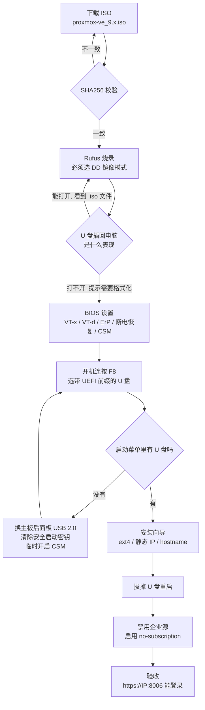

# 01 · Proxmox VE 安装全流程

> **适用硬件**：华硕 TUF GAMING B660M-PLUS D4 + i7-12700F + 32GB DDR4-3200 + 铠侠 RC20 1TB NVMe + GTX 1050 Ti
> **目标系统**：Proxmox VE 9.x（基于 Debian 13 "trixie"）
> **记录日期**：2026-08-31
> **前置依赖**：本机 IP 与主机名的规划方法见 [02 · 节点初始化与网络规划](02-network.md)

---

## 0. 总览

整个流程有四个容易卡住的关卡，图里用菱形标出：



**时间预估**

| 环节 | 耗时 |
|---|---|
| 下载 ISO + 校验 | 10–60 分钟（可挂后台） |
| **数据备份** | **看数据量，唯一不能赶的一步** |
| 制作 U 盘 | 5 分钟 |
| BIOS 设置 | 10 分钟 |
| 安装 | 15 分钟 |
| 换源 + 更新 | 10 分钟 |

---

## 1. 前置准备

### 1.1 备份 —— 唯一不可逆的一步

安装会**整盘抹掉**目标硬盘，包括你以为在"其他分区"的东西（安装器会重建整个分区表）。

| 类别 | 位置 | 备注 |
|---|---|---|
| SSH 私钥 | `C:\Users\<你>\.ssh\` | 丢了所有服务器都进不去 |
| **微信聊天记录** | `文档\WeChat Files\` | **不在 AppData**，位置反直觉，最常漏 |
| git 配置与 token | `.gitconfig`、各类配置文件 | 常忘 |
| 文档 / 照片 / 桌面 / 下载 | `C:\Users\<你>\` | — |
| 浏览器书签密码 | 登录账号同步一次即可 | — |
| 软件授权码 | 各家不同 | 有些绑硬件，需先"反激活" |

> **验证备份**：不是"我拷过去了"，是"**我在另一台设备上把文件打开看过了**"。移动硬盘拷贝中断、文件损坏、拷了个空文件夹 —— 这些都是抹盘之后才发现的。

**Windows 产品密钥**（保险起见，一般用不上）：

```powershell
# 管理员 PowerShell
(Get-WmiObject -query 'select * from SoftwareLicensingService').OA3xOriginalProductKey
```

> Windows 10/11 的数字许可证绑在主板上，同一块主板重装会**自动激活**，不需要密钥。

### 1.2 要记录的信息

装完之后原系统就没了，这些现在抄下来：

```cmd
:: 有线网卡 MAC（认准「以太网」那一行，不是 WLAN、不是虚拟网卡）
getmac /v /fo list

:: 当前网络配置：IP / 掩码 / 网关 / DNS
ipconfig /all
```

| 抄什么 | 用途 |
|---|---|
| 默认网关 | 安装向导要填 |
| 子网掩码 | 换算成 CIDR 位数（`255.255.255.0` → `/24`） |
| DNS 服务器 | 安装向导要填 |
| **有线网卡 MAC** | 路由器上做占位保留、以后配 WOL |

### 1.3 物理准备

| ✅ | 事项 | 原因 |
|---|---|---|
| ☐ | **插网线**，并在原系统里验证能上网 | **Proxmox 不支持 Wi-Fi** —— 安装器的网络配置界面根本不会列出无线网卡。提前验证还能发现网口是否损坏 |
| ☐ | 显示器接 GTX 1050 Ti | i7-12700F 是 **F 后缀，无核显**，独显是唯一输出 |
| ☐ | 键盘接 **USB 2.0（黑色）口** | 老 BIOS 对 USB 2.0 的初始化最可靠 |
| ☐ | 拔掉移动硬盘等不想被误擦的设备 | 物理隔离，最保险 |
| ☐ | 路由器 DHCP 池已缩小 | 见 [02 · 节点初始化](02-network.md#4-路由器侧配置) |

---

## 2. 下载 ISO 并校验

### 2.1 官方地址

| 用途 | 地址 |
|---|---|
| 官网 | https://www.proxmox.com |
| **下载页** | https://www.proxmox.com/en/downloads |
| ISO 直链目录 | https://enterprise.proxmox.com/iso/ |
| 官方文档 | https://pve.proxmox.com/pve-docs/ |
| Wiki（实操指南最全） | https://pve.proxmox.com/wiki/ |
| 官方论坛（排障首选） | https://forum.proxmox.com |

**不要下错架构**：文件名**不带 `-arm64` 后缀**的才是 x86_64 版本。

> 国内直连 `enterprise.proxmox.com` 速度不稳，下载页也提供 BT 种子，慢的话用种子更快。

### 2.2 校验完整性

下载页每个 ISO 旁边都标着 SHA256SUM，逐字符比对：

```cmd
:: Windows
certutil -hashfile "%USERPROFILE%\Downloads\proxmox-ve_9.x.iso" SHA256
```

```bash
# macOS / Linux
shasum -a 256 ~/Downloads/proxmox-ve_9.x.iso
```

> **不一致就重下。** ISO 损坏导致的安装失败症状很怪 —— 装到 70% 卡死、装完起不来、报莫名其妙的错 —— 你会往硬件上怀疑，排查半天才发现是文件问题。

---

## 3. 制作启动盘

### 3.1 最常见的误区

```
错误：把 proxmox-ve_9.x.iso 这个文件【拷贝】进 U 盘
      → BIOS 启动列表里压根不会出现这个 U 盘

正确：用工具把 ISO【烧录】到 U 盘
      → 整盘按字节覆写，包含引导扇区和分区表
```

启动盘不是"U 盘里有个系统文件"，而是**整个 U 盘的第一个扇区里要有引导代码、分区表要标记为可引导、EFI 引导文件要在固定路径**。拷贝文件做不到这些。

### 3.2 工具选型

| 工具 | Proxmox 官方立场 | 社区实测 | 结论 |
|---|---|---|---|
| **Rufus + DD 模式** | 官方推荐，注明"必须用 DD 模式" | 遇到问题的人换回 Rufus 后基本都解决了 | **首选** |
| balenaEtcher | 官方原话"开箱即用" | 有零星报告：提示 ISO 格式不正确，装机时看不到目标硬盘 | 备选 |
| **Ventoy** | 官方文档**完全没提** | 有明确的已知故障 | **不要用** |
| UNetbootin | 不支持 | 做出来的盘启动不了 | 不要用 |

#### 为什么 Ventoy 装 Proxmox 会失败

| | 工作原理 |
|---|---|
| **Ventoy** | 在 GRUB 启动参数里注入 `rdinit=/vtoy/vtoy`，系统起来后由 Ventoy 的钩子去挂载 U 盘上的 ISO **文件** |
| **Proxmox 安装器** | initrd 启动后主动扫描所有块设备，寻找带特定卷标的**安装介质分区** |

两者打架：Ventoy 把 ISO 变成了"一个文件"而不是"一个分区"，Proxmox 扫遍所有设备也找不到它认识的介质 → 报 `No Device with Valid ISO Found`，或卡在 `Loading initial ramdisk`。

### 3.3 Rufus 操作步骤

下载 **Portable 便携版**：https://rufus.ie

```
1. 插入 U 盘（≥8GB，里面数据会全没）
2. 打开 Rufus
3. 「设备」        → 选你的 U 盘（核对容量，别选成移动硬盘）
4. 「引导类型选择」 → 点【选择】→ proxmox-ve_9.x.iso
5. 其余全部保持默认 → 点【开始】
```

**三个弹窗，答错就白做：**

| 顺序 | 弹窗问什么 | 必须选 |
|---|---|---|
| ① | "此镜像需要下载新版 GRUB，是否下载？" | **否（No）** |
| ② | "检测到 ISOHybrid 镜像，请选择写入模式" | **以 DD 镜像模式写入** |
| ③ | "警告：U 盘上所有数据将被销毁" | 确定 |

> **弹窗②是全场唯一会翻车的地方。** 默认选中的是「ISO 镜像模式」，做出来的盘装 Proxmox 会失败 —— 而且失败得很晚（能启动、能进菜单，但选硬盘那一步看不到你的 SSD），你会以为是硬盘或 BIOS 的问题。
>
> 选了 DD 模式后，文件系统、卷标、分区类型这些选项会全部变灰 —— 这是正常的，DD 是整盘覆写，那些设置不适用。

### 3.4 验证烧录成功

| 检查项 | 成功的表现 | 失败的表现 |
|---|---|---|
| Windows 弹窗 | 弹出"**需要格式化才能使用**" → 点取消 | 无任何提示，U 盘正常打开 |
| 打开 U 盘 | **打不开**，或看到一堆 Linux 目录 | 看到一个 `.iso` 文件躺在里面 |
| 资源管理器容量 | 显示约 1.5GB（不是 U 盘实际容量） | 显示 U 盘完整容量 |
| macOS 插入 | 弹窗"您插入的磁盘本电脑无法读取" | 能正常挂载 |

在 macOS 上可以看得更精确：

```bash
diskutil list
```

烧录成功的 U 盘会有**多个分区**（一个 ISO9660 主体 + 一个 EFI 分区），这也是为什么 Windows 会给它分配**两个盘符且都提示格式化** —— 那是成功的标志，千万别点格式化。

---

## 4. BIOS 设置

### 4.1 进 BIOS

Windows 的**快速启动（Fast Startup）**会让按 Del 根本来不及。用这个方法 100% 能进：

```
开始菜单 → 电源 → 按住 Shift 不放，点「重启」
  → 疑难解答 → 高级选项 → UEFI 固件设置 → 重启
```

进去是 **EZ Mode**，**按 F7 切到 Advanced Mode**，否则大部分选项看不到。

> **顶部的「搜索(F9)」很好用** —— 找不到某个选项时直接按 F9 搜关键词（如 `VT-d`、`ErP`）会跳过去，比一层层翻快得多。

### 4.2 目录结构提示

华硕 BIOS 的「高级」标签点进去是**一列子菜单**，不是设置项。常见的坑是进了「CPU 配置」子菜单后以为其他选项不存在：

```
高级
  ├─ 平台各项设置
  ├─ CPU 配置                ← 虚拟化 VMX 在这里
  ├─ 系统代理(SA)设置         ← VT-d 在这里
  ├─ PCH 设置
  ├─ PCH 存储设备配置          ← SATA 模式在这里
  ├─ PCI 子系统设置           ← Above 4G Decoding 在这里
  ├─ USB 设备配置
  ├─ NVMe 设置
  ├─ 高级电源管理(APM)设置     ← ErP / 断电恢复 / 网络唤醒 在这里
  └─ 内置设备设置
```

### 4.3 逐项设置

#### 「高级」标签

| 路径 | 设成 | 为什么 |
|---|---|---|
| `CPU 配置 → Intel (VMX) Virtualization Technology` | **Enabled** | 不开虚拟机根本跑不起来 |
| `系统代理(SA)设置 → VT-d` | **Enabled** | 设备直通（GPU / 网卡）的硬前提 |
| `高级电源管理(APM)设置 → ErP Ready` | **Disabled** | ErP 是欧盟能耗指令模式，开启后关机会**彻底切断网卡供电**，把待机功耗压到 0.5W 以下 —— 代价是网卡没电就收不到魔术包，**WOL 直接失效** |
| `高级电源管理(APM)设置 → 断电后恢复电源状态` | **电源开启** | 这是常开服务器，停电来电后必须自己起来。华硕中文界面叫「电源开启」不是「开机」 |
| `高级电源管理(APM)设置 → 由 PCI-E 设备唤醒` | **Enabled** | 以后网络唤醒要用 |
| `PCH 存储设备配置 → SATA 模式选择` | **AHCI** | 别选 RAID |
| `PCI 子系统设置 → Above 4G Decoding` | **Enabled** | 大显存显卡直通的必要条件；这台机器暂时用不到，但开着无害 |

> **「断电后恢复电源状态」的取值要按节点角色定**：
>
> | 节点 | 取值 | 原因 |
> |---|---|---|
> | 常开节点（本机） | **电源开启** | 停电来电后要自己起来，否则网关服务一直断 |
> | 按需唤醒节点 | **电源关闭** | 否则每次跳闸来电它就自己开起来，白烧电 |

#### 「监控」标签

| 路径 | 设成 | 为什么 |
|---|---|---|
| `Q-Fan 配置 → CPU 风扇模式` | **Silent** | 24 小时开机的机器，噪音要忍很久 |
| `Q-Fan 配置 → 机箱风扇模式` | **Silent** | 同上 |

顺便记下待机温度作为基线（本机实测 **39°C**）。

#### 「启动」标签

| 路径 | 设成 | 为什么 |
|---|---|---|
| `快速启动 (Fast Boot)` | **Disabled** | 以后进 BIOS 方便；也让 USB 设备有时间被枚举 |
| `安全启动 → 操作系统类型` | **其他操作系统** | 允许未经微软签名的引导程序 |
| `安全启动 → 密钥管理 → 清除安全启动密钥` | 执行一次 | **仅设 OS Type 有时不够**，某些版本的「安全启动状态」仍显示 Enabled，清除密钥才是彻底关闭 |
| `CSM → 启动 CSM` | **Disabled**（目标状态） | 走纯 UEFI。若 U 盘识别不出来可临时开启，见 5.2 |
| `设置提示等待时间` | **5** 秒 | 以后进 BIOS 不用抢时机 |

> **如果 `CSM` 选项是灰的点不动**：先把 `安全启动 → 操作系统类型` 改成「其他操作系统」，F10 保存重启，再回来改 CSM —— 这两项在华硕 BIOS 里有依赖关系。
>
> **1050 Ti 是 Maxwell 架构，带 UEFI GOP 固件**，关掉 CSM 后开机自检画面照常显示，不会黑屏。更老的 Fermi 卡（GT610 等）很多只有 Legacy VBIOS，纯 UEFI 下会全程无显示 —— 换卡时要注意这一点。

#### 「概要」标签 —— 只记录不修改

| 记什么 | 本机实测 | 意义 |
|---|---|---|
| CPU 型号 | 12th Gen Intel Core i7-12700F | 验货 |
| **Intel VT-x Technology** | **Supported** | 硬件支持虚拟化 |
| 内存总容量 | 32768 MB | — |
| **内存频率** | **3200 MHz** | 确认没有降频 |
| BIOS 版本 / 日期 | 1402 / 2022-04-01 | 平台上市初期版本，可择机升级（非阻塞） |

内存的**插槽分布**（2×16 还是 4×8，决定以后能不能扩容）在这里看：

```
工具 → ASUS SPD 信息 → 下拉切换 DIMM_A1 / A2 / B1 / B2
```

最后 **F10 保存并重启**。

---

## 5. 从 U 盘启动

### 5.1 用一次性启动菜单，不要改启动顺序

改 Boot Order 是永久的，装完还得改回来。用一次性菜单更干净：

```
开机后连按 F8（华硕）
```

弹出的列表长这样：

```
Please select boot device:

  UEFI: <U盘品牌>, Partition 1      ←  选这一项
  <U盘品牌>                          ←  别选（Legacy 模式）
  UEFI OS (KIOXIA ...)
  Enter Setup
```

> **同一个 U 盘会出现两次，必须选带 `UEFI:` 前缀的。** 选错会装成 Legacy 模式。

BIOS 内部也有等价功能：`启动` 标签**最底部**的「**启动覆写 / Boot Override**」，列出所有当前可引导设备，点一下直接从它启动，不改任何配置。

### 5.2 排障：启动菜单里没有 U 盘

按可能性从高到低：

| # | 检查 | 处理 |
|---|---|---|
| 1 | **U 盘插在哪个口** | 机箱前面板口在 BIOS 自检阶段可能未初始化；USB Hub / 扩展坞 BIOS 阶段基本不支持。**换到主板后面板的黑色 USB 2.0 口** |
| 2 | **是不是热插拔的** | U 盘在**开机自检阶段**才被枚举。已经进了 BIOS 再插上去不会被扫描 —— **在 BIOS 里按 F10 保存重启**即可（这是完整自检），或完全关机再开 |
| 3 | **安全启动没真正关闭** | `启动 → 安全启动 → 密钥管理 → 清除安全启动密钥` |
| 4 | **纯 UEFI 下认不出** | **临时把 CSM 设成 Enabled**，引导设备控制设成「UEFI 和 Legacy OPROM」。这样主板会同时扫描两种引导方式，U 盘出现的概率最大 |
| 5 | **烧录方式错了** | 回到 3.4 验证 |
| 6 | 其他 | 换 8–16GB 的老 U 盘；换一台电脑做盘 |

> **两种重启的区别**（这是第 2 项的关键）：
>
> | 从哪里重启 | 走完整自检吗 |
> |---|---|
> | **从 BIOS 按 F10 重置** | **会**，U 盘能被枚举 |
> | 从 Windows 点「重启」/「关机」 | **可能不会** —— Windows 快速启动会跳过完整自检。要按住 Shift 点「关机」，或干脆拔电源线 10 秒 |

> **关于是否接受 Legacy 引导**：如果第 4 项之后只出现不带 `UEFI:` 前缀的条目，**也可以直接装**。Proxmox 完整支持 Legacy 引导，对纯做宿主机的场景没有功能损失。不要为了引导方式好看卡住半天。

### 5.3 启动成功

```
      Welcome to Proxmox Virtual Environment

   ▸ Install Proxmox VE (Graphical)      ←  正常走这个
     Install Proxmox VE (Terminal UI)
     Advanced Options                    ←  想先彻底抹盘走这里
     Rescue Boot
     Test memory (memtest86+)
```

看到这个菜单，说明 **U 盘做对了、BIOS 设对了、启动模式也对了**。

| 选项 | 什么时候用 |
|---|---|
| **Install Proxmox VE (Graphical)** | 正常安装 |
| Install Proxmox VE (Terminal UI) | 显卡驱动异常、图形界面花屏时的备选 |
| **Advanced Options → Debug mode** | 想先 `blkdiscard` 彻底抹盘时，会先给一个 shell |
| **Test memory (memtest86+)** | 内存来路不明时（尤其二手/服务器内存）强烈建议先跑一遍 |

### 5.4 可选：装前彻底抹盘

不需要额外 U 盘，Proxmox 安装器自带 shell：

```
Advanced Options → Install Proxmox VE (Debug mode) → 先掉进一个 shell
```

```bash
# 1. 先看清楚，确认设备名（顺序不能换：没确认前绝不执行下一步）
lsblk -o NAME,SIZE,MODEL
nvme list

# 2. 全盘 TRIM —— 秒级完成
blkdiscard -f /dev/nvme0n1

# 3. 确认已清空（应该看不到任何分区）
lsblk /dev/nvme0n1

# 4. 退出，继续进入安装界面
exit
```

| 注意 | 说明 |
|---|---|
| **不可逆** | `blkdiscard` 没有确认提示、没有进度条。执行前用 `nvme list` 对着型号和容量**双重确认设备号** |
| **可以跳过** | Proxmox 安装器本来就会重建整个分区表，原系统一样会被抹干净。这一步只是**额外**恢复 SSD 性能 |
| **额外收益** | 对无 DRAM 缓存的盘（如 RC20），用过一两年后 blkdiscard 一次能明显恢复写入性能（相当于回到出厂映射表状态） |

---

## 6. 安装向导逐屏

### ① 许可协议

点 **I agree**。

### ② 选择目标硬盘 —— 最关键的一屏

| 项 | 填什么 |
|---|---|
| **Target Harddisk** | 核对型号和容量再选 |
| **Options → Filesystem** | **ext4** |

**为什么不选 ZFS**：

| | ext4 + LVM-Thin | ZFS |
|---|---|---|
| 写放大 | 低 | **高**（CoW + 元数据），对无 DRAM 缓存的 SSD 加速老化 |
| 内存占用 | 低 | **ARC 缓存默认吃掉一半内存** |
| 快照 | LVM-Thin 原生支持 | 支持 |
| 校验和 / 自愈 | 无 | 有（但需要冗余盘才有意义） |

单盘 + 无 DRAM SSD + 32GB 内存的场景下，ZFS 的优势用不上，劣势全中。

> 磁盘容量显示 **931.51 GB** 是 1TB 盘的正常值，不是"Windows 没抹干净"：厂商按十进制标 1TB = 10¹² 字节，系统按二进制算 1 GiB = 2³⁰ 字节，`1,000,204,886,016 ÷ 1024³ ≈ 931.51`。

`Options` 里的 hdsize / swapsize / maxroot / minfree 保持默认即可。1TB 盘 + 32GB 内存的默认分配大致是：swap 8GB、root 96GB、data（虚拟机磁盘池）790GB。

### ③ 地区

| 项 | 填 |
|---|---|
| Country | `China` |
| Time zone | `Asia/Shanghai` |
| Keyboard Layout | `U.S. English` |

### ④ 密码和邮箱

| 项 | 说明 |
|---|---|
| Password | 密码框是掩码的，**打字时屏幕可能完全没反应**。CapsLock 状态看不见，安装器里也没有输入法（只能 ASCII） |
| Confirm | 下面的确认框是你唯一的校验 |
| Email | 填个能收的地址（系统告警会发到这里） |

> **建议用一个"闭着眼也能打对"的密码**（字母+数字，8 位以上），装完在 Web 界面里再改成复杂的。在看不见的情况下反复输错很浪费时间。
>
> **Proxmox 只设这一个密码**，控制台、Web 界面、SSH 用的是同一个。忘了的话可以从 GRUB 进单用户模式重置：启动时按 `e` → 在 `linux` 那行末尾加 `init=/bin/bash` → `Ctrl+X` → `mount -o remount,rw /` → `passwd root` → `reboot -f`。

### ⑤ 网络配置

用 1.2 抄下来的数据：

| 项 | 示例 | 说明 |
|---|---|---|
| Management Interface | 选 **`en` 开头**的接口 | Linux 命名规范：`en*` = 有线，`wl*` = 无线，`ww*` = 蜂窝。**必须选有线** —— 安装器没有 Wi-Fi 配置界面 |
| Hostname (FQDN) | `pve-old.lan` | **必须带一个点**。想好再填，改起来麻烦 |
| **IP Address (CIDR)** | `192.168.5.10/24` | **必须是静态的**，且**在路由器 DHCP 池之外** |
| Gateway | `192.168.5.1` | — |
| DNS Server | `223.5.5.5` | — |

**为什么必须静态**：以后所有配置、证书、书签都绑这个地址。特别是装了 k8s 之后，etcd 数据库和 TLS 证书里都写死了节点 IP —— 改 IP 基本等于重建集群。

**如果接口列表里出现两个 MAC**（比如机器还装了无线网卡）：

| 判断方法 | 说明 |
|---|---|
| **看接口名开头** | `en` = 有线，`wl` = 无线。最可靠 |
| 对照记录的 MAC | 1.2 步抄的「以太网」那一行 |
| 看芯片描述 | `Realtek RTL8125/8111` = 有线；`Intel AX2xx`、`MediaTek MT79xx` = 无线 |

### ⑥ 确认摘要 → Install

核对一遍点 **Install**，约 5–10 分钟。

> **重启前把 U 盘拔掉。** 但**不要在点 "Reboot Now" 之前卸载 ISO/U 盘** —— 那时系统仍运行在从安装介质启动的临时环境里，抽掉介质会让根文件系统消失，报 `Failed to execute shutdown binary`。
>
> 遇到这个报错时：**安装其实已经完成了**，硬盘上的系统是好的。用 Proxmox 的「**停止**」（强制断电，不是「关机」）再「启动」即可。

---

## 7. 首次启动与验收

### 7.1 登录

**Proxmox 只有一个账号：`root`**，密码是安装时设的。控制台、Web 界面、SSH 通用。

| 入口 | 用户名 | 备注 |
|---|---|---|
| 物理机控制台 | `root` | 输密码时**屏幕完全没有反应**（连星号都没有），Linux 终端的正常行为 |
| Web `https://<IP>:8006` | `root` | **Realm 必须保持 `Linux PAM standard authentication`** |
| SSH | `root` | Debian 默认 `PermitRootLogin prohibit-password`（密钥可以，密码不行） |

控制台登录后先验证网络：

```bash
ip a                    # 确认 vmbr0 是规划的 IP
ping -c 3 192.168.5.1   # 通不通网关
ping -c 3 223.5.5.5     # 能不能出外网
```

三条都通就可以拔掉显示器和键盘，之后全在浏览器里操作。

### 7.2 打开 Web 界面

```
https://192.168.5.10:8006
```

**地址必须写全**，三样缺一不可：

```
✗ 192.168.5.10                → 浏览器补成 http://...:80，没有服务
✗ http://192.168.5.10:8006    → 协议错，Proxmox 不听 HTTP
✗ https://192.168.5.10        → 端口错，走了 443
✓ https://192.168.5.10:8006
```

| 会遇到 | 处理 |
|---|---|
| "此连接不是私密连接" | **正常**（自签名证书）。Chrome：高级 → 继续前往；Safari：显示详细信息 → 浏览此网站 → 访问此网站 |
| 登录后弹 "No valid subscription" | **正常**，点 OK。免费版每次登录都会弹 |

### 7.3 关于「无有效订阅」

Proxmox VE 是开源免费的，**免费版和付费版功能完全相同**，没有任何功能阉割：

| | 免费（无订阅） | 付费订阅 |
|---|---|---|
| 虚拟机 / 容器 / 集群 / 备份 / 快照 / 直通 / 高可用 | 全都有 | 相同 |
| **软件源** | `no-subscription`（更新更快，测试稍少） | `enterprise`（更保守） |
| **官方技术支持** | 无（靠社区论坛） | 有 |

订阅买的是"官方支持 + 更保守的更新通道"，不是功能。

### 7.4 换软件源 —— 必做

Proxmox 装完**默认启用企业源**，没有订阅凭证会导致 `apt update` 报 401，所有更新都装不了。

**Web 界面操作（推荐，不会写错格式）：**

```
左侧点节点 → 更新 (Updates) → 软件源 (Repositories)
  ① 选中 pve-enterprise 那一行 → 点【禁用 / Disable】
  ② 如果还有 ceph 的企业源，一并禁用（不用 Ceph 的话）
  ③ 点【添加 / Add】→ 下拉选 "No-Subscription" → 添加
```

改完之后：

| 状态 | 组件 |
|---|---|
| 已禁用 | `pve-enterprise` |
| 已启用 | `pve-no-subscription` |
| 已启用 | Debian 的 `main` / `updates` / `security` |

> 页面顶部的黄色提示「no-subscription 软件源不建议用于生产环境」是**正常的**，不用管。它只是提醒这个源的测试没有企业源严格 —— 对个人实验室完全没问题。

#### 🔴 必须验证第 ③ 步真的生效了

**这是一个会静默失败的坑，2026-09-04 实测踩到过。**

PVE 9 的安装器会预先生成 `proxmox.sources`，但里面写的是 **`Enabled: false`**。如果只做了 ①② 禁用企业源、③ 没真正生效，结果是：

```
企业源被禁用   →  apt update 不再报 401  →  【看起来修好了】
no-subscription 仍是 false  →  实际上一个 PVE 源都没启用
                            →  内核 / qemu / pve-manager 永远收不到更新
```

**症状极其隐蔽**：`apt update` 干干净净没有任何报错，`apt upgrade` 也能正常跑（升的全是 Debian 基础包）。实测那台机器就这样落后了 9 个版本才被发现。

**机器可判定的验证信号**：

```bash
apt-cache policy pve-manager
```

```
✅ 正确 —— Candidate 来自仓库
   Candidate: 9.2.11
     9.2.11 500
        500 https://mirrors.ustc.edu.cn/proxmox/debian/pve trixie/pve-no-subscription

❌ 错误 —— Candidate 只来自本地 dpkg 状态库，说明没有任何仓库提供它
   Candidate: 9.2.2
     *** 9.2.2 100
        100 /var/lib/dpkg/status        ← 只有这一行就是没救回来
```

顺带确认 apt 实际加载了哪些仓库：

```bash
apt-get indextargets --no-release-info | grep '^URI:' | sed 's|/dists/.*||' | sort -u
```

**换成国内镜像加速**

Proxmox VE 9 基于 **Debian 13 "trixie"**，用的是新的 **deb822 格式（`.sources` 文件）**。网上很多教程还是 PVE 8 的 `bookworm` + `.list` 写法，照抄会报错。

> 🔴 **Proxmox 源和 Debian 源用的是不同镜像站，这不是笔误。**
> 阿里云**没有镜像 Proxmox 仓库**（实测 `mirrors.aliyun.com/proxmox/...` 返回 404），
> 只能用中科大；而 Debian 基础源两家都有，用阿里云。
>
> 🔴 **不要用清华 TUNA。** 2026-09-04 实测它封禁了本地出口 IP，
> `apt` / `pypi` / ISO 下载一律 403，连镜像站根目录都进不去，
> 且返回的是它自己的 HTML 提示页而不是可读的错误。

```bash
cat > /etc/apt/sources.list.d/proxmox.sources <<'EOF'
Types: deb
URIs: https://mirrors.ustc.edu.cn/proxmox/debian/pve
Suites: trixie
Components: pve-no-subscription
Signed-By: /usr/share/keyrings/proxmox-archive-keyring.gpg
Enabled: true
EOF

cat > /etc/apt/sources.list.d/debian.sources <<'EOF'
Types: deb
URIs: https://mirrors.aliyun.com/debian/
Suites: trixie trixie-updates
Components: main contrib non-free-firmware
Signed-By: /usr/share/keyrings/debian-archive-keyring.gpg
Enabled: true

Types: deb
URIs: https://mirrors.aliyun.com/debian-security/
Suites: trixie-security
Components: main contrib non-free-firmware
Signed-By: /usr/share/keyrings/debian-archive-keyring.gpg
Enabled: true
EOF

apt update && apt-cache policy pve-manager     # 🔴 换完立刻验证，别等到要升级时才发现
```

> **`Enabled: true` 要显式写。** 省略时默认虽然是启用，但安装器生成的文件里可能已经写着 `Enabled: false` —— 用 `cat >` 覆盖能一并解决，用编辑器改则要确认这一行。

> 镜像站的目录结构偶尔会调整，报 404 时以镜像站的帮助页为准（如 https://mirrors.ustc.edu.cn/help/proxmox.html ）。

### 7.5 验收清单

```
□ 物理机控制台能用 root 登录
□ ip a 显示 vmbr0 是规划的静态 IP
□ ping 网关、ping 外网都通
□ 从另一台机器 ping 得通本机
□ 浏览器能打开 https://<IP>:8006 并登录
□ 企业源已禁用，no-subscription 已启用
□ apt update 不报 401
□ apt full-upgrade 执行完成
□ 拔掉显示器和键盘，纯远程管理
```

---

## 8. 排障速查表

本次安装实际遇到的问题，按出现顺序：

| 现象 | 根因 | 解决 |
|---|---|---|
| 启动菜单里没有 U 盘 | ① USB 口位置 ② 热插拔未重新枚举 ③ 安全启动未彻底关闭 | 换后面板 USB 2.0 → BIOS 里 F10 重启（完整自检）→ 清除安全启动密钥 → 临时开 CSM |
| U 盘在 Windows 里显示**两个盘符且都提示格式化** | **这是烧录成功的正常表现**（ISO9660 主体 + EFI 分区两个分区，Windows 都读不懂） | 不要点格式化 |
| 装完重启总是停在启动选择界面 | U 盘还插着 / 启动顺序不对 | 拔掉 U 盘；或 BIOS 里把硬盘引导项设为第一 |
| 点 "Reboot Now" 前卸载了 ISO，报 `Failed to execute shutdown binary` | 系统仍运行在安装介质的临时环境里，抽掉介质根文件系统就没了 | **安装其实已完成**。用「停止」强制断电再「启动」。下次先重启再卸载 ISO |
| curl 能通、Safari 能通，**Chrome 报 `ERR_ADDRESS_UNREACHABLE`** | **macOS 15+ 的「本地网络」隐私权限**没授予 Chrome。Safari 是系统应用默认有权限，curl 也已授权 | `系统设置 → 隐私与安全性 → 本地网络` → 打开 Chrome 的开关 → **`Cmd+Q` 完全退出 Chrome 再打开** |
| curl 通但所有浏览器都不通 | Surge 等代理软件残留了系统代理设置（curl 不读 macOS 系统代理，浏览器读） | `系统设置 → 网络 → <接口> → 详细信息 → 代理`，把所有勾选项取消（**有线和 Wi-Fi 要分别检查**） |
| `apt update` 报 401 | 企业源需要订阅凭证 | 见 7.4 换源 |

### 相关的 macOS 权限问题

这类"某个应用访问不了局域网"的问题以后还会遇到（Grafana、OpenWebUI、k8s Dashboard 全是局域网服务）。**一次性把常用工具的本地网络权限都打开**：

```
系统设置 → 隐私与安全性 → 本地网络
  → 检查 Chrome / 终端 / Postman / IDE / Docker Desktop 是否都已开启
```

如果某个应用不在列表里，说明它还没触发过权限请求 —— 用它访问一次局域网地址，系统会弹窗询问。

---

## 参考资料

- [Prepare Installation Media · Proxmox 官方 Wiki](https://pve.proxmox.com/wiki/Prepare_Installation_Media)
- [Installing Proxmox VE · 官方文档](https://pve.proxmox.com/pve-docs/chapter-pve-installation.html)
- [Package Repositories · Proxmox 官方 Wiki](https://pve.proxmox.com/wiki/Package_Repositories)
- [Ventoy install of Proxmox halts at "Loading initial ramdisk" · 官方论坛](https://forum.proxmox.com/threads/ventoy-install-of-proxmox-8-1-halts-at-loading-initial-ramdisk.143196/)
- [\[SOLVED\] No Device with Valid ISO Found · 官方论坛](https://forum.proxmox.com/threads/error-no-device-with-valid-iso-found.134510/)
