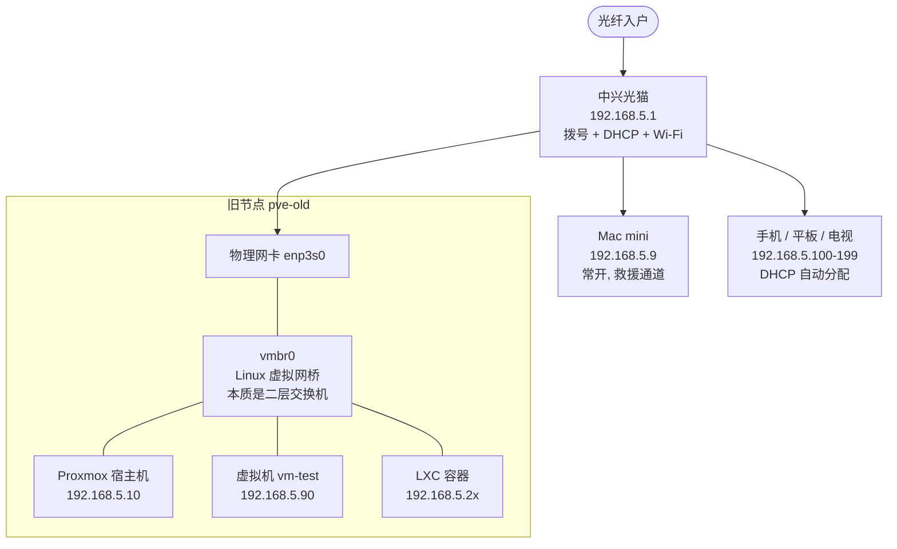
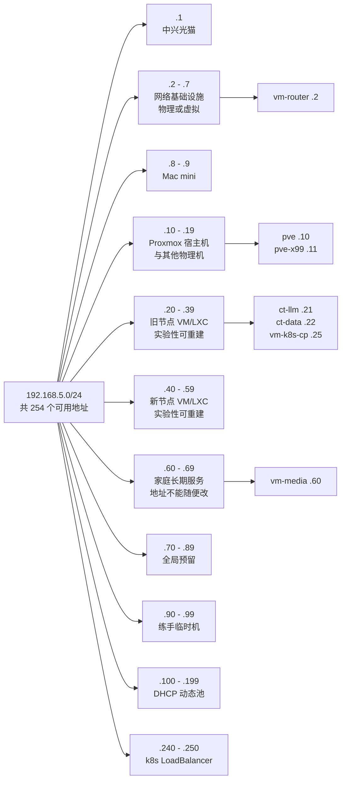

# 02 · 节点初始化与网络规划

> **承接**：[01 · Proxmox VE 安装全流程](01-proxmox-install.md)
> **面向**：装完宿主机之后、开始建虚拟机之前，需要一次性定下来的网络与地址规划
> **原则**：地址规划是**改起来最贵**的决定之一 —— 一旦 k8s、证书、书签、脚本里都写死了地址，返工成本极高。宁可前期多花半小时想清楚

---

## 0. 网络拓扑



**关键认知**：`vmbr0` 是一个虚拟二层交换机，宿主机自己也接在上面。虚拟机拥有独立的 MAC 地址，**对路由器来说和物理设备完全平级** —— 路由器的客户端列表里能看到它们，它们从同一个网段取地址。

---

## 1. 网段选型

### 1.1 先排除两个大段

| 网段 | 谁在用 | 结论 |
|---|---|---|
| **`10.0.0.0/8`** | 企业 NetBird / WireGuard VPN（如 `10.10.0.0/16`）；k8s Service 默认 `10.96.0.0/12`；Flannel Pod 默认 `10.244.0.0/16`；k3s `10.42/10.43.0.0/16`；**绝大多数公司内网** | **家里不要用**。你要连公司 VPN，用 10.x 等于主动去撞公司网段 —— 撞上之后路由表里出现两条相同网段，排查极其困难 |
| **`172.16.0.0/12`** | Docker 默认网桥 `172.17.0.0/16`；Docker Compose 自建网络 `172.18`–`172.31`；部分企业 VPN / VMware | 要跑大量容器的话，这一段基本被 Docker 吃光 |

### 1.2 在 `192.168.0.0/16` 里挑一个冷门的第三段

`192.168.x.0/24` 有 256 个选择，大部分设备只用其中十几个当默认值。

**必须避开的（都是某厂商的默认值）：**

| 值 | 谁的默认 |
|---|---|
| **0 / 1** | TP-Link、腾达、水星、大部分路由器 —— 最容易撞 |
| 2 | 部分光猫、部分路由器 |
| **3** | **华为路由器** |
| 8 | 华为随身 WiFi / 移动路由 |
| 11 | Buffalo |
| **31** | **小米路由器** |
| **43 / 49** | **Android 手机热点 / Wi-Fi Direct** |
| 42 | 部分 Android USB 网络共享 |
| **50** | **华硕路由器** |
| **56** | **VirtualBox 仅主机网络** |
| **64** | **macOS 虚拟化（UTM / Multipass）** |
| 88 | MikroTik |
| 99 | Docker Machine / minikube |
| **100** | **电信 / 联通光猫管理地址** —— 国内极常见 |
| **137** | **Windows 移动热点** |
| 178 | AVM FritzBox |

**本环境实际使用：`192.168.5.0/24`**

| 检查项 | 结果 |
|---|---|
| 是主流路由器默认值吗 | 否 |
| 和企业 NetBird `10.10.0.0/16` 冲突吗 | 否 |
| 和 Docker `172.17–172.31.x` 冲突吗 | 否 |
| 和 k8s `10.96.x` / `10.244.x` 冲突吗 | 否 |
| 在酒店 / 咖啡厅 / 朋友家撞车吗 | 否（那些都是 `.0` / `.1`） |

> **已经在一个干净网段上就不要改。** 改网段的代价是端口转发规则、静态 IP 设备、书签、脚本全部要重配，收益为零。

### 1.3 掩码为什么是 `/24`

```
IP:      192 . 168 .   5 .  10
掩码:    255 . 255 . 255 .   0
         └──── 网络号 24 位 ────┘ └ 主机号 8 位 ┘
```

前 24 位相同的设备属于同一个局域网，可以**直接二层通信**；后 8 位区分网段内的设备。

| 地址 | 用途 | 可分配 |
|---|---|---|
| `192.168.5.0` | 网络地址（代表网段本身） | 否 |
| `192.168.5.1` – `192.168.5.254` | 主机地址，**254 个** | 是 |
| `192.168.5.255` | 广播地址 | 否 |

**规则：局域网内所有设备的掩码必须完全一致。**

| 填错成 | 后果 |
|---|---|
| `/16` | 设备认为 `192.168.0.x` – `192.168.255.x` 全是本地网络，发往外网的包不走网关 → 上不了网 |
| `/25` | 设备认为网段只到 `.127`，和 `.128` 以上的设备通信要经过路由器 → 部分设备互相看不见 |

> **常见误解**：`192.168.5.10/24` 不是"这台机器分到了整个 `.5` 网段"，而是"这台机器占用 `.10` 这**一个**地址，同时它知道整个 `.5` 网段是本地的"。地址池是**所有设备共享**的。

---

## 2. 地址分配方案

### 2.1 分段规则：十位数 = 归属



| 范围 | 用途 | 分配方式 |
|---|---|---|
| `.1` | 主路由器 | 固定 |
| **`.2 – .7`** | **网络基础设施（物理或虚拟）** | 静态 |
| `.8 – .9` | Mac mini | DHCP 保留 |
| **`.10 – .19`** | **Proxmox 宿主机与其他物理机** | 静态 / DHCP 保留 |
| **`.20 – .39`** | **旧节点上的 VM / LXC** —— 实验性，可重建 | 静态 |
| **`.40 – .59`** | **新节点上的 VM / LXC** —— 实验性，可重建 | 静态 |
| **`.60 – .69`** | **家庭长期服务** —— 不绑宿主机 | 静态 |
| `.70 – .89` | 全局预留 | — |
| `.90 – .99` | 练手 / 临时机，用完即删 | — |
| **`.100 – .199`** | **DHCP 动态池**（手机、笔记本、电视） | 路由器自动 |
| `.200 – .239` | 预留 | — |
| **`.240 – .250`** | **k8s LoadBalancer（MetalLB）** | 静态，必须在 DHCP 池外 |

**判断规则**：`.2x` / `.3x` 在旧节点，`.4x` / `.5x` 在新节点，`.1xx` 是临时接入的终端。不用查表。

### 🔴 `.60 – .69` 为什么单独分一段

`.20 – .59` 的分段依据是"跑在哪台宿主机上"，对**长期服务**这个维度没有意义，而且有害：

| | |
|---|---|
| 地址会被写进你控制不到的地方 | iPhone 的 Jellyfin 客户端、电视 App、家人手机的书签。改一次要挨个设备改 |
| 与实验设施性质相反 | `.20 – .59` 那些重建是常态，`.60 – .69` 这些一旦定下就不该动 |
| 不绑宿主机 | 服务可能从旧节点迁到新节点，按宿主机编号就得跟着改地址 |

**规划表真正该表达的信息是"哪些能随便炸掉重来、哪些不能"**，而不只是"它在哪台机器上"。

### 🔴 VMID 约定

| 段 | 用途 | 例 |
|---|---|---|
| `1xx` | 普通虚拟机，**`100 + IP 尾数`** | `102` ↔ `.2`；`160` ↔ `.60` |
| `9xxx` | 模板 | `9000` = `tmpl-ubuntu-2404` |

`qm stop 160` 一眼知道动的是 `.60` 那台。

**VMID 创建后不能改** —— 它是主键，贯穿配置文件名 / 磁盘卷名 / 快照卷名 / 备份文件名。手工改要同时重命名多个 LVM 卷并改两处配置引用，官方不支持，**有快照时更是雷区**。所以克隆时就按规划表定对；反正克隆只要 1 分钟。

### 2.2 具体分配

```
━━━ 网络基础设施 .1 – .9 ━━━━━━━━━━━━━━━━
192.168.5.1      中兴光猫 zte.home     主路由（拨号 + DHCP + Wi-Fi）
192.168.5.2      vm-router            旁路由：出站分流 + 入站回家   VMID 102
192.168.5.3–7    ─ 预留 ─              交换机 / AP / IP-KVM
192.168.5.9      macmini              Mac mini（有线，Wi-Fi 已关）

━━━ 宿主机与物理机 .10 – .19 ━━━━━━━━━━━━
192.168.5.10     pve                  旧节点 Proxmox 宿主机
192.168.5.11     pve-x99              新节点 Proxmox 宿主机
192.168.5.12–19  ─ 预留 ─              NAS / 树莓派 / IP-KVM

━━━ 旧节点 VM/LXC .20 – .39（实验性）━━━━
192.168.5.21     ct-llm               LiteLLM + OpenWebUI
192.168.5.22     ct-data              PostgreSQL + Redis + MinIO
192.168.5.23     ct-observability     Prometheus + Grafana + Loki
192.168.5.24     ct-bench             压测客户端
192.168.5.25     vm-k8s-cp            k8s 控制面
192.168.5.26–39  ─ 预留 ─

━━━ 新节点 VM/LXC .40 – .59（实验性）━━━━
192.168.5.40     vm-k8s-w1            k8s worker
192.168.5.41     vm-k8s-w2            k8s worker
192.168.5.42     vm-inference         GPU 推理（显卡直通）
192.168.5.43     vm-dev               开发 / 编译
192.168.5.44     vm-windows           偶尔办公
192.168.5.45–59  ─ 预留 ─

━━━ 家庭长期服务 .60 – .69 ━━━━━━━━━━━━━
192.168.5.60     vm-media             Jellyfin + qBittorrent + 网盘   VMID 160
192.168.5.61–69  ─ 预留 ─              HomeAssistant / 家庭相册 / NAS 服务

━━━ 其余 ━━━━━━━━━━━━━━━━━━━━━━━━━━━
192.168.5.70–89    ─ 全局预留 ─
192.168.5.90–99    练手 / 临时机，用完即删
192.168.5.100–199  DHCP 池
192.168.5.240–250  k8s LoadBalancer
```

> **命名去掉了两处歧义**：
> - `ct-gateway` → **`ct-llm`** —— 避免和网络网关 `vm-router` 撞名
> - `pve-old` → **`pve`** —— 机器自身 hostname 就是 `pve`，改 PVE 节点名要连 `/etc/pve/nodes/<name>/` 下的 VM 配置一起搬，风险大于收益

### 🔴 Mac mini 是两块网卡

实测 `.9` 和 `.100` 的端口指纹完全一致（6152/6153 Surge、5900 屏幕共享、88 Kerberos）—— **同一台机器的有线与 Wi-Fi**。

`.100` 落在 DHCP 池第一个地址上，大概率不是保留而是"当时池里第一个空位"，**随时可能漂移**。而 macOS 的「专用 Wi-Fi 地址」会随机化 MAC，路由器根本没法给它做保留。

**处理**：Wi-Fi 已关，代理地址统一指向 `.9`（有线，常年插着）。

### 2.3 k8s 内部网段不冲突验证

k8s 自己还有两个**虚拟网段**，和局域网无关，但不能和任何真实网段重叠：

| 网段 | 用途 | 和本环境冲突？ |
|---|---|---|
| `10.96.0.0/12` | k8s Service CIDR（默认） | 不冲突 |
| `10.244.0.0/16` | k8s Pod CIDR（Flannel 默认） | 不冲突 |
| `10.10.0.0/16` | 企业 NetBird 网段 | 不冲突 |
| `172.17.0.0/16` | Docker 默认网桥 | 不冲突 |
| `192.168.5.0/24` | 本局域网 | — |

> **默认值正好都安全，不用改。** 但装 k8s 时要**明确写出来**，别让工具自己选 —— 某些发行版默认用 `10.42.0.0/16` 或 `172.17.0.0/16`，后者会和 Docker 默认网桥打架。

---

## 3. 固定 IP 的三种方式与适用边界

| 方式 | 做法 | 适用 |
|---|---|---|
| **A. 设备内静态配置** | 在系统里写死 IP | **服务器全部用这个** |
| **B. 路由器 DHCP 保留** | 按 MAC 地址绑定 | 终端设备（Mac、打印机） |
| **C. 两者都做** | 设备内写死 + 路由器上也保留同一地址 | **推荐组合** |

### 3.1 为什么服务器不能只靠 DHCP 保留

| 场景 | 只有 DHCP 保留 | 设备内静态 |
|---|---|---|
| 路由器重启中，服务器也重启 | **拿不到地址，节点失联** | 正常 |
| 换了路由器 | **保留配置全没了** | 不受影响 |
| 路由器 DHCP 服务故障 | **全部服务器掉线** | 不受影响 |
| k8s etcd 证书绑定的地址 | **地址一漂集群就坏** | 稳定 |

### 3.2 那为什么还要在路由器上做保留

**不是为了分配地址，是为了占位** —— 防止半年后你自己忘了，把 `.10` 又配给别的设备。相当于在路由器上留了一张"此位已占"的便签。

### 3.3 静态 IP 与 DHCP 池的关系

**关键机制：配了静态 IP 的设备根本不发 DHCP 请求。**

```
DHCP 设备：  开机 → 广播「谁能给我个地址？」→ 路由器分配 → 用
静态 设备：  开机 → 直接用配置文件里写的地址 → 不问任何人
```

路由器**没有任何办法阻止**一台设备用某个地址。所以四种情况：

| # | 情况 | 后果 |
|---|---|---|
| 1 | 静态 `.10`，路由器上什么都没配 | **正常**。路由器会自动在 ARP 表里学到「`.10` 是这个 MAC」 |
| 2 | 静态 `.10`，路由器 DHCP 保留也是 `.10` | **最理想**。保留只是占位，设备不会去请求 |
| 3 | 静态 `.10`，路由器保留写成了 `.50` | 设备用 `.10`（静态优先）。`.50` 被预定但永远没人用，浪费且令人困惑 |
| 4 | **静态 `.10`，但 `.10` 落在 DHCP 池里** | **IP 冲突** ← 唯一真正危险的情况 |

**IP 冲突的症状**（全是"时好时坏"，最难查的那种）：

```
□ ping 有时通有时不通
□ Web 界面偶尔打不开，刷新几次又好了
□ SSH 连一半断掉
□ 两台设备互相"踢"下线
□ 换个时间又完全正常
```

你会先怀疑网线、网卡、交换机、软件有 bug —— 因为它不是持续故障。这类问题平均要花半天才能想到是 IP 冲突。

**检测方法**（在另一台机器上）：

```bash
sudo arp -d 192.168.5.10
ping -c 3 192.168.5.10
arp -a | grep 192.168.5.10
```

如果同一个 IP 对应的 MAC 地址来回变，就是冲突。

**防护规则：**

```
① 静态地址必须在 DHCP 池【之外】
② 路由器上做一条同名的 DHCP 保留（占位用）
③ 维护一张分配表（写进本文档、Proxmox 的 Notes、或 hosts 文件）
```

---

## 4. 路由器侧配置

### 4.1 先分清 WAN 和 LAN

运营商光猫的管理页里，最容易走错的是把 **WAN 设置**当成 LAN 设置：

| | **WAN 侧** | **LAN 侧** |
|---|---|---|
| 面向谁 | 运营商 / 外网 | 家里的设备 |
| 典型选项 | DHCP、静态、PPPoE 拨号、桥接 | LAN IP、子网掩码、DHCP 服务器起止地址 |
| 决定什么 | 怎么上网 | **家里设备的 IP 是 192.168.几** |

**改 WAN 不会改变家里的网段，而且改错了会直接断网。**

LAN 设置的菜单名因固件而异，找含这些关键词的：`局域网配置` / `LAN` / `本地网络` / `DHCP 服务`。进去后应该能看到 LAN IP、子网掩码、DHCP 起止地址这几项。

> **如果找不到 LAN 菜单**：运营商定制光猫默认给的是普通用户账号，菜单被裁剪。需要用超级管理员账号登录才能看到完整菜单（账号因运营商和地区而异，机身贴纸上一般印着普通账号）。用超管账号前建议先导出配置备份，并注意改动可能影响 IPTV / VoIP 业务的绑定。

### 4.2 必做的两项设置

```
局域网配置 → DHCP 地址池
    起始地址：192.168.5.100
    结束地址：192.168.5.199

局域网配置 → 租约时间（如果有这一项）
    改成 86400 秒（24 小时）
```

**为什么必须缩小 DHCP 池**：家用路由器默认的池通常是 `.2 – .254`（整个网段）。不缩小的话，路由器随时可能把 `.10` 分给你的手机，和宿主机撞车。

**为什么上界留到 `.199` 而不是 `.254`**：`.240 – .250` 以后要留给 k8s 的 LoadBalancer（MetalLB）。它要自己往外发 ARP 应答，**必须在 DHCP 池之外**，否则会和终端设备抢地址。现在设一次到位是零成本的；等装 k8s 时再缩池，已经拿到 `.2xx` 地址的设备要等租约到期才会挪走。

`.100 – .199` 是 100 个地址，手机、平板、电视、音箱、摄像头、扫地机加起来撑死三四十个，一倍余量。

**租约时间改长的好处**：终端设备的 IP 更少变动，排查网络问题时看日志会轻松很多。家用环境设备来去不频繁，不用担心地址回收慢。

### 4.3 DHCP 保留（占位用）

需要每台设备的 MAC 地址：

| 设备 | 在哪查 MAC |
|---|---|
| Proxmox 宿主机 | Web 界面 `节点 → System → Network`，或 `ip link` |
| VM / LXC | Web 界面 `实例 → Hardware → Network Device` |
| macOS | `networksetup -listallhardwareports`，找 `Hardware Port: Ethernet` 下面那个 |
| Windows | `getmac /v /fo list`，认准「以太网」那一行 |

> **不要配到「安全 / 防火墙」下面的「IP/MAC 绑定」** —— 那个是**访问控制**（只允许指定 MAC 上网），不是地址分配，配错可能把别的设备挡在外面。地址保留必须在**局域网配置 / DHCP** 相关的菜单里，和 DHCP 地址池挨着。

### 4.4 关闭 AP 隔离

```
无线设置 → 关闭「AP 隔离」/「客户端隔离」/「访客网络隔离」
```

开着的话广播包会被拦截，**网络唤醒（WOL）会失效**。以后要用魔术包唤醒按需开机的节点时必须关掉。

### 4.5 macOS 侧的一个坑

如果给 Mac 做 DHCP 保留，**绑的必须是实际使用的那个接口的 MAC**：

| 接口 | 说明 |
|---|---|
| 有线（`en0`，Mac mini） | **MAC 永远不变**，推荐用有线并绑它 |
| 无线（`en1`） | **macOS 的「私有 Wi-Fi 地址」会随机化 MAC**，绑定会失效 |

关闭随机化：`系统设置 → Wi-Fi → 网络右侧「详细信息」→ 私有 Wi-Fi 地址 → 关闭`，然后**断开重连**让 MAC 变回真实硬件地址，**再去绑定**（顺序不能反）。

检测是否在用随机 MAC：

```bash
networksetup -listallhardwareports   # 显示硬件 MAC
ifconfig en1 | grep ether            # 显示当前使用的 MAC
# 两者不一致 = 正在用随机地址
```

> **常开的桌面主机建议直接接网线并关掉 Wi-Fi** —— 少一条网络路径就少一类故障，而且不用处理随机 MAC 的问题。

---

## 5. 各类设备的配置方法

### 5.1 Proxmox 宿主机

安装向导里已经填过。事后要改的话，**用网页界面改，别直接编辑文件**：

```
节点 → System → Network → 双击 vmbr0
  → IPv4/CIDR: 192.168.5.10/24
  → Gateway:   192.168.5.1
  → OK
  → 回到列表页，点上方的【Apply Configuration】才生效
```

Proxmox 会先把改动写进 `/etc/network/interfaces.new`，点 Apply 才真正应用 —— **改错了不会立刻失联**，这是网页界面比手改文件安全的地方。

DNS 在另一处：`节点 → System → DNS`。

对应的配置文件（了解即可）：

```
auto vmbr0
iface vmbr0 inet static
    address 192.168.5.10/24
    gateway 192.168.5.1
    bridge-ports enp3s0
    bridge-stp off
    bridge-fd 0
```

> **k8s 装好之后改宿主机或节点 IP 会非常痛苦** —— etcd 数据库和 TLS 证书里都绑死了地址，改 IP 基本等于重建集群。这一步要一次到位。

### 5.2 LXC 容器 —— 最简单

**完全不用进容器**，在宿主机的网页界面上填：

```
容器 → Network → 双击 eth0
  → IPv4: Static
  → IPv4/CIDR: 192.168.5.21/24
  → Gateway (IPv4): 192.168.5.1
DNS 在「容器 → DNS」里填 223.5.5.5
```

这是 LXC 相对 VM 的一个实际优势：网络配置在宿主机层面完成，容器里的 `/etc/network/interfaces` 由 Proxmox 自动生成。

### 5.3 虚拟机

VM 的网络**必须在客户机系统内部配置**（Proxmox 只负责把虚拟网卡接到 `vmbr0` 上）。

**Ubuntu（netplan）：**

```yaml
# /etc/netplan/50-cloud-init.yaml
network:
  version: 2
  ethernets:
    ens18:
      dhcp4: false
      addresses: [192.168.5.25/24]
      routes:
        - to: default
          via: 192.168.5.1
      nameservers:
        addresses: [223.5.5.5, 119.29.29.29]
```

```bash
sudo netplan apply
```

**Debian（/etc/network/interfaces）：**

```
auto ens18
iface ens18 inet static
    address 192.168.5.20/24
    gateway 192.168.5.1
    dns-nameservers 223.5.5.5 119.29.29.29
```

> Proxmox 里 VM 的网卡名通常是 **`ens18`**（VirtIO 网卡的标准命名），不是 `eth0`。先 `ip a` 确认实际名字。

**更省事的方式：Cloud-Init**。如果虚拟机是从 cloud image 建的，在 Proxmox 的 `Cloud-Init` 标签页直接填 IP / 网关 / DNS，重启后自动生效，不用进系统。详见 [04 · 虚拟机创建与模板化](04-vm-template.md)。

### 5.4 macOS 手动静态配置（DHCP 保留不可用时的备选）

```
系统设置 → 网络 → 以太网 → 详细信息… → TCP/IP
    配置 IPv4：  手动
    IP 地址：    192.168.5.12
    子网掩码：   255.255.255.0
    路由器：     192.168.5.1
→ DNS 标签页 → 添加 223.5.5.5 → 好
```

> **「路由器」那一栏空着的话，Mac 能和同网段设备通信，但出不了网** —— 症状会很怪，容易误判成 DNS 问题。

---

## 6. 主机名解析

记十几个 IP 地址很快就受不了。三个方案：

| 方案 | 影响范围 | 难度 |
|---|---|---|
| **A. 客户端 `/etc/hosts`** | 只有这一台机器 | 最简单 |
| **B. 路由器加静态 DNS 记录** | 全家设备 | 看路由器支不支持 |
| **C. 内网 DNS 服务（dnsmasq / AdGuard Home）** | 全家设备 + 还能去广告 | 要先搭起来 |

**起步用 A**，两分钟搞定：

```bash
sudo nano /etc/hosts
```

```
# ── homelab ──────────────────────
192.168.5.1     router
192.168.5.10    pve-old
192.168.5.11    pve-x99
192.168.5.12    macmini
192.168.5.20    sidecar
192.168.5.21    gateway
192.168.5.22    data
192.168.5.23    grafana
192.168.5.25    k8s-cp
192.168.5.40    k8s-w1
192.168.5.41    k8s-w2
192.168.5.42    inference
192.168.5.43    dev
192.168.5.44    win
```

之后浏览器直接输 `https://pve-old:8006`，SSH 直接 `ssh root@k8s-cp`。

---

## 7. 端口速查

| 服务 | 主机名 | 端口 | 协议 |
|---|---|---|---|
| Proxmox 旧节点 | `pve-old` | **8006** | HTTPS |
| Proxmox 新节点 | `pve-x99` | **8006** | HTTPS |
| Proxmox SPICE | — | 3128 | — |
| k8s API Server | `k8s-cp` | **6443** | HTTPS |
| OpenWebUI | `gateway` | 8080 或 3000 | HTTP |
| LiteLLM | `gateway` | 4000 | HTTP |
| Grafana | `grafana` | 3000 | HTTP |
| Prometheus | `grafana` | 9090 | HTTP |
| vLLM（OpenAI 兼容） | `inference` | 8000 | HTTP |
| Windows 远程桌面 | `win` | 3389 | RDP |
| SSH | 全部 | 22 | SSH |

> **Grafana 和 OpenWebUI 都默认 3000**，它们在不同实例上所以不冲突，但配置时容易搞混。

---

## 8. 物理连线

```
        光猫 / 路由器
             │
    ┌────────┼────────┐
    │        │        └── Wi-Fi ── 手机 / 平板
  旧节点   Mac mini
   .10       .12
```

**两台机器必须都接路由器，绝对不要"对插网线"直连：**

| 直连的后果 | 说明 |
|---|---|
| 两台机器成孤岛 | 上不了外网 → 下不了镜像、装不了包 |
| 其他设备访问不到 | 网页管理界面打不开 |
| WOL 失效 | 魔术包是二层广播，需要经过交换机 |

**千兆够不够**：

| 流量类型 | 实际带宽 |
|---|---|
| LLM 流式输出 | 100 并发也才约 500 KB/s |
| k8s 控制面通信 | 全是小包 |
| 跨机传模型文件 | 16GB ÷ 125MB/s ≈ 128 秒 |

而且最后这项通常**不走网线** —— 同一台宿主机上的虚拟机之间走 `vmbr0` 虚拟网桥，是内存速度。**千兆先用着，真遇到瓶颈再升级。**

---

## 9. 验收清单

```
□ 路由器 DHCP 池已缩小到 .100–.199
□ 路由器租约时间设为 24 小时
□ 路由器 AP 隔离 / 客户端隔离已关闭
□ 宿主机 IP 静态，重启后不变
□ 从 Mac ping 得通宿主机
□ 宿主机 ping 得通网关和外网
□ 每个已分配的 IP 都记录在案，没有两个用同一个
□ /etc/hosts 已配置，能用主机名访问
□ 静态地址全部在 DHCP 池之外
```

---

## 10. 三条最容易出事的

| # | |
|---|---|
| 1 | **DHCP 池没缩小** → 半年后随机 IP 冲突，症状诡异到你怀疑硬件坏了 |
| 2 | **k8s 节点用 DHCP 保留而不是设备内静态** → 路由器一重启，etcd 就可能失联 |
| 3 | **两台机器直连网线** → 看起来"更快"，实际上把两台机器都变成孤岛 |

---

## 11. 关于 VLAN

**起步不用做。** VLAN 的价值在企业环境（几百台设备、需要安全域隔离、有支持 VLAN 的交换机）。家庭规模下：

| 代价 | 收益 |
|---|---|
| 跨网段需要路由器支持静态路由（运营商光猫大多不支持） | 隔离性 |
| 不在同一广播域 → mDNS / Bonjour / AirPlay / 打印机发现全部失效 | 地址空间 |
| k8s 节点跨网段，集群网络要额外配置，排查难度陡增 | — |
| 每加一个网段多一层排查 | — |

254 个地址用了不到 20 个，隔离性和地址空间**两样都不缺**。

**而且以后改起来不难** —— Proxmox 的网桥支持 VLAN aware，新建一个 `vmbr1` 挂新网段即可，现有的东西不用动。**先扁平跑起来，需要时再切分。**

出现下列情况之一时再考虑：

```
□ 要把不信任的容器 / 实验流量和家庭网络隔离
□ 设备数量真的逼近 200 台
□ 买了支持 VLAN 的交换机和路由器
□ 需要模拟多网段环境来写文档
```

---

**下一步** → [03 · Proxmox VE 核心概念](03-proxmox-concepts.md)
