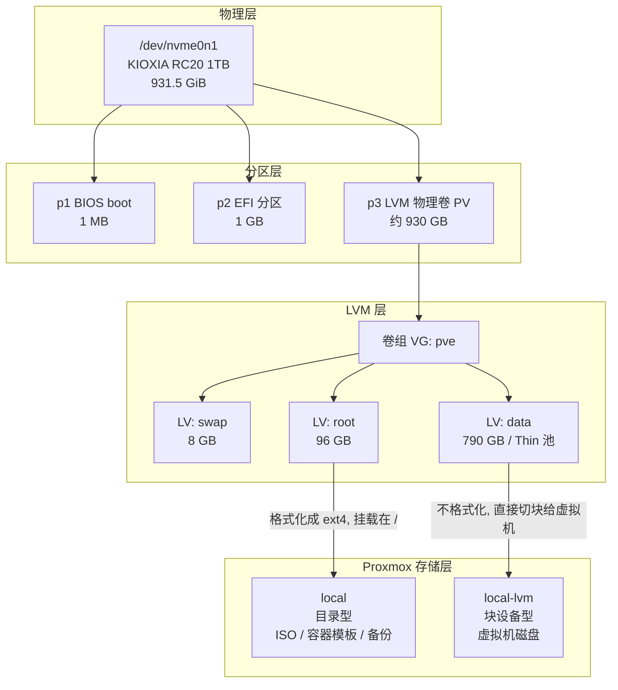

# 03 · Proxmox VE 核心概念

> **承接**：[02 · 节点初始化与网络规划](02-network.md)
> **面向**：宿主机已经装好、能登录 Web 界面，准备创建第一个虚拟机之前
> **为什么放在这里**：创建虚拟机的向导里有一半选项，不理解概念就只能瞎选 —— 而其中几项**装完就改不了**

---

## 1. 虚拟化的两条路：VM 与 LXC

Proxmox 同时提供两种"跑东西"的方式，很多人一开始分不清。

| | **虚拟机 (VM / KVM)** | **容器 (LXC)** |
|---|---|---|
| 内核 | **自带一个完整的内核** | **共享宿主机的内核** |
| 隔离级别 | 硬件级（CPU 的 VT-x 指令支持） | 内核命名空间 + cgroup |
| 内存开销 | 高（要跑完整的操作系统） | **低 60–70%** |
| 启动速度 | 30 秒 – 1 分钟 | **1–3 秒** |
| 能跑别的操作系统吗 | 能（Windows、BSD…） | 只能跑 Linux |
| 能加载内核模块吗 | 能 | **不能**（用的是宿主机内核） |
| 网络配置在哪 | **客户机系统内部** | **宿主机的 Web 界面上** |
| 适合什么 | k8s 节点、需要直通设备的、Windows | 无状态服务、数据库、监控、网关 |

### 什么时候必须用 VM

| 场景 | 原因 |
|---|---|
| **k8s 节点** | kubelet 需要自己的内核和独立的 cgroup 层级 |
| **设备直通**（GPU / 网卡） | VFIO 需要独立的 IOMMU 上下文 |
| **软路由 / VPN** | TUN/TAP、TPROXY、netfilter 需要内核能力，在 LXC 里要么配不了，要么要给容器开一堆危险权限 |
| **非 Linux 系统** | Windows、BSD |

### 什么时候优先用 LXC

无状态的、纯用户态的服务 —— 网关、监控、数据库、对象存储。**同样的服务，LXC 比 VM 少用 60–70% 内存**，在 32GB 的宿主机上这个差别很关键。

---

## 2. 存储：从物理盘到虚拟机磁盘

### 2.1 分层结构



### 2.2 LVM 是什么

**LVM = Logical Volume Manager（逻辑卷管理器）**，在物理硬盘和文件系统之间加的一层抽象。

**类比：**

| | 传统分区 | LVM |
|---|---|---|
| 做法 | 拿刀把硬盘切成几块 | 把硬盘倒进一个"**水池**"，再用"**杯子**"从池里舀 |
| 改大小 | 要重新分区，有丢数据风险 | **在线调整，随时改** |
| 加硬盘 | 只能当成另一块独立的盘 | **再倒一块进同一个池子，空间自动合并** |
| 快照 | 没有 | 原生支持 |

**三层结构：**

```
PV（Physical Volume，物理卷）      实际的硬盘或分区
      ↓ 倒进池子
VG（Volume Group，卷组）           一个大存储池，可由多块硬盘组成
      ↓ 舀出来
LV（Logical Volume，逻辑卷）        从池里切出的"虚拟分区"
```

**查看命令：**

```bash
pvs    # 物理卷：显示 /dev/nvme0n1p3 属于 VG pve
vgs    # 卷组：显示 pve 的总容量和剩余（VFree）
lvs    # 逻辑卷：显示 swap / root / data
```

### 2.3 local 与 local-lvm 的区别

| | **local** | **local-lvm** |
|---|---|---|
| 类型 | **目录（Directory）** | **LVM-Thin 块设备池** |
| 物理位置 | `/var/lib/vz`（在 root LV 上） | 卷组 `pve` 里的 `data` LV |
| 是不是文件系统 | 是（ext4） | **不是**，是"生"的块空间 |
| 能用 `ls` 看吗 | 能 | **不能** |
| 容量 | 约 96 GB（**和系统根分区共用**） | 约 790 GB |
| **存什么** | ISO 映像、容器模板、备份、片段 | **虚拟机磁盘、容器根文件系统** |

**一个好懂的类比：**

```
local      =  一个文件夹     → 放「文件」（ISO 是文件，备份是文件）
local-lvm  =  一块生硬盘空间 → 切成小块，直接当虚拟机的硬盘用
```

**为什么要分开**：虚拟机的磁盘走**裸块设备**，不经过宿主机文件系统那一层，**少一层开销、性能更好**，而且 LVM-Thin 原生支持快照。如果把虚拟机磁盘存成 `local` 里的 `.qcow2` 文件，就变成"文件系统里的文件里面又是一个文件系统"，多一层损耗。

**`local` 的目录结构：**

```
/var/lib/vz/
├── template/
│   ├── iso/      ← ISO 映像
│   └── cache/    ← LXC 容器模板
├── dump/         ← 备份文件
└── snippets/     ← cloud-init 配置片段
```

**实际使用对照：**

| 场景 | 选哪个 |
|---|---|
| 下载 ISO | `local` |
| 下载 LXC 容器模板 | `local` |
| **创建虚拟机时的"存储"栏** | **`local-lvm`** |
| **EFI 磁盘的存储栏** | **`local-lvm`** |
| 创建 LXC 容器的"根磁盘存储" | `local-lvm` |
| 备份 | **别长期放 `local`** |

### 2.4 `local` 容量有限，且和系统共用

```
96 GB  =  Proxmox 系统本身（约 4 GB）
        + ISO 映像
        + 容器模板
        + 备份文件          ← 危险来源
```

**把备份堆在 `local` 里会撑满根分区** → 系统日志写不进去、服务异常、Web 界面打不开。

**使用原则：**

| 内容 | 建议 |
|---|---|
| ISO 映像 | 放 `local`，但**只留常用的 2–3 个**，装完就删 |
| 容器模板 | 放 `local`，每个才 100–200 MB，无压力 |
| **备份** | **别长期放 `local`**，放外接硬盘、NAS 或另一台节点的 NFS |

```bash
df -h /       # local 的实际使用情况
lvs           # data 那行的 Data% = local-lvm 使用率
```

### 2.5 Thin（精简置备）与爆池风险

`local-lvm` 的完整类型是 **LVM-Thin**。

| | 厚置备 Thick | **精简置备 Thin** |
|---|---|---|
| 分配 100GB 给虚拟机 | 立刻占用 100GB | **只占实际写入的那部分** |
| 装完系统用了 5GB | 仍占 100GB | **只占 5GB** |
| 能超额分配吗 | 不能 | **能** |

**好处**：可以给 10 台虚拟机每台分配 100GB（声称 1000GB），而池子只有 790GB —— 因为实际加起来可能只用了 80GB。

**风险**：

```
一旦所有虚拟机实际写入的总量逼近池容量
  → 池子爆掉
  → 所有虚拟机的写操作同时失败，可能损坏文件系统
```

**这比普通磁盘满严重得多** —— 普通磁盘满只影响那一台，thin 池爆掉影响池上的**所有**实例。

**两条防护：**

```
① 定期看：节点 → local-lvm → 摘要，或 lvs 的 Data% 列
② 超过 80% 就要处理：删快照、清理不用的 VM、或扩容
③ 【关键】虚拟机磁盘必须勾选 Discard，否则空间只增不减（见 4.2）
```

### 2.6 为什么不用 ZFS

Proxmox 安装时可以选 ZFS，但在**单盘 + 无 DRAM 缓存 SSD + 32GB 内存**的场景下不合适：

| | ext4 + LVM-Thin | ZFS |
|---|---|---|
| 写放大 | 低 | **高**（CoW + 元数据），加速无 DRAM SSD 老化 |
| 内存占用 | 低 | **ARC 缓存默认吃掉一半内存** |
| 快照 | LVM-Thin 原生支持 | 支持 |
| 校验和 / 自愈 | 无 | 有，**但需要冗余盘才有意义**（单盘只能发现损坏，不能修复） |

ZFS 的优势（自愈、多盘池化、压缩）在单盘家用场景用不上，劣势全中。

---

## 3. 网络：vmbr0 虚拟网桥

### 3.1 模型

```
物理网卡 enp3s0
     │
  vmbr0 ← Linux Bridge，本质是一个虚拟二层交换机
   ├── 宿主机自己   192.168.5.10
   ├── VM1         192.168.5.90
   └── CT1         192.168.5.22
```

**关键认知**：`vmbr0` 是虚拟交换机，宿主机的物理网卡是它的一个"上行口"。虚拟机接在它上面，**每台有独立的 MAC 地址**，对路由器来说和局域网里的物理设备完全平级。

### 3.2 三个实际影响

| 影响 | 说明 |
|---|---|
| **虚拟机的 IP 从局域网段取** | 不需要额外的 NAT 或路由配置，直接分配 `192.168.5.x` |
| **路由器能看到虚拟机** | 客户端列表里会出现它们，可以做 DHCP 保留 |
| **同宿主机上的虚拟机互通走内存** | 流量不上物理网线，速度是内存级别 —— 这也是"跨机传大文件慢"在实际中影响不大的原因 |

### 3.3 VM 与 LXC 的网络配置位置不同

| | 配置在哪 |
|---|---|
| **LXC 容器** | **宿主机的 Web 界面**（`容器 → Network`）。容器内的配置文件由 Proxmox 自动生成 |
| **虚拟机** | **客户机系统内部**（netplan / interfaces）。Proxmox 只负责把虚拟网卡接到 `vmbr0` |

例外：如果 VM 装了 **cloud-init**，可以在 Proxmox 的 `Cloud-Init` 标签页填 IP，开机时自动注入 —— 兼顾了两者的便利。

---

## 4. 虚拟机的硬件模型

创建向导里的选项，按"影响程度"排序。

### 4.1 机型：i440fx vs q35

| | i440fx（默认） | **q35** |
|---|---|---|
| 模拟的芯片组 | Intel 440FX（1996 年） | Intel Q35（2009 年） |
| 总线 | **只有 PCI**，无原生 PCIe | **原生 PCIe** |
| 设备数量 | 32 个 PCI 槽 | 更多 PCIe 端口 |

**为什么选 q35**：PCIe 设备直通需要真正的 PCIe 总线。在 i440fx 下，直通的显卡要经过"PCI 转 PCIe 桥"模拟，现代显卡（尤其 NVIDIA）经常初始化失败、驱动报 Code 43、或者能启动但性能异常。

**改起来的代价（装完系统后改）：**

```
客户机看到的硬件全变了
  → 磁盘控制器变了，/dev/sda 可能变成别的
  → 网卡的 PCI 地址变了，ens18 可能变成 ens19
  → 系统起不来，或者起来了没网
```

### 4.2 BIOS：SeaBIOS vs OVMF

| | SeaBIOS（默认） | **OVMF (UEFI)** |
|---|---|---|
| 是什么 | 传统 Legacy BIOS 的开源实现 | UEFI 固件的开源实现（基于 Intel TianoCore） |
| 引导方式 | MBR | GPT + EFI 分区 |
| 磁盘上限 | 2 TB | 无实际限制 |
| 启动速度 | 慢 | 快 |

**为什么选 OVMF**：

| 理由 | 说明 |
|---|---|
| **GPU 直通几乎必须** | 现代显卡的 VBIOS 是 **UEFI GOP** 格式，SeaBIOS 下显卡输出经常黑屏 |
| 和 q35 配套 | 现代芯片组 + 现代固件，这是标准组合 |
| 和宿主机一致 | Proxmox 本身也是 UEFI 引导的 |

**代价**：需要一个 **EFI 磁盘**（约 528 KB），存放 UEFI 的 NVRAM 变量 —— 启动项顺序、Secure Boot 密钥这些"固件级别的设置"。物理主板上这些存在 CMOS 芯片里，虚拟机没有芯片，所以要一个小文件来充当。

**预注册密钥（Pre-Enroll Keys）**：预先把微软的 Secure Boot 证书写进 EFI 磁盘。

| 场景 | 建议 |
|---|---|
| Linux 客户机 | **取消勾选**。用不到 Secure Boot，某些发行版的 shim 签名链偶尔会有问题，开着多一层排查点 |
| **Windows 11 客户机** | **必须勾选**（Win11 硬性要求 Secure Boot + TPM） |

### 4.3 VirtIO 全家桶

这是理解虚拟机性能的核心概念。

```
传统方式（模拟真实硬件芯片）：
  客户机驱动 → 写寄存器 → QEMU 逐条解释寄存器操作 → 转成真实 IO
  每个 IO 都要模拟一遍硬件行为，开销大

VirtIO（半虚拟化 paravirtualization）：
  客户机【知道自己在虚拟机里】→ 通过共享内存的环形队列直接投递请求
  没有硬件模拟开销，性能高数倍
```

| 设备类型 | 传统模拟 | **VirtIO 版本** |
|---|---|---|
| 磁盘控制器 | LSI 53C895A / AHCI | **VirtIO SCSI** |
| 网卡 | RTL8139 / Intel E1000 | **VirtIO 网络设备** |
| 显卡 | 标准 VGA | VirtIO-GPU |
| 内存回收 | — | **VirtIO 气球设备** |
| 主机通信 | — | **VirtIO Serial**（Guest Agent 走这条） |

**SCSI 控制器为什么选 `VirtIO SCSI single`**：`single` 表示**每块磁盘一个独立的控制器**，配合 IO thread 时每块盘有自己的处理线程，多盘时不会互相阻塞。

**磁盘总线的四种选择：**

| 总线 | 性能 | 支持 TRIM | 支持 SSD 仿真 | 说明 |
|---|---|---|---|---|
| IDE | 最慢 | 否 | 否 | 只为兼容极老系统 |
| SATA | 中等 | 部分 | 部分 | 模拟真实 SATA 控制器 |
| VirtIO Block | 快 | 有限 | **否** | 快但功能少 |
| **SCSI**（配 VirtIO SCSI） | **快** | **完整** | **是** | **兼具性能和功能** |

### 4.4 磁盘的三个关键开关

#### Discard（丢弃）

**作用**：让虚拟机内部的 **TRIM / UNMAP 命令**穿透到底层的 LVM-Thin 池。

```
不勾 Discard：
  VM 里写了 10GB 文件  →  thin 池占用 +10GB
  VM 里删掉这 10GB     →  thin 池占用【不变】
  → 池子占用【只增不减】，单调增长
  → 最终池子爆掉

勾了 Discard：
  VM 里删掉文件 → 发出 UNMAP → LVM-Thin 把那些块标记为空闲
  → 空间还回池子
```

**这是精简置备场景下最重要的一个选项。** 不勾的话，thin provisioning 的省空间优势完全失效，还多了爆池风险。

#### SSD 仿真

**作用**：告诉客户机"你的磁盘是 SSD，不是机械盘"。

| 效果 | 说明 |
|---|---|
| 客户机自动启用周期性 TRIM | 配合 Discard 才有意义 |
| 禁用为机械盘设计的 IO 调度优化 | 电梯算法、激进预读对 SSD 反而有害 |

**注意**：VirtIO Block 总线不支持这个选项，**SCSI 才支持** —— 这是选 SCSI 的又一个理由。

#### IO thread

**作用**：给这块磁盘分配一个**专用线程**处理 IO，而不是共用 QEMU 的主事件循环。

磁盘 IO 阻塞时不会卡住虚拟机的其他操作（网络收发、中断处理），多磁盘时提升明显。

### 4.5 缓存模式

| 模式 | 用宿主机页缓存 | 写入何时被确认 | 断电风险 |
|---|---|---|---|
| **无缓存 (none)** | 绕过 | 数据真正落盘后 | **安全** |
| 回写 (writeback) | 用 | 写进宿主机内存就确认 | 宿主机断电丢数据 |
| 直写 (writethrough) | 读用 | 落盘后 | 安全，但写很慢 |
| **不安全 (unsafe)** | 用 | 立即确认，**忽略 flush** | **绝对不要用** |

**为什么选"无缓存"**：客户机自己已经有一层页缓存了，宿主机再缓存一层是重复的 —— 既浪费宿主机内存，又增加断电时丢数据的窗口。

**`unsafe` 会忽略客户机的 fsync 请求**（数据库靠 fsync 保证持久化），宿主机异常关机基本必然导致数据损坏。它只适合"装系统时临时加速，装完立刻改回来"。

### 4.6 CPU 类别

| | kvm64 / x86-64-v2-AES（默认） | **host** |
|---|---|---|
| 暴露给客户机的 | 一个"**最小公倍数**"CPU 模型，只有通用指令集 | 宿主 CPU 的**全部特性** |
| 目的 | 保证虚拟机能在**任何**宿主机之间在线迁移 | 性能最大化 |
| AVX2 / AVX-512 / AES-NI | **不可见** | **全部可用** |

**性能差距：**

| 场景 | 影响 |
|---|---|
| 编译、压缩 | AVX2 带来 20–50% 提升 |
| 加密（TLS、磁盘加密） | AES-NI 硬件加速，快 5–10 倍 |
| **AI 推理的 CPU 部分** | AVX2/AVX-512 对矩阵运算影响巨大，可能差 2–4 倍 |
| **某些软件直接拒绝启动** | llama.cpp 等会检测指令集，缺 AVX2 直接报错或退回极慢的路径 |

**代价**：用了 `host` 就不能把虚拟机**在线迁移**到 CPU 型号不同的宿主机上（客户机已经在用宿主 CPU 的特有指令，换一颗 CPU 那些指令就没了 → 崩溃）。

**为什么在本环境不受影响：**

```
① 两台宿主机的 CPU 型号本来就不同，本来就不可能在线迁移
② k8s 的高可用靠【应用层重新调度 Pod】，不靠 VM 迁移
③ 家用场景需要停机维护时，关机再开就行
```

**NUMA**：多路 CPU 服务器上，每颗 CPU 有自己直连的内存，访问另一颗 CPU 的内存要绕路。单路 CPU 只有一个 NUMA 节点，**开了没有任何意义**。

### 4.7 内存气球（Ballooning）

**是什么**：一个虚拟设备，宿主机内存紧张时可以**"膨胀"占住客户机内部的内存**，逼客户机释放，从而把物理内存还给宿主机。

```
客户机分配 8GB，实际只用了 2GB
  → 气球膨胀 6GB，占住那 6GB
  → 宿主机可以把这 6GB 物理内存分给别的虚拟机
```

**平时保持开启**：能超额分配内存。可以给 5 台 VM 各分 8GB（共 40GB），而物理只有 32GB。

**什么时候必须关闭：GPU 直通的虚拟机。**

原因：VFIO 直通要把客户机的内存**固定映射**到设备的 DMA 地址空间。显卡通过 DMA 直接读写这块内存，如果内存被气球动态回收/换页，显卡访问到的就是无效地址 → **宿主机内核崩溃**。

> **一个重要区别**：vCPU 可以超额分配（时间片轮转），**内存不能**（除非用气球）。这是规划虚拟机规格时的核心约束。

### 4.8 QEMU Guest Agent

**是什么**：宿主机和客户机之间的一条**旁路通信通道**（走 virtio-serial，不占用网络）。

| 作用 | 没有它会怎样 |
|---|---|
| 报告 IP 和主机名 | Proxmox 摘要页的 IP 一栏**永远空白** |
| **优雅关机** | 点"关机"只能发 ACPI 电源键事件，客户机卡住时只能强制断电（相当于拔电源） |
| 备份时冻结文件系统（fsfreeze） | 数据库可能处于写入中间状态，恢复出来的备份不一致 |

**关键：两边都要有**

```
Proxmox 侧勾选「QEMU 代理」          →  只是【打开这条通道】
客户机里 apt install qemu-guest-agent →  【有人在通道那头应答】

只做一半，等于没做
```

验证方法：装完 agent 后回 Proxmox 网页看虚拟机的「摘要」页，**IP 地址那一栏显示出来**就是生效了。

---

## 5. "事后很难改"的设置清单

| # | 设置 | 事后改的代价 |
|---|---|---|
| 1 | **机型 q35** | 硬件拓扑全变，系统可能起不来 |
| 2 | **BIOS = OVMF** | 引导方式变了，必须重装 |
| 3 | **VM ID** | **不能改**，只能克隆一份新的 |
| 4 | **磁盘勾 Discard** | 能改，但之前泄漏的空间要手动 `fstrim` 回收 |
| 5 | **CPU = host** | 能改，重启生效（这条最容易） |

其余的（内存、核心数、磁盘大小、网卡模型）都能随时调整。

---

## 6. 术语速查

| 术语 | 全称 | 一句话解释 |
|---|---|---|
| **PVE** | Proxmox Virtual Environment | 基于 Debian 的开源虚拟化平台 |
| **KVM** | Kernel-based Virtual Machine | Linux 内核的虚拟化模块，提供硬件级隔离 |
| **QEMU** | Quick Emulator | 硬件模拟器，和 KVM 配合提供完整虚拟机 |
| **LXC** | Linux Containers | 操作系统级容器，共享宿主机内核 |
| **LVM** | Logical Volume Manager | 硬盘和文件系统之间的抽象层，支持在线调整大小 |
| **PV / VG / LV** | Physical / Volume Group / Logical Volume | LVM 的三层：物理卷 → 卷组 → 逻辑卷 |
| **Thin Provisioning** | 精简置备 | 按实际写入量占空间，允许超额分配 |
| **VirtIO** | — | 半虚拟化设备标准，客户机知道自己在虚拟机里，性能远高于硬件模拟 |
| **vmbr0** | Virtual Machine Bridge | Linux 虚拟网桥，本质是二层交换机 |
| **q35 / i440fx** | — | 模拟的芯片组型号，q35 有原生 PCIe |
| **OVMF** | Open Virtual Machine Firmware | UEFI 固件的开源实现 |
| **SeaBIOS** | — | 传统 Legacy BIOS 的开源实现 |
| **VFIO** | Virtual Function I/O | 内核框架，把物理设备直通给虚拟机 |
| **IOMMU** | Input-Output Memory Management Unit | 硬件单元，为设备提供地址转换和隔离，直通的前提 |
| **VT-x / VT-d** | Virtualization Technology / for Directed I/O | Intel 的 CPU 虚拟化 / 设备直通指令集 |
| **Ballooning** | 内存气球 | 动态回收客户机未使用内存的机制 |
| **Guest Agent** | QEMU Guest Agent | 宿主机与客户机之间的旁路通信通道 |
| **Discard / TRIM / UNMAP** | — | 通知底层存储"这些块已经没用了"的命令 |
| **ESP** | EFI System Partition | FAT32 格式的分区，存放 UEFI 引导程序 |
| **GOP** | Graphics Output Protocol | UEFI 下显卡输出画面的协议，老显卡可能不支持 |
| **CIDR** | Classless Inter-Domain Routing | `192.168.5.10/24` 这种"地址 + 掩码位数"的写法 |

---

**下一步** → [04 · 虚拟机创建与模板化](04-vm-template.md)
