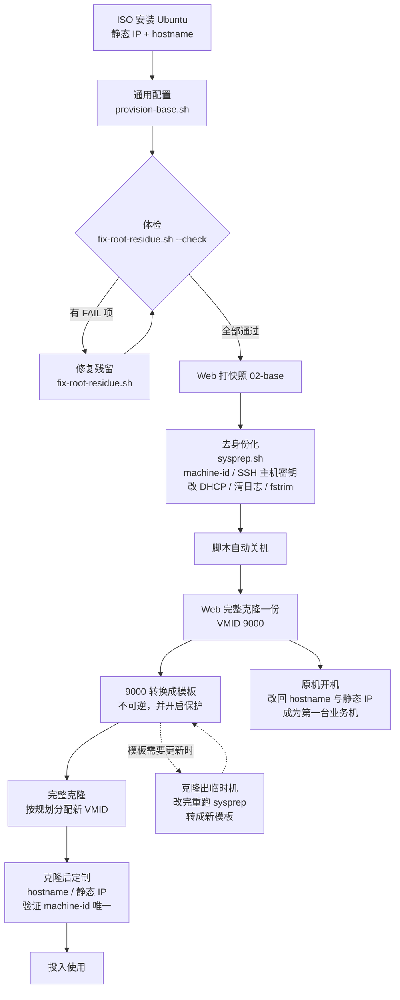

# 04 · 虚拟机创建与模板化

> **承接**：[03 · Proxmox VE 核心概念](03-proxmox-concepts.md)
> **本文的两个目标**：① 用 ISO 装出第一台可用的 Ubuntu 虚拟机；② 把它清理成一个可以反复克隆的模板
> **各项配置的"为什么"**已在 [03](03-proxmox-concepts.md) 详述，本文只给结论和操作

---

## 0. 模板生命周期



> **为什么是「先克隆到 9000 再转模板」，而不是直接把本机转掉**
> 转模板**不可逆**，被转掉的那台**再也开不了机**。先克隆一份出去做模板，原机就能原地改回身份、直接当第一台业务机用，省掉一次克隆。详见 [6.5](#65-转换成模板)。

---

## 1. 准备 ISO

### 1.1 版本选择

| 版本 | 评价 |
|---|---|
| **Ubuntu 24.04 LTS (Noble Numbat)** | **推荐**。NVIDIA 驱动、CUDA、vLLM、k8s 的官方文档和社区经验绝大多数基于它 |
| 最新的 LTS（如 26.04） | 支持周期更长，但刚发布几个月 —— **遇到问题搜不到答案**，第三方软件适配还不全 |

用太新的系统会让时间花在"为什么教程里的命令在我这不работ"上，而不是花在真正想学的东西上。

**下 Server 版，不要 Desktop 版**。文件名形如 `ubuntu-24.04.x-live-server-amd64.iso`。Desktop 版带图形界面，对服务器纯属浪费（多占 4GB 磁盘 + 几百 MB 内存）。

### 1.2 让 Proxmox 自己下载（推荐）

不经过浏览器，服务器直连下载。

```
左侧展开节点 → local → ISO 映像 → 【从 URL 下载 / Download from URL】
  ① 粘贴 URL → 点【查询 URL】（会自动填好文件名和大小）
  ② 确认文件名含 live-server
  ③ 点【下载】
```

国内镜像（快得多）：

```
https://mirrors.aliyun.com/ubuntu-releases/24.04/
https://mirrors.ustc.edu.cn/ubuntu-releases/24.04/
```

> 🔴 **不要用清华 TUNA。** 它拒绝本地这个 IPv4（接受 IPv6，但光猫的 IPv6
> WAN 已关闭），ISO 下载同样 403，返回的还是它自己的 HTML 提示页。
> 完整机制见 [02 · 旁路由「坑 9」](../02-gateway/README.md)。

等价的 Shell 操作：

```bash
cd /var/lib/vz/template/iso/
wget https://mirrors.aliyun.com/ubuntu-releases/24.04/ubuntu-24.04.x-live-server-amd64.iso
```

校验：

```bash
sha256sum ubuntu-24.04.x-live-server-amd64.iso
curl -s https://mirrors.aliyun.com/ubuntu-releases/24.04/SHA256SUMS | grep live-server
```

---

## 2. 创建虚拟机

### 2.1 建议先建一台练手机

```
名称:   vm-test
VMID:   190
IP:     192.168.5.90    ← 预留段，跑通流程后删掉或转成模板
```

第一台难免要重来几次，用预留地址练手，正式的实例等熟了再按规划表建。

### 2.2 逐页配置

#### 常规 (General)

| 字段 | 填 | 说明 |
|---|---|---|
| 节点 | `pve-old` | — |
| **VM ID** | `190` | 建议 **100 + IP 尾数**。看到 `qm stop 190` 就知道动的是 `.90` 那台。**创建后不能改** |
| 名称 | `vm-test` | 纯显示标签，随时可改 |

配置文件路径：`/etc/pve/qemu-server/190.conf`

#### 操作系统 (OS)

| 字段 | 选 |
|---|---|
| 存储 | `local` |
| ISO 映像 | 刚下的 Ubuntu Server |
| 类别 | `Linux` |
| 版本 | `6.x - 2.6 Kernel` |

> 这不是"检测系统"，而是告诉 QEMU 采用哪一套默认硬件参数。选 Linux 会启用 `kvm-clock` 时钟源、假定支持 VirtIO、硬件时钟按 UTC 处理。**选成 Windows 会导致 Linux 客户机时间差 8 小时**。

#### 系统 (System) —— 三个必改

| 字段 | 默认 | **改成** | 事后能改吗 |
|---|---|---|---|
| **机型** | `i440fx` | **`q35`** | **不能**（系统会起不来） |
| **BIOS** | `SeaBIOS` | **`OVMF (UEFI)`** | **不能**（必须重装） |
| EFI 存储 | — | `local-lvm` | — |
| 预注册密钥 | 勾着 | **取消勾选**（Linux 客户机） | 能 |
| SCSI 控制器 | `VirtIO SCSI single` | 保持默认 | — |
| **QEMU 代理** | 不勾 | **勾上** | 能 |

#### 磁盘 (Disks)

| 字段 | 设成 |
|---|---|
| 总线/设备 | **SCSI** |
| 存储 | **`local-lvm`** |
| 磁盘大小 | 练手 `32` GB；k8s 节点建议 `60–100` GB |
| **丢弃 (Discard)** | **勾上** |
| **SSD 仿真** | **勾上** |
| **IO thread** | 勾上 |
| 缓存 | 保持 `默认(无缓存)` |

#### CPU

| 字段 | 设成 |
|---|---|
| 插槽 | `1` |
| 核心 | `2`（练手） |
| **类别** | 默认 `x86-64-v2-AES` → **改成 `host`** |

#### 内存 (Memory)

| 字段 | 设成 |
|---|---|
| 内存 | `4096` MB |
| 气球设备 | 保持勾选（**GPU 直通的虚拟机必须取消**） |

#### 网络 (Network)

| 字段 | 设成 |
|---|---|
| 桥接 | `vmbr0` |
| 模型 | **VirtIO (半虚拟化)** |
| VLAN 标签 | 留空 |
| 防火墙 | **取消勾选**（起步阶段少一层排查点，随时能开） |

> Proxmox 这一侧只负责"把网线插到 `vmbr0` 上"，**不管 IP**。IP 是在客户机系统内部配的。

---

## 3. Ubuntu 安装向导

### 3.1 网络配置

```
Network connections
   ens18   eth   -              ← 选中它，回车
       → Edit IPv4
           IPv4 Method:    Manual         （不要用 Automatic/DHCP）
           Subnet:         192.168.5.0/24 ← 【网段】
           Address:        192.168.5.90   ← 【本机地址】
           Gateway:        192.168.5.1
           Name servers:   223.5.5.5,119.29.29.29
           Search domains: (留空)
       → Save
```

| 常见错误 | 后果 |
|---|---|
| **`Subnet` 和 `Address` 填反** | 系统认为自己的地址是 `192.168.5.0`（网络地址，非法）→ 完全不通 |
| 用 DHCP | 服务器地址会被写死在别的地方（k8s 证书、监控目标、其他服务的配置），租约到期换地址就全废 |

> 网卡名是 `ens18`（VirtIO 网卡的标准命名），不是 `eth0`。

### 3.2 引导式存储配置 —— 三个决定

```
Guided storage configuration

  (X) Use an entire disk
      [ /dev/sda   local disk   32.000G  ▼ ]
      [X] Set up this disk as an LVM group
          [ ] Encrypt the LVM group with LUKS

  ( ) Custom storage layout
```

#### 决定一：整盘 vs 自定义

| | **Use an entire disk** | Custom storage layout |
|---|---|---|
| 做什么 | 自动划分好所有分区 | 手动一个个建 |
| 适合 | **虚拟机、绝大多数场景** | 有特殊分区需求时 |

**什么时候才需要 Custom**：给某个容易膨胀的目录单独一个分区，防止它撑爆根分区。

| 目录 | 谁会撑爆它 |
|---|---|
| `/var/log` | 日志失控（某个服务疯狂报错） |
| **`/var/lib/containerd`** | **容器镜像**，k8s 节点上很容易几十 GB（CUDA 基础镜像动辄 5–10GB） |

根分区被撑满的后果很严重：系统日志写不进去、SSH 登不上（需要写临时文件）、服务批量异常。独立分区能把损害限制在那一个目录里。

> 练手 VM 不需要。**以后建 k8s 节点时可以考虑**，或者更简单：把根盘直接给大一点（60–100GB）。

#### 决定二：LVM 勾不勾 —— 建议保持勾选

| | **勾 LVM** | 不勾 |
|---|---|---|
| 分区结构 | 多一层抽象 | 简单直接 |
| **加第二块虚拟磁盘扩容** | **直接吸收进 VG，不碰分区表** | 只能挂在别的目录，不能扩根分区 |
| 扩大原有磁盘 | `pvresize` + `lvextend` + `resize2fs` | `growpart` + `resize2fs` |
| 客户机内快照 | 支持 | 不支持 |

**一个合理的疑问**：Proxmox 那层已经有 LVM 了，客户机里再套一层不重复吗？

确实有点重复，但仍建议勾上：

| 理由 | 说明 |
|---|---|
| **加盘扩容更灵活** | 磁盘不够时在 Proxmox 里加一块新虚拟磁盘 → 客户机里 `vgextend` 吸收 → 根分区在线变大，**全程不重启、不碰分区表** |
| 这是 Ubuntu 的默认路径 | 出问题时网上搜到的答案都基于这个结构 |

**不勾也完全能用**，这是"两个都对"的选择。

#### 决定三：LUKS 加密 —— 不要勾

```
勾了之后：每次开机 → 停在密码提示符 → 必须有人手动输密码 → 才继续启动
```

| 场景 | 后果 |
|---|---|
| 宿主机断电重启 | 虚拟机停在密码提示符，服务全挂，直到你去控制台手动输 |
| 你人在外地 | 只能远程连 Proxmox 开控制台输密码 —— 前提是网络还通 |
| 自动化重启（升级内核） | 完全没法无人值守 |

它防的是**物理威胁**（有人偷走硬盘直接读数据）。家用虚拟机的威胁模型不成立 —— 而且 **Proxmox 宿主机那一层本来就没加密**，虚拟磁盘躺在宿主机上，能拿到宿主机就什么都能拿到。

### 3.3 生成的分区结构

```
/boot/efi   1.0 G   fat32   ESP（EFI 系统分区）
/boot       2.0 G   ext4    内核 + initrd + GRUB
/           剩余     ext4    LVM 逻辑卷 ubuntu-lv
```

| 分区 | 为什么存在 |
|---|---|
| **`/boot/efi`** | **必须是 FAT32** —— UEFI 规范只要求固件实现 FAT 驱动，加载操作系统之前它不认识 ext4。因为在 Proxmox 里选了 OVMF 才有这个分区；选 SeaBIOS 会换成一个 1MB 的 BIOS boot 分区 |
| **`/boot`** | 根分区在 LVM 里面。GRUB 虽然能读 LVM，但**读一个普通 ext4 分区更简单可靠**。2GB 不大 —— 每个内核版本约 150–200MB，Ubuntu 默认保留 2–3 个旧内核以便回滚 |
| `/` | LVM 逻辑卷，主体 |

### 3.4 关键的坑：`ubuntu-lv` 没有占满卷组

```
USED DEVICES
  ubuntu-vg (new)   LVM volume group   28.996G
    ubuntu-lv (new)                    16.996G   ← 只拿了一半多
    free space                         12.000G   ← 白白空着
```

**Ubuntu 的引导式 LVM 默认只分配一部分空间给根分区**，留出空闲给以后做快照或划分独立分区。在物理服务器上这个保留有价值，**但对虚拟机没必要** —— 虚拟机的磁盘本身就能在 Proxmox 里随时扩大。

不改的话，你以为给了 32GB，实际能用的只有 17GB —— 装几个容器镜像就满了。

#### 修复方法一：装的时候就改（推荐）

```
① 用方向键移到 USED DEVICES 里的 ubuntu-lv 那一行
② 回车 → 选【Edit】
③ Size 那一栏：直接清空（留空 = 用满所有可用空间），或填一个具体值
④ 选【Save】
⑤ 回到摘要，确认 / 的大小接近磁盘总容量
⑥ 【Done】→【Continue】（会警告要格式化磁盘）
```

#### 修复方法二：装完之后扩

```bash
sudo vgs                                          # 看 VFree 有多少空闲
sudo lvextend -l +100%FREE /dev/ubuntu-vg/ubuntu-lv
sudo resize2fs /dev/ubuntu-vg/ubuntu-lv           # 这一步不能省
df -h /
```

**全程在线，不用重启、不会丢数据。**

> `lvextend` 只是把"容器"变大了，文件系统还不知道自己可以用更多空间。**两步都做才生效。**

### 3.5 用户设置

Ubuntu 安装器**强制要求建一个普通用户**，并**默认锁定 root 账号**（root 密码字段是 `!`，任何输入都无法匹配）。这是 Ubuntu 的设计，没有跳过选项。

```
Your name:            Jing              ← 只是显示名
Your server's name:   vm-test           ← 【这就是 hostname】，别填成人名
Pick a username:      jing              ← 登录用的用户名
Choose a password:    ********
```

**日常不需要解锁 root**：

```bash
sudo -i          # 直接得到完整的 root shell，提示符变成 root@vm-test:~#
```

**真要启用 root，三个层次：**

| 层次 | 做法 | 评价 |
|---|---|---|
| ① 仅本地控制台 | `sudo passwd root` | 设完密码自动解锁，**不影响 SSH** |
| ② **root 密钥 SSH** | 把公钥放到 `/root/.ssh/authorized_keys` | **推荐的折中**。Ubuntu 的 sshd 默认就是 `prohibit-password`，不用改配置。这也是 Proxmox/Debian 的默认模式 |
| ③ root 密码 SSH | `PermitRootLogin yes` | **不建议**。root 是全世界都知道的用户名，开放密码登录等于把攻击面减半 |

**建议按 Ubuntu 默认来**，理由不是安全教条：

```
① k8s、Ansible、绝大多数工具的文档都假设「普通用户 + sudo」
② sudo 有审计日志（/var/log/auth.log），能查"这个配置什么时候被改的"
③ 沉淀的技术文档用行业标准做法才有参考价值
```

代价是多打四个字母，可以配成免密：

```bash
echo "$USER ALL=(ALL) NOPASSWD:ALL" | sudo tee /etc/sudoers.d/$USER
sudo chmod 440 /etc/sudoers.d/$USER
```

> **为什么 Proxmox 是 root 直登、Ubuntu 不是**：Debian 保留传统 Unix 的 root 模型，Ubuntu 从一开始就推 sudo 模型。都能用，跟着各自的默认走最省事。

### 3.6 Ubuntu Pro —— Skip for now

Canonical 的订阅服务，**个人用户最多 5 台机器免费**。

| 功能 | 说明 |
|---|---|
| **ESM（扩展安全维护）** | 安全更新从 5 年延长到 10 年 |
| **扩大覆盖范围** | 免费版只对 `main` 仓库（约 2300 个包）提供安全更新；Pro 覆盖 `universe` 的 23000+ 个包 |
| Livepatch | 内核热补丁，打安全补丁不用重启 |

**现在选 `Skip for now`**：启用要登录账号拿 token，安装流程多一步；随时能后补（`sudo pro attach <token>`）；24.04 标准支持到 2029 年，ESM 现在用不上；实验虚拟机随时可能重建，绑 5 台的免费额度不划算。

跳过后每次登录会看到一行 ESM 广告，纯属美观问题，嫌烦可以关：

```bash
sudo pro config set apt_news=false
sudo chmod -x /etc/update-motd.d/88-esm-announce 2>/dev/null
sudo chmod -x /etc/update-motd.d/91-contract-ua-esm-status 2>/dev/null
```

### 3.7 SSH 与 Snap

```
SSH Setup
  [X] Install OpenSSH server           勾上
  Import SSH identity: from GitHub     ← 公钥在 GitHub 上的话可以直接导入
```

不装 OpenSSH 的话只能用 Proxmox 的控制台 —— 那是 **VNC**，输入有延迟、不能复制粘贴、终端尺寸受限。装几十台 VM 会崩溃。

**Featured server snaps 一个都别选。** Snap 自带运行时、包体积大、启动慢、还会跑后台更新守护进程。服务器上用 `apt` 就够了。

### 3.8 安装完成时的一个坑

**不要在点 "Reboot Now" 之前卸载 ISO。**

```
点 Reboot Now 时，系统仍运行在【从 ISO 启动的临时环境】里
  → 卸载 ISO → 临时环境的根文件系统凭空消失
  → shutdown 可执行文件读不到 → 报 "Failed to execute shutdown binary"
```

**这不是故障，安装已经完成了**，硬盘上的系统是好的。处理：

```
Proxmox 网页 → 虚拟机 →【停止 / Stop】（强制断电，不是「关机」）→ 再【启动】
```

用「停止」而不是「关机」：客户机的 shutdown 已经坏了不会响应 ACPI 信号，「关机」会一直等到超时。这次强制断电是安全的 —— 安装早就写完盘了。

**更干净的做法：不卸载 ISO，改引导顺序**

```
虚拟机 → 选项 (Options) → 引导顺序 (Boot Order) → 编辑
  → 把 scsi0（硬盘）拖到第一位
  → 把 ide2（CD/DVD）取消勾选或排到最后
```

这样 ISO 可以一直挂着不用管，需要重装或救援时随时能用回它。

---

## 4. 装完必做

```bash
# ① QEMU 代理（Proxmox 侧勾选只是打开通道，客户机里必须装上软件才能应答）
sudo apt update
sudo apt install -y qemu-guest-agent
sudo systemctl enable --now qemu-guest-agent

# ② 系统更新
sudo apt full-upgrade -y

# ③ 检查根分区是否被 LVM 只分了一半
df -h /
sudo vgs        # VFree 应该接近 0
```

**验证：**

```bash
# 确认是 UEFI 引导（对应选的 OVMF）
[ -d /sys/firmware/efi ] && echo "UEFI ✓" || echo "Legacy ✗"

# 从另一台机器
ping -c 3 192.168.5.90
ssh jing@192.168.5.90
```

装完 guest-agent 后回 Proxmox 网页看虚拟机的「摘要」页，**IP 地址那一栏显示出来**就是生效了。

---

## 5. 模板通用配置脚本

系统装完之后、去身份化之前，跑一遍 [`scripts/provision-base.sh`](scripts/provision-base.sh)，把**所有克隆机都需要**的东西一次配齐。

### 5.1 边界：什么进模板，什么不进

模板的价值在于**省掉重复劳动**，而不是"功能齐全"。判断标准只有一条：**是不是每台克隆机都要**。

| ✅ 进模板 | 理由 |
|---|---|
| `qemu-guest-agent` | 不装的话 Proxmox 看不到 VM 的 IP、「关机」按钮无响应 |
| SSH 公钥、sudo 免密 | 否则每台克隆都要重配一遍 |
| 时区、NTP、DNS、journald 限制 | 系统级基础，每台都要 |
| 运维/研发工具、语言运行时 | 开局第一件事都是装这些 |

| ❌ 不进模板 | 理由 |
|---|---|
| **桌面环境（XFCE / xrdp）** | 7 台克隆里只有 2 台需要。让 5 台白背 500 MB 磁盘和一堆用不上的包 |
| **业务软件**（Jellyfin、qBittorrent、数据库…） | 各机器角色不同 |
| **Docker** | 见 5.4 |
| `/etc/fstab` 的外接盘挂载 | 每台机器接的盘不一样 |

> **一个反模式**：先装满所有软件，做模板时再卸载掉不需要的。
> `apt remove` 会残留配置文件、数据目录、用户、systemd unit、apt 源和 GPG key；`apt purge` 也不删 `/var/lib/xxx`。
> **最大的问题是你无法验证干净到什么程度** —— 半年后模板出问题，你会怀疑"是不是当初卸载没干净"，而这几乎没法排查。
> **模板应该是「从来没装过」的状态，不是「装了又卸掉」的状态。**

### 5.2 用法

```bash
# 在目标机器上，用【普通用户】执行，不要用 root
cd homelab/scripts
./provision-base.sh
```

或者直接从仓库拉：

```bash
curl -fsSLO https://raw.githubusercontent.com/Jingk97/homelab/main/scripts/provision-base.sh
chmod +x provision-base.sh
./provision-base.sh
```

**可选开关：**

| 环境变量 | 作用 |
|---|---|
| **`PROXY`** | 境外目标走代理。**只施加于 GitHub / astral.sh / go.dev**，国内镜像仍直连 |
| `SKIP_MIRROR=1` | 跳过国内镜像源配置（apt / pip / npm / GOPROXY），全部用官方源 |
| `SKIP_LANG=1` | 跳过语言运行时（Python 工具链 / Go / Node.js），只做系统配置和工具 |

> 🔴 **不能以 root 执行 —— 脚本会直接拒绝**
>
> M5/M7 装的是**用户级**工具，它们按 `$HOME` 决定落点：
>
> | 工具 | 正常落点 | root 下的落点 |
> |---|---|---|
> | `uv` | `~/.local/bin/uv` | 🔴 `/root/.local/bin/uv` |
> | `npm config set registry` | `~/.npmrc` | 🔴 `/root/.npmrc` |
> | `pipx ensurepath` | `~/.bashrc` | 🔴 `/root/.bashrc` |
> | `nvm` | 路径由脚本显式拼出，位置对 | 🔴 **目录属主变成 root，普通用户用不了** |
>
> **这类问题不会报错**，只会在你后来敲命令时"找不到" —— 或者汇总里显示"未装"但 `find` 得到 `/root/.local/bin/uv`。
>
> 正确用法：**用日常账号执行**，脚本内部需要提权的地方会自己调 `sudo`。
> 确实只有 root 可用的机器：`ALLOW_ROOT=1 ./provision-base.sh`。

### 5.2.1 🔴 代理：只能作用于境外目标

#### 一个必踩的坑

把代理全局 export 之后再跑脚本，`apt update` 会直接失败：

```
Failed to fetch https://mirrors.aliyun.com/ubuntu/dists/noble/InRelease
403  Forbidden [IP: 192.168.5.100 6152]
                    ↑ 这是代理的地址
```

**原因**：apt 把国内镜像的请求也发给了代理，代理转发到境外节点 → **出口 IP 变成境外** → 镜像站返回 403。

> 🔴 **但反过来不成立：403 不等于走了代理。**
> 2026-09-04 实测，清华 TUNA 在**完全直连**的状态下也返回 403 —— 它拒绝的是
> 本地这个 IPv4（见 [02 · 旁路由「坑 9」](../02-gateway/README.md)），与代理
> 无关。当时旁路由日志明确显示该域名命中
> `GeoSite(cn) using DIRECT`，流量根本没经过代理。
>
> **诊断顺序**：① 先看方括号里的 IP —— 是内网代理地址（如上例）才说明走了
> 代理；② 查旁路由日志确认实际命中哪条规则；③ 横向对比其他镜像站。
> 一上来就归因于代理会查错方向。

🔴 **国内镜像走代理不但没必要，而且一定失败。**

#### 正确划分

脚本按**目标地址**决定要不要用代理，而不是全局开关：

| 目标 | 走代理？ | 说明 |
|---|---|---|
| M1 apt / M3 / M4 / M5 的 apt install | 🔴 **直连** | 阿里云镜像 |
| M5 pip | 🔴 直连 | 阿里云镜像 |
| M6 Go 版本查询 + tarball | 🔴 **直连** | `golang.google.cn` 是 Go 官方中国站点 |
| M6 GOPROXY | 🔴 直连 | `goproxy.cn` |
| M7 Node 二进制 | 🔴 直连 | 阿里云 `nodejs-release` |
| **M0 GitHub 预检** | 🟢 **走代理** | |
| **M4 yq** | 🟢 走代理 | `github.com/mikefarah/yq/releases` |
| **M5 uv** | 🟢 走代理 | `astral.sh` → GitHub releases |
| **M7 nvm 本体** | 🟢 走代理 | `github.com/nvm-sh/nvm.git` |
| M6 Go 回退源 | 🟢 仅回退时 | `go.dev`，中国站点不通才用 |

#### 实现方式

```bash
# 脚本开头：把继承来的代理收编，然后从全局环境清除
PROXY_URL="${PROXY:-${https_proxy:-${HTTPS_PROXY:-}}}"
unset http_proxy https_proxy HTTP_PROXY HTTPS_PROXY no_proxy NO_PROXY

# 只对单条命令施加代理，变量不泄漏到其他地方
with_proxy() {
  if [[ -n "$PROXY_URL" ]]; then
    http_proxy="$PROXY_URL" https_proxy="$PROXY_URL" \
    HTTP_PROXY="$PROXY_URL" HTTPS_PROXY="$PROXY_URL" "$@"
  else
    "$@"
  fi
}

# 用法
with_proxy curl ... github.com/...        # 走代理
curl ... golang.google.cn/...             # 直连
```

> 🔴 **脚本会主动 `unset` 继承来的代理变量。** 你在 shell 里 `export https_proxy=...` 之后再跑脚本，脚本会把它收编成内部的 `PROXY_URL` 再清除全局的 —— 否则 apt 继承了那些变量，照样 403。

> 🟡 **yq 的下载改成了「用户态下载到 `/tmp` → `sudo install`」**，而不是 `sudo -E curl`。这样代理变量不用穿过 `sudo`，避开 sudo 的环境清空问题。

> 🔴 **`uv` 有兜底路径**：官方 `astral.sh/uv/install.sh` 失败时，脚本会改从 GitHub Releases 直接拉预编译二进制装到 `~/.local/bin/`。两条路都失败才告警跳过。
>
> **而且不能只认一个安装路径** —— 不同版本的官方安装脚本落点不一样（新版 `~/.local/bin`、旧版 `~/.cargo/bin`），只查一个会误判成"未安装"，实际上装好了。脚本用 `uv_path()` 依次探测四个候选目录再回落到 `command -v`，装完还会打印实际落点。

#### 一个变量命名的坑

脚本里管 nvm 版本的变量**不能叫 `NVM_VERSION`**：

```
/home/jing/.nvm/nvm.sh: line 930: local: NVM_VERSION: readonly variable
```

`nvm.sh` 内部也用这个名字，我们在外层 `readonly NVM_VERSION=...` 之后，加载 nvm 时它的 `local NVM_VERSION` 就会报错。脚本里改用 `NVM_TAG`。

> 这类"和被 source 的脚本抢变量名"的问题，**只有真跑一遍才会暴露** —— 语法检查和静态分析都发现不了。

#### 起点必须是 Mac 上已有的代理

不能指望先建 `vm-router`：

```
建 vm-router 需要下载 mihomo / netbird  →  这两个也在 GitHub 上  →  需要代理
```

Mac 侧（Surge 为例）：开启「允许来自局域网的连接」，记下 HTTP 代理端口（默认 `6152`），并确认 `[General]` 里有局域网直连规则：

```ini
skip-proxy = 127.0.0.1, 192.168.0.0/16, 10.0.0.0/8, 172.16.0.0/12, localhost, *.local
```

跑之前先验证：

```bash
# 直连能通国内镜像
curl -I --connect-timeout 10 https://mirrors.aliyun.com/ && echo "镜像直连 OK"

# 经代理能通 GitHub
https_proxy=http://192.168.5.9:6152 curl -I --connect-timeout 10 https://github.com && echo "代理 OK"

# 跑脚本
PROXY=http://192.168.5.9:6152 ./provision-base.sh
```

M0 会自动做上面这两项预检并打印结果。

> 代理只在本次执行生效，**不写入任何持久化配置**。等 `vm-router` 建好后，代理角色由它接管，Surge 退回只服务 Mac 自己。

### 5.3 脚本做了什么

| 模块 | 内容 | 关键说明 |
|---|---|---|
| **M0** 前置检查 | 拒绝 root 直跑、确认系统、确认 sudo、**清除继承的代理变量、预检国内镜像直连 + GitHub 经代理** | 见 5.2.1 |
| **M1** apt 源 + 更新 | 切阿里云镜像（**deb822 格式**）+ `full-upgrade` | Ubuntu 24.04 用 `.sources` 而非 `.list`，格式不同 |
| **M2** 系统基础 | 时区 / NTP / DNS / journald / locale / sudo 免密 | 详见下表 |
| **M3** 运维工具 | `htop btop ncdu mtr tcpdump nmap rsync sysstat smartmontools tmux vim …` | |
| **M4** 研发工具 | `git build-essential jq ripgrep fd bat yq` | Ubuntu 把 `bat`/`fd` 打包成 `batcat`/`fdfind`，脚本建了软链恢复常用名 |
| **M5** Python | 系统 `python3` + `venv` + `pipx` + **`uv`** | 见下方说明 |
| **M6** Go | **动态拉官方最新稳定版**到 `/usr/local/go` | 不写死版本号 |
| **M7** Node.js | **nvm** + 最新 LTS | 用户级安装，以后能随时切版本 |
| **M8** 收尾 | 清 apt 缓存 + 打印版本汇总 | |

**M2 的六项分别解决什么：**

| 项 | 配置 | 不做的后果 |
|---|---|---|
| 时区 | `Asia/Shanghai` | 日志时间全是 UTC，排查时要心算 +8 |
| **NTP** | 阿里云 + `cn.pool.ntp.org` | 🔴 **时钟漂移会导致 k8s 证书验证失败、TLS 握手失败** |
| **DNS** | `223.5.5.5` / `119.29.29.29` 兜底 | 这是**全局兜底**，DHCP 下发的 DNS 优先级更高，不会覆盖 netplan 的设置 |
| **journald** | `SystemMaxUse=500M` | 🔴 默认无上限，跑久了能吃掉几个 GB，32 G 磁盘上很要命 |
| locale | 系统 `en_US.UTF-8` + 生成 `zh_CN.UTF-8` | 系统保持英文让**报错能搜到答案**；同时保证中文文件名/网页正常显示 |
| sudo 免密 | `NOPASSWD:ALL` | 脚本会用 `visudo -c` 校验语法 —— 写坏 sudoers 会导致完全无法提权 |

**M5 为什么不直接 `pip install`：**

Ubuntu 24.04 起启用了 **PEP 668** 保护，`pip install` 到系统 Python 会被直接拒绝。所以脚本装的是：

- `pipx` —— 隔离安装命令行工具（每个工具一个独立虚拟环境）
- `uv` —— Astral 的现代 Python 工具链，比 pip 快一到两个数量级，能自己下载和管理多个 Python 版本，不污染系统 Python

**M6 为什么动态取版本号：**

```bash
curl -fsSL 'https://golang.google.cn/VERSION?m=text'
```

写死版本号的脚本半年后就过期了。用官方接口取最新稳定版，脚本永远不用改。`golang.google.cn` 是 Go 官方的中国站点，国内可直连；失败时自动回退到 `go.dev`。

> **解压前必须先 `rm -rf /usr/local/go`** —— Go 官方明确要求。不删直接覆盖会让新旧版本文件混在一起，出现极难排查的编译错误。脚本里这个顺序不能调换。

### 5.4 🔴 脚本刻意不做的三件事

| 不做 | 原因 | 谁需要 |
|---|---|---|
| **不装 Docker** | 🔴 Docker 和 k8s 用的 containerd 存在 **cgroup driver 冲突**，是经典排查陷阱。而且 7 台克隆里只有开发机需要 | 需要的机器克隆后单独装 |
| **不关 swap** | k8s 节点**必须关**（kubelet 默认拒绝在开启 swap 的节点启动），但媒体机 / 开发机保留 swap 更好 | 见 [8.1](#81-必须关闭-swap) |
| **不改 SSH 密码登录** | 🔴 模板里禁用密码登录，万一克隆后公钥没生效，就把自己**锁在门外**了 | 克隆后确认密钥可用再关 |

> 这三项的共同点：**它们的正确取值取决于机器角色**。放进模板等于替所有克隆做了决定，而其中大部分决定是错的。

### 5.5 幂等性与网络降级

**反复执行是安全的，而且不做无谓的重启：**

| 项 | 幂等方式 |
|---|---|
| apt 源 | 已是镜像源则跳过；首次替换会备份为 `ubuntu.sources.bak-<时间戳>` |
| **系统配置** | 用 `write_if_changed` 比对内容，**只有内容真的变了才写盘并重启对应服务** |
| 配置文件位置 | 全部写成独立 drop-in（`*.conf.d/`），**不修改主配置文件** |
| Go | 比对已安装版本与官方最新版，相同则跳过 |
| **Node** | 用 `nvm current` 判断 —— 见下方陷阱 |
| uv / yq | 检测命令是否已存在 |
| locale | 检测 `locale -a` 里是否已有目标 locale |
| npm registry | 比对当前值，已是 npmmirror 则跳过 |
| `~/.bashrc` | 检测到已有 `NVM_DIR` 则不重复追加 |

> 🔴 **`nvm ls | grep 'lts/'` 是个陷阱**
>
> 即使一个 Node 版本都没装，`nvm ls` 也会列出 `lts/*`、`lts/argon`、`lts/jod` 等**远程别名**：
>
> ```
> N/A
> lts/* -> lts/jod (-> N/A)
> lts/argon -> v4.9.1 (-> N/A)
> ```
>
> grep 一定命中，会被误判成"已安装"从而**永远跳过安装**。必须用 `nvm current` —— 未安装时它返回 `none` 或 `N/A`，装了才返回 `v22.x.x`。

**网络失败不会中断整个脚本：**

`yq`、`uv`、`nvm`、`Go` 这四项依赖外网下载。任何一项失败**只跳过该项并告警**，其余配置照常完成，失败项可事后手动补装。

### 5.6 验证

脚本结尾会自动打印版本汇总。也可以手动确认：

```bash
# 重新加载环境变量
source ~/.bashrc && source /etc/profile.d/golang.sh

# 系统基础
timedatectl                          # 时区 Asia/Shanghai，NTP synchronized: yes
resolvectl status | grep -A2 'DNS Servers'
journalctl --disk-usage              # 应该在 500M 以内
sudo -n true && echo "sudo 免密 OK"

# 语言运行时
python3 --version && uv --version && pipx --version
go version && go env GOPROXY
node --version && npm --version && npm config get registry
```

不过手敲逐条确认有两个问题：**容易漏项**，而且**看不出属主是否正确**（装在对的位置但属主是 root，命令照样能跑，`nvm install` 才会失败）。

**更可靠的做法是跑体检脚本**，它把上面所有检查连同属主校验一起做成**机器可判定的信号**：

```bash
./fix-root-residue.sh --check
echo $?        # 0 = 全部通过；1 = 有 FAIL 项
```

详见 [5.8](#58-修复与体检脚本-fix-root-residuesh)。

---

### 5.7 各类机器用什么身份操作

这是踩过坑之后总结出来的约定。**每一类机器的日常操作身份是固定的**，混用会出现"装是装上了，但装错了地方"这种不报错的问题。

| 机器 | 日常操作身份 | 为什么 |
|---|---|---|
| **Proxmox 宿主机** | **`root`** | PVE 的设计就是如此：Web 登录用 `root@pam`，`qm` / `pct` / `pvesm` 这些命令都要 root。**不要在 PVE 上建普通用户做日常管理** —— 官方工具链没有为此设计，只会自找麻烦 |
| **Ubuntu 虚拟机** | **普通用户（`jing`）+ sudo 免密** | 见下面三条理由 |
| **LXC 容器内部** | 容器里的 `root` | 隔离边界在**容器**上（跑 unprivileged 容器），不在用户上。容器里再分身份是多余的 |

#### 为什么虚拟机里不用 root

**理由一：工具链会装错地方（真实踩过的坑）**

用户级工具的落点由 `$HOME` 决定，用 root 跑安装脚本会全部跑偏：

| 工具 | 用 `jing` 跑 | 用 `root` 跑 |
|---|---|---|
| `uv` | `~/.local/bin/uv` ✅ | `/root/.local/bin/uv` —— `jing` 敲 `uv` 提示 command not found |
| `npm config set` | `~/.npmrc` ✅ | `/root/.npmrc` —— `jing` 的 registry 还是官方源 |
| `pipx ensurepath` | `~/.bashrc` ✅ | `/root/.bashrc` —— `jing` 的 PATH 没变 |
| `nvm` | 目录属主 `jing` ✅ | **位置对，但属主变 root** —— `nvm install` 直接 permission denied |

**这类问题全程不报错**，只在你后来敲命令时表现为"找不到"或"没权限"，排查方向完全跑偏。

**理由二：爆炸半径（这条对 AI agent 驱动的开发尤其重要）**

以后让 agent 在机器上执行命令时，普通用户身份下一条写错路径的 `rm -rf` 最多毁掉家目录，**重装家目录 ≠ 重装系统**。root 身份下同一条命令能把系统删掉。加上 sudo 免密之后，需要提权的操作照样一条命令完成，**没有任何效率损失**。

**理由三：路径一致性**

文档、脚本、`~/.bashrc` 里写的都是 `~/...`。混用身份会让"同一条命令在不同人手里指向不同路径"，这是最难交接的一类问题。

#### 什么时候确实需要 root

| 场景 | 做法 |
|---|---|
| 装系统包、改 `/etc` 下的配置 | `sudo <命令>` —— **脚本内部会自己调 sudo，不用你先提权** |
| 需要一个完整的 root shell | `sudo -i`（Ubuntu **锁了 root 账号**，`su -` 用不了） |
| 连续多条特权命令 | `sudo -i` 进去做完就 `exit` 出来，**不要留在 root shell 里跑安装脚本** |

> 🔴 **一条命令判断脚本是不是被 root 跑过：**
>
> ```bash
> sudo ls /root/.local/bin /root/.npmrc 2>/dev/null
> ```
>
> 只要有输出，就说明用户级工具装进了 root 家目录。用 [5.8](#58-修复与体检脚本-fix-root-residuesh) 的脚本修。

---

### 5.8 修复与体检脚本 fix-root-residue.sh

[`scripts/fix-root-residue.sh`](scripts/fix-root-residue.sh) 做三件事：**扫描残留 → 确认后清理 → 重新体检**。

```bash
./fix-root-residue.sh              # 扫描 → 交互确认 → 清理 → 体检
./fix-root-residue.sh --check      # 只体检，不扫描不清理
./fix-root-residue.sh --dry-run    # 只列清单，绝不动手
./fix-root-residue.sh --yes        # 跳过交互确认（自动化用）
```

#### 会清理什么

| 类型 | 内容 | 处理 |
|---|---|---|
| **A · 装错地方** | `/root/.local/bin/uv`、`/root/.local/bin/uvx`、`/root/.npmrc`、`/root/.nvm` | 删除 |
| **B · 属主错了** | `~/.nvm`、`~/.local`、`~/.npm`、`~/.cache`、`~/.config` 下的 root 属主文件 | `chown` 回日常用户 |
| **C · 只提示** | `/root/.bashrc` 里被追加的 `NVM_DIR` / `pipx` 段落 | **不自动改** —— 那里可能还有你自己加的东西，误删代价高 |

> **删除前一定会先把清单打印出来**，交互环境下要输入 `yes` 才动手；非交互环境（管道执行）下不给 `--yes` 就只体检不清理。宁可什么都不做，也不擅自删东西。

#### 体检哪些项

| 分组 | 项 |
|---|---|
| 系统基础 | 系统版本 / 时区 / NTP / **默认 target** / apt 镜像源 / journald 上限 / sudo 免密 / **DNS（配置层 + 运行时两层）** / guest-agent |
| 工具 | 运维工具、研发工具是否齐全，`yq` 是否装上 |
| 语言运行时 | `python3` / `pipx` / **`uv`（含"只在 /root 下"的专门判断）** / `go` + `GOPROXY` / **`nvm` 目录属主** / `node` / `npm` registry |
| 兜底 | 家目录下有无非日常用户属主的文件；`/root` 下有无残留 |

**退出码就是验证信号**：`0` 全部通过，`1` 存在 FAIL 项，`2` 参数或前置检查不通过。

> 脚本**拒绝以 root 执行** —— 那样体检的是 `/root` 而不是日常账号，恰恰查不出要查的问题。

> 🔴 **探测用户环境不能用 `bash -lc`**：`provision-base.sh` 把 nvm 初始化追加在 `~/.bashrc`，而 Ubuntu 的 `~/.bashrc` 开头就有 `case $- in *i*) ;; *) return;; esac`（非交互 shell 直接 return）。`bash -lc` 是非交互的，走到这行就返回了，**装好的 node 会被误判成"没有可用版本"**。脚本改成显式 source `nvm.sh`，并用 `~/.nvm/versions/node/` 区分"根本没装"和"装了但加载不到"—— 这两种故障的修法完全不同。

---

## 6. 模板化

### 6.1 核心概念：必须先"去身份化"

**克隆是块级复制，磁盘上的每一个字节都一模一样。** 而一台机器身上有一批东西本该"全世界只有一份"，复制之后就撞车了。

这类故障有个共同特点，也是它们难查的根本原因：**报错完全不提真正的原因**。你会顺着错误的方向查很久。

按"撞了会多严重"分三档：

| 档 | 内容 | 撞了会怎样 |
|---|---|---|
| 🔴 **A · 唯一标识** | `machine-id`、SSH 主机密钥、hostname | **两台机器被系统当成同一台** |
| 🟡 **B · 身份与网络状态** | 静态 IP、cloud-init 状态、随机种子、DHCP 租约 | 地址冲突、初始化被跳过、行为异常 |
| 🟢 **C · 卫生** | 日志、shell 历史、`known_hosts`、apt 缓存、临时文件 | 不出故障，但**体积膨胀 + 信息泄漏** |

---

### 6.2 每个动作在防什么

#### 🔴 A1 · `/etc/machine-id`

**是什么**：32 位十六进制字符串，systemd 在系统**首次启动**时生成。注意它标识的**不是硬件，而是"这一次操作系统安装"** —— 所以克隆会原样带走。

**谁在消费它**：

| 消费者 | 用法 | 撞了会怎样 |
|---|---|---|
| `systemd-journald` | 日志条目里的 `_MACHINE_ID` 字段 | 集中收日志时分不清来源 |
| **DHCP 客户端** | 按 RFC 4361 从 machine-id 派生 **client-id** | 🔴 **两台 MAC 不同的机器拿到同一个 IP** |
| **kubelet** | 上报到 Node 对象的 `status.nodeInfo.machineID` | 🔴 **节点注册互相覆盖**，调度器认为两个节点是同一台 |

第二条最反直觉：你以为 DHCP 是按 MAC 分配的，但**现代 DHCP 客户端优先发 client-id，服务器认 client-id 而不是 MAC**。所以"MAC 明明不一样，为什么抢同一个地址"这个现象，**从 MAC 那条线怎么查都查不出来**。

**为什么是 `truncate` 而不是 `rm`**：

```bash
sudo rm /etc/machine-id              # ❌
sudo truncate -s 0 /etc/machine-id   # ✅
```

systemd 在启动**非常早**的阶段就要读这个文件，文件不存在会让部分服务启动异常。而"**文件存在但内容为空**"是 systemd 专门认识的状态 —— 它会调用 `systemd-machine-id-setup` 生成新的写进去。这是官方支持的做模板方式。

**为什么还要动 `/var/lib/dbus/machine-id`**：这是历史遗留 —— D-Bus 早年有自己独立的机器 ID。现在的发行版把它做成了指向 `/etc/machine-id` 的软链。**但如果它在你的系统上是个独立的真文件，那就是第二份没清掉的唯一 ID，前面白清了。** 所以脚本是删掉再重建软链，保证只有一个真实来源。

#### 🔴 A2 · SSH 主机密钥 `/etc/ssh/ssh_host_*`

**是什么**：服务器用来向客户端证明"我还是你上次连的那台"的**私钥**。客户端首次连接时记进 `~/.ssh/known_hosts`，以后每次比对。

**撞了会怎样**，两个层次：

| 层次 | 后果 |
|---|---|
| 表面 | SSH 到 A 机再到 B 机，客户端**不会告警** —— 指纹一样，它以为还是 A |
| 🔴 本质 | **中间人攻击的检测机制彻底失效**。而且私钥被复制了 N 份，**任何一台被拿下，攻击者就能冒充其余所有台** |

**必须配重建兜底**：常见做法是"删掉就行，首次启动会自动重新生成"，但那**依赖 cloud-init 恰好正常跑起来**。万一没跑：

```
sshd 找不到任何主机密钥 → 拒绝启动 → 克隆机 SSH 完全连不上，只能靠 noVNC 抢救
```

`sysprep.sh` 装的兜底服务见 [6.4](#64-去身份化脚本-sysprepsh)。

> ⚠️ **删掉密钥之后到关机之前，不要重启 sshd** —— 会当场把自己锁在门外。

#### 🔴 A3 · hostname

| 撞了会怎样 | 说明 |
|---|---|
| 日志、监控、shell 提示符 | **分不清谁是谁** |
| 🔴 **k8s 节点名** | 默认取 hostname —— 两个节点同名，**第二个 join 时会覆盖第一个的注册信息** |

**为什么要同步改 `/etc/hosts`**：那里有一行 `127.0.1.1 <hostname>`。不改的话 `sudo` 每次都要去解析当前主机名、解析失败、等超时 —— 表现为 **`sudo` 卡几秒才响应**，很多人会误以为是机器慢。

模板里改成通用名 `ubuntu-tmpl`，好处是**克隆出来一眼就能看出"这台还没改名"**。留着 `vm-test` 反而容易漏改。

#### 🟡 B1 · 静态 IP → DHCP

**撞了会怎样**：第二台克隆机一开机就 IP 冲突，**连都连不进去**，只能 noVNC 救。

**为什么改成 DHCP 而不是干脆留空**：留空的话克隆机开机没网，同样只能进控制台。DHCP 至少能先拿个临时地址让你 SSH 进去，再从容改成规划的静态 IP。

**🔴 这一步藏着整个流程最容易踩的坑**，详见 [6.4](#64-去身份化脚本-sysprepsh) 的顺序陷阱。

#### 🟡 B2 · cloud-init 状态 `/var/lib/cloud`

**机制**：cloud-init 靠 `/var/lib/cloud/instance-id` 判断"我是不是**第一次**在这台实例上运行"。

**不清会怎样**：它认为已经跑过了，**所有 per-instance 的模块全部跳过** —— 你在 Proxmox 界面配的用户、SSH 公钥、网络，一条都不执行，**而且不报错**。

```bash
sudo cloud-init clean --logs --seed
```

#### 🟡 B3 · 随机种子 `/var/lib/systemd/random-seed`

给内核熵池（entropy pool，系统的随机数来源）的启动种子。所有克隆机带同一个种子 → 开机初期熵池状态相同 → **早期生成的密钥理论上可预测**。systemd 启动后会重新播种，实际风险不高，但清掉是零成本的事。

#### 🟡 B4 · DHCP 租约 `/var/lib/dhcp/*`

克隆机开机时看到有旧租约，会先发 **DHCPREQUEST（续租我原来那个地址）**而不是 DHCPDISCOVER（给我个新的）。结果是延迟拿到地址，或者**直接去抢模板那台的地址**。

#### 🟢 C · 卫生类

| 动作 | 防什么 |
|---|---|
| `journalctl --rotate && --vacuum-time=1s` | 体积；以及**模板制作过程的完整操作记录**被带进每一台克隆机 |
| `find /var/log -not -path '/var/log/journal/*' -exec truncate -s 0 {} +` | 同上。🔴 **必须排除 journal 目录** —— 那是二进制文件，截断成 0 会让 journald 报错 |
| 删 `~/.bash_history`、`/root/.bash_history` | 里面**经常有密码、token 的命令行参数**；复制到 7 台机器就是 7 份泄漏 |
| 删 `~/.ssh/known_hosts` | 记录了模板制作时连过的所有内网机器 —— **等于把内网拓扑发给每台克隆机** |
| `apt clean` + `rm -rf /var/lib/apt/lists/*` | 纯体积，能省几十到上百 MB |
| `rm -rf /tmp/* /var/tmp/*` | 临时文件里可能有半成品凭证 |

> **一个无效动作**：`history -c` 在**非交互脚本里是空操作** —— 脚本是子进程，清不掉调用者会话的内存历史。真正有效的是删 `~/.bash_history` 文件；而 bash 只在**正常 exit** 时回写该文件，去身份化最后是 `shutdown`（SIGTERM），所以不会被写回。

#### 收尾 · `fstrim -av`

**这一步不属于去身份化，属于收尾，但顺序至关重要。**

LVM-Thin（精简置备）池里，文件系统"删除"文件只是改元数据，**底层的块还被占着**。`fstrim` 是告诉底层"这些块我不要了"。

```
🔴 必须放在所有删除动作之后。先 trim 后删 = 白做。
```

**为什么对模板特别值钱**：模板会被克隆很多次。做模板前跑一次，**模板本身变小 → 之后每一份完整克隆都跟着变小**。一次投入，N 次收益。

前提是 Proxmox 上这块硬盘勾了 **Discard**，否则是空操作。`sysprep.sh` 的 M1 会检测并告诉你。

---

### 6.3 模板里装什么、保留什么、清什么

#### ✅ 应该装

| 内容 | 理由 |
|---|---|
| `qemu-guest-agent` | 每台都要。不装的话 Proxmox 看不到 VM 的 IP、「关机」按钮无响应 |
| `cloud-init` | 以后想用自动化配置的前提 |
| 常用工具（vim / curl / htop / net-tools） | 省得每台重装 |
| 时区、软件源、sudo 免密、DNS、journald 限制 | 系统级基础，每台都要 |
| 语言运行时与工具链 | 开局第一件事都是装这些 |

#### 🔴 故意保留、不能清

清过头会让模板失去价值。**这几项是有意留下的，不是漏了**：

| 保留 | 理由 |
|---|---|
| **`~/.ssh/authorized_keys`** | 你的**公钥**。删了的话克隆机**只能用密码从 noVNC 进** |
| 用户账号、密码、sudo 免密 | 模板的价值就在这 |
| 时区 / NTP / DNS / apt 源 / journald 限制 | 通用配置 |
| `/etc/ssh/sshd_config` | 配置要保留，**只删主机密钥**，两者不是一回事 |

#### ❌ 不该装

| 内容 | 理由 |
|---|---|
| **静态 IP** | 克隆后会冲突。改回 DHCP，或留给 cloud-init |
| **桌面环境（XFCE / xrdp）** | 7 台克隆里只有 2 台需要 |
| **业务软件**（Jellyfin、qBittorrent、数据库…） | 各机器角色不同 |
| 绑定主机名的服务 | k8s、数据库等要在克隆后单独初始化 |
| 任何已生成唯一标识的软件 | 比如已经 join 过集群的 kubelet |
| `/etc/fstab` 里外接盘的挂载 | 每台机器接的盘不一样 |

#### 🟡 需要你自己判断的一项：用户 SSH 私钥

`~/.ssh/` 下如果有 **私钥**（`id_ed25519`、`id_rsa`、deploy key 等），它会被**原样复制进每一台克隆机** —— 和 A2 的主机密钥是**同一类风险**：一份私钥变成 N 份，任何一台被拿下，攻击者就能拿着这把钥匙去它能到的所有地方（Git 仓库、跳板机、其他节点）。

但这**不能由脚本替你决定**，因为也可能是你**故意**放的（想让每台克隆机开箱就能拉私有仓库）。

`sysprep.sh` 的做法是**检测到就红字告警、列出文件、给出删除命令，但不自动删**，并在收尾时再提醒一次（M1 的告警很容易被后面几百行输出淹掉）。

自查：

```bash
# 按【内容】识别而不是文件名 —— 叫什么名字都可能是私钥，
# 但私钥的第一行一定是 -----BEGIN ... PRIVATE KEY-----
for f in ~/.ssh/* /root/.ssh/*; do
  sudo head -1 "$f" 2>/dev/null | grep -q 'BEGIN .*PRIVATE KEY' && echo "私钥: $f"
done
```

---

### 6.4 去身份化脚本 sysprep.sh

#### 🔴 顺序陷阱（这一节的重点）

去身份化里有两步必须按特定顺序做，顺序错了会**当场翻车**：

| 陷阱 | 后果 |
|---|---|
| **先关机，再想起来改网络** | 机器已经关了，根本没机会改 → 每台克隆机都是同一个静态 IP，**第二台开机就冲突** |
| **改完网络执行 `netplan apply`** | IP 立刻从静态切成 DHCP，**当前 SSH 连接当场断开**，脚本收到 `SIGHUP` 被杀 → 后面的 `fstrim` 和关机**全都不会执行** |

**正确顺序**：

```
改 netplan 配置文件  →  只跑 netplan generate 校验语法（不 apply）
                     →  fstrim  →  关机
```

改动在**下次开机**自然生效。反正马上要关机，`apply` 没有任何价值，只有断连的风险。

#### 用法

[`scripts/sysprep.sh`](scripts/sysprep.sh) 把上面这条顺序约束固化进流程，一次做完。

```bash
# 🔴 执行前先在 Proxmox 网页上打快照 —— 本脚本不可逆
cd homelab/scripts

./sysprep.sh --dry-run        # 先空跑一遍，看清楚会做什么
./sysprep.sh                  # 交互确认（要输入 sysprep）→ 清理 → 自动关机
./sysprep.sh --no-shutdown    # 清理完不关机，自己去 Web 上关
```

| 环境变量 | 作用 |
|---|---|
| `TMPL_HOSTNAME=ubuntu-tmpl` | 模板的通用主机名（默认值），克隆出来一眼看出"这台还没改名" |
| `SKIP_UPGRADE=1` | 跳过 `apt full-upgrade` |
| `KEEP_STATIC_IP=1` | 保留静态 IP —— **极少用**，会导致克隆机冲突 |
| `ENABLE_PVE_CLOUDINIT=1` | 打开 Proxmox Cloud-Init 支持，见 [7](#7-进阶cloud-init-模板) |

#### 脚本做了什么

| 模块 | 内容 |
|---|---|
| **M0** | 前置检查 + **不可逆操作确认**（打印主机名 / IP / 虚拟化类型，要求输入 `sysprep`）。检测到是物理机会红字告警 |
| **M1** | 转模板前关键项体检：家目录属主、`/root` 残留、**SSH 公钥是否在**、sudo 免密、**磁盘是否支持 discard** |
| **M2** | 通用软件补齐：`full-upgrade` + `qemu-guest-agent` / `cloud-init` / vim curl wget htop |
| **M3** | 主机名改成通用名，同步改 `/etc/hosts`（不改的话克隆机 `sudo` 会有几秒 DNS 解析延迟） |
| **M4** | 网络改回 DHCP：备份原文件 → 写新配置 → `chmod 600` → **只 `generate` 不 `apply`** |
| **M5** | **去身份化核心**：清空 `machine-id`、删 SSH 主机密钥 + **装首次启动重建的兜底服务**、`cloud-init clean`、清随机种子与 DHCP 租约 |
| **M6** | 清理：apt 缓存与包索引、journal、`/var/log` 文本日志、shell 历史、临时目录 |
| **M7** | `fstrim` 把已删除的块还给 LVM-Thin 池 |
| **M8** | 结果报告 + 10 秒倒计时后关机（可 Ctrl+C 取消） |

#### 比手工清理多做的三件事

**① SSH 主机密钥的重建兜底 —— 这条能救命**

常见说法是"删掉主机密钥，首次启动会自动重新生成"。但那**依赖 cloud-init 恰好正常跑起来**。万一没跑，`sshd` 因为没有主机密钥**根本起不来**，克隆机就只能靠 noVNC 抢救。

脚本会装一个 systemd 兜底服务：

```ini
[Unit]
Description=Regenerate SSH host keys if missing (first boot after sysprep)
# 密钥存在时 Condition 不成立，服务直接跳过 —— 天然幂等，不需要自我禁用
ConditionPathExistsGlob=!/etc/ssh/ssh_host_*_key
Before=ssh.service ssh.socket

[Service]
Type=oneshot
RemainAfterExit=yes
ExecStart=/usr/bin/ssh-keygen -A
```

> ⚠️ 主机密钥删掉之后到关机之前，**不要重启 sshd** —— 会让 SSH 服务直接起不来。脚本会在这一步打印提醒。

**② cloud-init 数据源检测**

见 [7](#7-进阶cloud-init-模板) —— ISO 装出来的系统默认**读不到** Proxmox 注入的 cloud-init 配置盘，脚本会检测并告诉你。

**③ 更精确的日志清理**

```bash
# ❌ 旧写法：会把 journal 的二进制文件也截断成 0，导致 journald 报错
sudo find /var/log -type f -exec truncate -s 0 {} \;

# ✅ 排除 /var/log/journal（那里已经由上一步的 vacuum 处理过了）
sudo find /var/log -type f -not -path '/var/log/journal/*' -exec truncate -s 0 {} +
```

顺带说明：`history -c` 在**非交互脚本里是空操作**（脚本是子进程，清不掉你当前会话的内存历史），旧版清单里这条没有意义。真正有效的是删 `~/.bash_history` 文件 —— 而 bash 只在**正常 exit** 时回写该文件，我们最后是 `shutdown`（SIGTERM），所以不会被写回。

#### 手工等价命令（顺序已修正）

不想用脚本的话，按这个顺序敲。**注意第 ⑧ 步没有 `netplan apply`**：

```bash
# ① 通用软件
sudo apt update && sudo apt full-upgrade -y
sudo apt install -y qemu-guest-agent cloud-init vim curl wget htop
sudo systemctl enable qemu-guest-agent

# ② 清 apt（顺序不能换：先卸载再清缓存，反过来会把待卸载包的 deb 又拉回来）
sudo apt autoremove --purge -y
sudo apt clean
sudo rm -rf /var/lib/apt/lists/*

# ③ 主机名改通用名
sudo hostnamectl set-hostname ubuntu-tmpl
sudo sed -i "s/\b$(hostname)\b/ubuntu-tmpl/g" /etc/hosts

# ④ 清空 machine-id —— truncate，不是 rm
sudo truncate -s 0 /etc/machine-id
sudo rm -f /var/lib/dbus/machine-id
sudo ln -sf /etc/machine-id /var/lib/dbus/machine-id

# ⑤ SSH 主机密钥重建兜底服务（先装服务，再删密钥）
sudo tee /etc/systemd/system/regenerate-ssh-host-keys.service > /dev/null <<'EOF'
[Unit]
Description=Regenerate SSH host keys if missing
ConditionPathExistsGlob=!/etc/ssh/ssh_host_*_key
Before=ssh.service ssh.socket
DefaultDependencies=no
After=local-fs.target
Wants=local-fs.target
[Service]
Type=oneshot
RemainAfterExit=yes
ExecStart=/usr/bin/ssh-keygen -A
[Install]
WantedBy=multi-user.target
EOF
sudo systemctl daemon-reload && sudo systemctl enable regenerate-ssh-host-keys.service
sudo rm -f /etc/ssh/ssh_host_*        # 此后不要重启 sshd

# ⑥ 其他唯一状态
sudo cloud-init clean --logs --seed 2>/dev/null || true
sudo rm -f /var/lib/systemd/random-seed
sudo rm -f /var/lib/dhcp/*

# ⑦ 清日志与历史
sudo journalctl --rotate && sudo journalctl --vacuum-time=1s
sudo find /var/log -type f -not -path '/var/log/journal/*' -exec truncate -s 0 {} +
rm -f ~/.bash_history ~/.ssh/known_hosts
sudo rm -f /root/.bash_history
sudo rm -rf /tmp/* /var/tmp/*

# ⑧ 🔴 网络改回 DHCP —— 必须在关机之前，且【不要 netplan apply】
NIC="$(ip route show default | awk '{print $5}' | head -1)"
sudo cp -a /etc/netplan/50-cloud-init.yaml /etc/netplan/50-cloud-init.yaml.bak
sudo tee /etc/netplan/50-cloud-init.yaml > /dev/null <<EOF
network:
  version: 2
  ethernets:
    ${NIC}:
      dhcp4: true
EOF
sudo chmod 600 /etc/netplan/50-cloud-init.yaml
sudo netplan generate       # 只校验语法。执行 apply 会断开 SSH 并杀掉后续步骤

# ⑨ fstrim 必须在所有删除动作【之后】
sudo fstrim -av

# ⑩ 关机
sudo shutdown -h now
```

> **第 ⑨ 步 `fstrim` 的价值**：模板会被克隆很多次。做模板前跑一次，把"已删除但底层还占着"的块还给 LVM-Thin 池 —— **模板本身变小，之后每一份完整克隆也跟着变小**。
> 前提是 Proxmox 上这块硬盘勾了 **Discard**，否则这一步是空操作。

---

### 6.5 转换成模板

#### 先决定：把本机转掉，还是先克隆一份出去转？

转模板**不可逆**，被转掉的那台**再也开不了机**。而第一台机器往往还想接着当业务机用，两个用途是冲突的。

| 方案 | 做法 | 结果 |
|---|---|---|
| A · 直接转 | 本机 → 模板 | 本机没了，还要**再克隆一台**才能开始用 |
| **B · 先克隆再转**（推荐） | 本机清理干净 → **完整克隆到 9000** → **9000 转模板** | 本机原地改回身份就是第一台业务机；VMID 也符合"模板用 9000+"的规范 |

thin provisioning（精简置备：只占实际写入的块，不是标称容量）下这份克隆实际只占 8–10 GB，**方案 B 的成本很低**。

#### VMID 编号约定

| 段 | 用途 | 例 |
|---|---|---|
| `1xx` | 普通虚拟机，**`100 + IP 尾数`** | `111` ↔ `192.168.5.21`；`126` ↔ `192.168.5.26` |
| `9xxx` | **模板**，和实际虚拟机分开 | `9000` = `tmpl-ubuntu-2404` |

看到 `qm stop 126` 就知道动的是 `.26` 那台。**VMID 创建后不能改**，所以做模板时的 VMID 要一次定对。

#### Web 操作

**① 克隆出模板母本**

```
右键本机 → 克隆 (Clone)
```

| 字段 | 填 | 说明 |
|---|---|---|
| VM ID | `9000` | 模板专用编号段 |
| 名称 | `tmpl-ubuntu-2404` | |
| **模式** | **完整克隆 (Full Clone)** | 🔴 必须完整。链接克隆会让本机变成 9000 的**单点依赖**，本机一动模板就废 |
| 目标存储 | `local-lvm` | |

> **MAC 地址不用管** —— Proxmox 克隆时会自动生成新的，不会撞。

**② 转换成模板**

```
右键 9000 → 转换成模板 (Convert to template)
```

| 特性 | 说明 |
|---|---|
| **转换不可逆** | 模板变不回普通虚拟机 |
| **模板不能启动** | 想改内容只能克隆一份出来改，再重新做模板 |
| 磁盘变只读 | 卷名变成 `base-9000-disk-0` |
| 图标变成一张"纸" | 和普通虚拟机区分开 |

**③ 开启保护，防误删**

```
9000 → 选项 (Options) → 保护 (Protection) → 编辑 → ✅ 是
```

开了之后 Proxmox 会拒绝任何删除操作，直到手动关掉它。

#### 关于快照

**Proxmox 并不禁止带快照转模板**，但仍然建议转之前删掉：

| 原因 | 说明 |
|---|---|
| 空间 | 快照把去身份化**之前**的旧块钉在 thin 池里，`fstrim` 省下来的空间又还回去了 |
| 克隆基点 | 模板带多个快照后，链接克隆要选"基于哪个快照"，容易选错且难以察觉 |

**建议的时机**：去身份化跑完、克隆到 9000 并确认模板可用**之后**，再删掉原机的快照 —— 在那之前快照是你唯一的回滚点。

### 6.6 克隆

```
右键模板 → 克隆 (Clone)
```

| 字段 | 选 |
|---|---|
| VM ID | 按规划表（如 `125` 对应 `192.168.5.25`） |
| 名称 | `vm-k8s-cp` |
| 模式 | 见下 |

| | **完整克隆 (Full)** | 链接克隆 (Linked) |
|---|---|---|
| 原理 | 完整复制一份磁盘 | 只存和模板的**差异** |
| 速度 | 几十秒 | **秒级** |
| 占空间 | 每份都占（thin 池下差别不大） | 极省 |
| **依赖** | **完全独立** | **模板不能删、不能改**，删了所有克隆机全废 |

**建议用完整克隆。** thin provisioning 本身已经很省空间了，不值得为省一点空间换来"模板成了单点依赖"。

### 6.7 克隆之后的三步

```bash
# ① 改主机名
sudo hostnamectl set-hostname vm-k8s-cp
sudo sed -i 's/vm-test/vm-k8s-cp/g' /etc/hosts

# ② 改成规划的静态 IP
sudo nano /etc/netplan/50-cloud-init.yaml
sudo netplan apply

# ③ 验证 machine-id 是新的（和模板、和其他克隆机都不一样）
cat /etc/machine-id
```

```yaml
network:
  version: 2
  ethernets:
    ens18:
      dhcp4: false
      addresses: [192.168.5.25/24]
      routes:
        - to: default
          via: 192.168.5.1
      nameservers:
        addresses: [223.5.5.5, 119.29.29.29]
```

**第 ③ 步一定要验。** 如果输出是空的或者和别的克隆机一样，说明清理那步没生效：

```bash
sudo systemd-machine-id-setup      # 手动重新生成
sudo reboot
```

#### 完整验收清单

这几条都对才算克隆成功，缺一条都可能在几周后变成一个难查的故障：

```bash
# ① machine-id 非空，且与模板、与其他克隆机都不同
cat /etc/machine-id

# ② 主机密钥已重建（时间是今天，各机指纹不同）
ls -l --time-style=+%F /etc/ssh/ssh_host_*_key
ssh-keygen -lf /etc/ssh/ssh_host_ed25519_key.pub

# ③ 主机名已改，/etc/hosts 同步
hostnamectl | head -3
grep 127.0.1.1 /etc/hosts

# ④ 拿到规划的 IP
ip -4 addr show | grep inet

# ⑤ sshd 真的起来了 —— 这条最容易被跳过，也最容易出事
systemctl is-active ssh
```

| 检查 | 期望 | 不对怎么办 |
|---|---|---|
| ① | 32 位十六进制，**非空**，各机不同 | `sudo systemd-machine-id-setup && sudo reboot` |
| ② | 4 个文件，日期是今天，指纹各机不同 | `sudo ssh-keygen -A && sudo systemctl restart ssh` |
| ③ | 是你规划的名字，`127.0.1.1` 那行同步 | 重跑 `hostnamectl set-hostname` + 改 `/etc/hosts` |
| ④ | 规划表里的地址 | 检查 netplan 文件缩进与网卡名 |
| ⑤ | `active` | noVNC 进去看 `journalctl -u ssh -n 50` |

---

## 7. 进阶：Cloud-Init 模板

上面这套"克隆后手动改 hostname 和 IP"，建三五台还行，建十几台会烦。

**cloud-init 的做法**：克隆之后在 Proxmox 网页的 **Cloud-Init** 标签页里直接填用户名 / SSH 公钥 / IP / 网关 / DNS，开机后自动完成配置 —— **30 秒就能 SSH 进去**，不用进控制台、不用改任何文件。

> #### 🔴 一个会让人白折腾半天的隐藏假设
>
> **用 ISO 装出来的系统，Proxmox 的 Cloud-Init 标签页填了也不生效。**
>
> Ubuntu Server 的安装器（subiquity）装完会在 `/etc/cloud/cloud.cfg.d/` 下写一条：
>
> ```yaml
> datasource_list: [ None ]
> ```
>
> 意思是"不要去任何地方找配置"。而 Proxmox 是通过挂载一个 **ConfigDrive / NoCloud 配置盘**把内容喂给客户机的 —— 数据源被禁掉，那张盘根本不会被读。表现就是：**界面上认真填了用户名和 IP，开机后一点反应都没有，也没有任何报错。**
>
> `sysprep.sh` 的 M5 会检测这个文件并提示。要打开支持：
>
> ```bash
> ENABLE_PVE_CLOUDINIT=1 ./sysprep.sh
> ```
>
> 它会写入 `/etc/cloud/cloud.cfg.d/90-pve-datasource.cfg`：
>
> ```yaml
> datasource_list: [ NoCloud, ConfigDrive, None ]
> ```
>
> 用**云镜像**（cloud image）做的模板没有这个问题 —— 云镜像本来就是给 cloud-init 用的。

| | ISO 安装 → 模板 | cloud image + cloud-init |
|---|---|---|
| 制作成本 | 已经做完了 | 要花一小时搭一次 |
| **每台克隆的成本** | 手动改 hostname + IP，约 5 分钟 | **界面填两栏，30 秒** |
| 磁盘大小 | 32GB（含完整安装） | 3.5GB（云镜像很精简） |
| 灵活性 | 改模板要克隆出来改再转回去 | 配置全在克隆时注入 |

**建议**：先用 ISO 装的这台做成模板，够用了。**等真的要批量建 k8s 节点（4 台以上）时，再花一小时做 cloud-init 模板** —— 那时候投入产出比才划算，而且现在积累的分流规则、网络配置经验都能复用。

---

## 8. k8s 节点的额外准备

以后用这个模板建 k8s 节点时，克隆后还要多做两步。

### 8.1 必须关闭 swap

Ubuntu 现在默认用 **swapfile**（`/swap.img`）而不是 swap 分区。

**kubelet 默认拒绝在开启 swap 的节点上启动** —— swap 会让 cgroup 的内存限制语义失效，Pod 可能被静默地换出到磁盘，性能塌陷而没有任何告警。

```bash
sudo swapoff -a
sudo sed -i '/swap/s/^/#/' /etc/fstab     # 永久关闭
sudo rm -f /swap.img                       # 释放空间
free -h                                    # Swap 那一行应该全是 0
```

### 8.2 容器镜像的空间

`/var/lib/containerd` 会存所有拉取的容器镜像，跑 AI 相关镜像时膨胀很快（CUDA 基础镜像动辄 5–10GB）。

| 做法 | 说明 |
|---|---|
| **简单** | 不单独分区，但**根盘直接给大一点**（60–100GB） |
| 讲究 | 加一块独立虚拟磁盘挂到 `/var/lib/containerd`，撑爆了也不影响系统 |

---

## 9. 操作清单

### 建第一台虚拟机

```
□ local → ISO 映像 → 从 URL 下载 Ubuntu Server 24.04
□ 创建虚拟机，六个必改项：
     机型 = q35
     BIOS = OVMF (UEFI)，EFI 存储 = local-lvm
     取消勾选「预注册密钥」
     勾选「QEMU 代理」
     磁盘：SCSI + local-lvm + Discard + SSD 仿真 + IO thread
     CPU 类别 = host
□ 启动 → 控制台 → Ubuntu 安装向导
     网络 Manual：Subnet 是网段，Address 是本机
     磁盘：把 ubuntu-lv 撑满
     Ubuntu Pro：Skip for now
     勾选 Install OpenSSH server，snaps 一个不选
□ 点 Reboot Now（此时不要卸载 ISO）
□ 从另一台机器 SSH 验证
```

### 跑通用配置脚本

```
□ Web 界面：引导顺序只留 scsi0，卸掉 CD/DVD 的 ISO，重启使其生效
□ 打快照 01-clean（不勾「包含内存」）
□ Mac 上 ssh-copy-id，把公钥推进去
□ cd homelab/scripts && ./provision-base.sh      🔴 用普通用户，不要 root
□ ./fix-root-residue.sh --check                  退出码必须是 0
     有 FAIL 项 → ./fix-root-residue.sh 修完再来一次
□ 打快照 02-base（不勾「包含内存」）
```

### 转成模板

```
□ 确认 02-base 快照已打（sysprep 不可逆，这是唯一的回滚点）
□ ./sysprep.sh --dry-run                         先空跑，看清楚会做什么
□ ./sysprep.sh                                   输入 sysprep 确认 → 自动关机
     🔴 脚本内部顺序：改 DHCP（不 apply）→ fstrim → 关机
□ Web 确认已 stopped
□ 右键本机 → 克隆 → VMID 9000 / tmpl-ubuntu-2404 / 🔴 完整克隆
□ 右键 9000 → 转换成模板（不可逆）
□ 9000 → 选项 → 保护 → 是
□ 本机开机 → noVNC 进去改回 hostname + 静态 IP → 成为第一台业务机
□ 删掉本机的 02-base 快照（确认模板可用之后再删）
□ 再克隆一台验证：machine-id 是新的、SSH 主机密钥已重建、能 SSH
```

> **最后的验证别跳过** —— 模板做坏了要等你克隆了五台之后才发现，那时候返工成本高得多。

---

## 10. 排障速查

| 现象 | 根因 | 解决 |
|---|---|---|
| 点 Reboot Now 前卸载 ISO，报 `Failed to execute shutdown binary` | 系统仍运行在安装介质的临时环境里 | **安装已完成**。用「停止」强制断电再「启动」 |
| 重启后又进了安装程序 | 引导顺序里 CD 排在硬盘前面 | `选项 → 引导顺序`，把 scsi0 拖到第一位 |
| 磁盘明明给了 32G，`df` 只显示 17G | Ubuntu 引导式 LVM 只分配了一半 | `lvextend -l +100%FREE` + `resize2fs` |
| Proxmox 摘要页看不到虚拟机 IP | 客户机里没装 `qemu-guest-agent` | `apt install qemu-guest-agent` 并 enable |
| 点「关机」没反应，一直转圈 | 同上（只能靠 ACPI 超时） | 同上；紧急情况用「停止」 |
| 克隆的机器 MAC 不同却拿到同一个 IP | **machine-id 重复**（DHCP client-id 由它生成） | `truncate -s 0 /etc/machine-id` 后重启 |
| SSH 到克隆机报主机密钥冲突 | 模板里的 SSH 主机密钥没删 | 模板里 `rm -f /etc/ssh/ssh_host_*`，重做模板 |
| 网络完全不通 | Ubuntu 安装器里 `Subnet` 和 `Address` 填反了 | Subnet 填网段 `x.x.x.0/24`，Address 填本机 |
| **克隆机开机后 SSH 完全连不上**，noVNC 能进 | 主机密钥删了但没重新生成，`sshd` 起不来 | noVNC 里 `sudo ssh-keygen -A && sudo systemctl restart ssh`；模板里应装 [6.4](#64-去身份化脚本-sysprepsh) 的兜底服务 |
| **Cloud-Init 标签页填了 IP / 用户，开机毫无反应且无报错** | ISO 安装器写了 `datasource_list: [None]`，配置盘不会被读 | 见 [7](#7-进阶cloud-init-模板)，用 `ENABLE_PVE_CLOUDINIT=1 ./sysprep.sh` |
| 去身份化脚本跑到一半 SSH 断了，机器没关成 | 执行了 `netplan apply`，IP 当场切换、脚本被 SIGHUP 杀掉 | 只跑 `netplan generate` 校验语法，**不要 apply**；见 [6.4](#64-去身份化脚本-sysprepsh) |
| 装好的 `uv` 敲 `uv --version` 提示 command not found | 脚本被 root 跑过，装进了 `/root/.local/bin` | `./fix-root-residue.sh`；身份约定见 [5.7](#57-各类机器用什么身份操作) |

---

**回到** → [README](../README.md)
