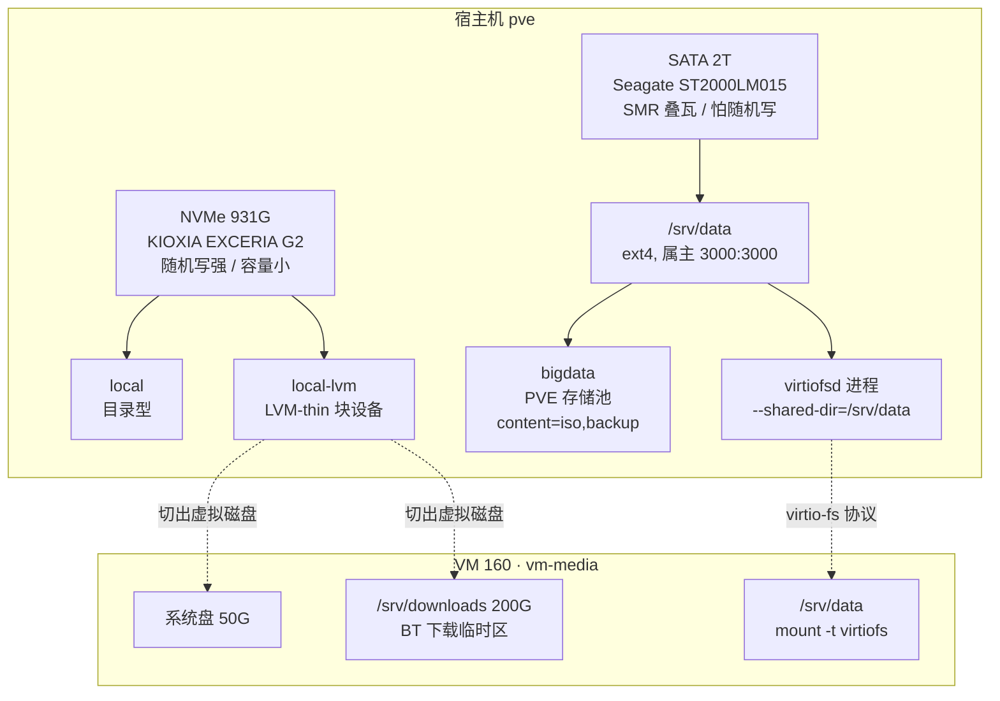

# 05 · 数据盘：从裸盘到虚拟机可用

> **承接**：[03 · Proxmox 核心概念](03-proxmox-concepts.md) —— 那篇讲的是**系统盘**（单块 NVMe）如何切成 `local` / `local-lvm`
> **面向**：给宿主机**加第二块物理盘**，并让虚拟机用上它
> **贯穿全文的一条原则**：**把「随机写」和「顺序写」分到不同介质上**。本文几乎所有决策都是这条的推论

---

## 0. 全景



**一句话概括**：机械盘做成一个普通 ext4 目录挂在宿主机上，然后走两条路对外提供 —— **对 PVE 自己**注册成存储池（放 ISO 和备份），**对虚拟机**用 virtio-fs 直接映射目录。

---

## 1. 先认盘：这块盘到底是什么

**不要拿到盘就格式化。** 至少先搞清三件事：是不是 SMR、健康度如何、里面有没有数据。

### 1.1 基本信息

```bash
lsblk -d -o NAME,SIZE,MODEL,SERIAL,ROTA,TRAN
#   ROTA=1 机械盘   ROTA=0 固态
#   TRAN   接口类型：sata / nvme / usb
```

顺便确认链路速率协商到位了 —— 线材或接口不对会掉到 3.0Gbps：

```bash
for l in /sys/class/ata_link/link*; do
  cat "$l/sata_spd" 2>/dev/null
done
# 期望：6.0 Gbps
```

### 1.2 🔴 判断是不是 SMR（叠瓦盘）

**SMR = Shingled Magnetic Recording（叠瓦式磁记录）**：磁道像屋顶瓦片一样部分重叠以提高密度。代价是**不能原地改写单条磁道** —— 改一点数据，硬盘要把整个 zone（几十 MB）读出来、修改、再整体重写回去。

**判据（可机器判定）：机械盘却报 `TRIM Command: Available`。**

```bash
smartctl -i /dev/sda | grep -E 'Rotation Rate|TRIM'
# Rotation Rate:    5400 rpm          ← 机械盘
# TRIM Command:     Available         ← 🔴 机械盘不该有这个
```

为什么这条判据成立：TRIM 是用来通知设备"这些块不再使用、可以回收"的命令，**传统 CMR 机械盘根本没有需要回收的东西**，所以不实现这个命令。只有 DM-SMR 盘需要靠 TRIM 管理它内部的持久缓存区。

**SMR 的行为特征：**

盘内有一块 20–40 GB 的 CMR 缓存区（不叠瓦，可随机写）。写入先落进缓存，空闲时再整理进叠瓦区。

| 场景 | 表现 |
|---|---|
| 短时间写入 < 缓存容量 | 和普通机械盘一样，100+ MB/s |
| 持续大量写入，缓存耗尽 | 🔴 **暴跌到 10–20 MB/s，甚至卡顿几十秒** |
| 读取 | ✅ **完全不受影响** |

所以判断很简单：**顺序大写 + 大量读 = 舒适区；持续随机小写 = 灾难区。**

### 1.3 SMART 该看哪几项

```bash
smartctl -A /dev/sda
smartctl -H /dev/sda      # 总体健康自评
```

| 属性 | 判据 |
|---|---|
| `Reallocated_Sector_Ct` | 🔴 **不为 0 就别放不可再生数据** |
| `Current_Pending_Sector` | 🔴 同上，待重映射扇区 |
| `Offline_Uncorrectable` | 🔴 同上 |
| `Power_On_Hours` | 参考通电时长，判断是新盘还是旧盘 |
| `Start_Stop_Count` / `Load_Cycle_Count` | 启停与磁头加载次数，2.5" 盘要留意 |

> ⚠️ **希捷盘的一个坑**：`Raw_Read_Error_Rate` 会显示一个吓人的大数（例如 `92731420`）。**这不是错误次数** —— 希捷把内部统计量编码进这个字段，正常盘就是这种量级。别被它误导，看上面三项就够了。

### 1.4 盘里有没有数据

二手盘、拆机盘常带着旧数据。**格式化前必须只读挂载看一眼**：

```bash
mkdir -p /mnt/peek
mount -o ro /dev/sda2 /mnt/peek      # 🔴 -o ro：只读，不可能写入
ls -la /mnt/peek
df -h /mnt/peek
umount /mnt/peek
```

---

## 2. 角色分工：什么放 SSD，什么放机械盘

### 2.1 判断方法

一份数据该放哪，问三个问题：

```
1. 写入模式    一次写完还是反复改写？    顺序大写 → 机械盘    随机小写 → SSD
2. 延迟要求    能忍 10ms 级寻道吗？      能 → 机械盘         要微秒级 → SSD
3. 可再生性    丢了能重下/重建吗？        能 → 放心放         不能 → 必须有第二份
```

### 2.2 两块盘的定位

|  | **NVMe（KIOXIA 931G）** | **SATA 2T（SMR 5400rpm）** |
|---|---|---|
| **定位** | 系统 + 计算 | 数据 + 存档 |
| **强项** | 随机读写、IOPS 高、延迟微秒级 | 每 GB 便宜、顺序吞吐够用 |
| **软肋** | 容量小、有写入寿命 | 🔴 随机写是致命伤 |
| **该放** | PVE 系统本体<br/>所有 VM 的**系统盘**<br/>数据库<br/>🔴 **BT 下载临时区** | 媒体库、做种完成区<br/>ISO 镜像库<br/>PVE 虚拟机备份<br/>Docker Registry blob |

### 2.3 具体清单

**✅ 适合放机械盘**

| 场景 | 为什么 |
|---|---|
| PVE 虚拟机备份（vzdump） | 大块顺序写，定时跑。且 `local` 只有 ~94G，根本存不下几个备份 |
| ISO / 安装镜像库 | 下一次，用很多次 |
| Docker Registry 的 blob | blob 是整块大文件顺序写；还能让多台机器共享基础镜像 |
| 媒体库 + BT 做种 | 顺序写一次，之后顺序读 |
| apt / pip 局域网缓存 | 写一次，多机复用 |
| 照片、视频原片归档 | 导入一次，之后只看 |
| 数据库转储（`pg_dump` 输出） | 顺序大写。🔴 注意是**转储文件**，不是数据库本体 |

**🟡 有条件**

| 场景 | 条件 |
|---|---|
| 大仓库裸克隆（`git clone --mirror`） | 克隆时海量小文件写会慢；克隆完只读就没问题 |
| 监控历史数据 | 🔴 只能放**冷归档**。Prometheus / Loki 的活跃 TSDB 是持续随机写，绝对不能放 |
| 文件同步目录 | 同步大文件 ✅；海量小文件的活跃目录 ❌ |

**🔴 明确不要放**

```
数据库数据目录        PostgreSQL / MySQL / Redis / MongoDB
时序库活跃写入        Prometheus / Loki / InfluxDB 的 TSDB
虚拟机磁盘            随机写，必须留在 local-lvm
容器可写层            /var/lib/docker 的 data-root
ZFS 池                SMR + ZFS 是社区著名的翻车组合
编译 / 构建目录        node_modules、CI 工作区、target/
swap 分区
Mac Time Machine      增量备份本质是随机写
```

### 2.4 🔴 单盘无冗余

这块盘**没有 RAID、没有校验和**。按「丢了会怎样」再切一刀：

| 类别 | 例子 | 对策 |
|---|---|---|
| 可再生 | ISO、Docker 镜像、做种内容 | 重下就行，放心放 |
| **不可再生** | 照片、个人文档、项目资料 | 🔴 **必须有第二份**，别只存这一块盘 |

**关于备份要特别说一句**：把虚拟机备份放在**同一台机器的另一块盘**上，只防「NVMe 单盘故障」，**不防**主板挂、电源烧、进水、误删、勒索软件。备份的价值在于「另一份、另一处」。

```
第一层   2T 盘          日常备份，恢复快          ← 本文覆盖的范围
第二层   异地 / 离线     移动硬盘定期拷贝          ← 重要数据还需要这层
```

---

## 3. 裸盘 → 可用文件系统

### 3.1 🔴 第一步永远是安全闸

多块盘的机器上，`/dev/sda` today 未必是 `/dev/sda` tomorrow —— 内核枚举顺序不保证稳定。**销毁性操作前必须用序列号确认目标**：

```bash
S=$(lsblk -dno SERIAL /dev/sda | tr -d ' ')
[ "$S" = "WY21QF5N" ] || { echo "序列号不符，中止"; exit 1; }
```

### 3.2 清除旧签名与分区表

```bash
umount /dev/sda* 2>/dev/null            # 1. 先确保没挂载
wipefs -a /dev/sda                      # 2. 抹掉文件系统 / 分区表签名
sgdisk --zap-all /dev/sda               # 3. GPT 主表 + 备份表 + PMBR 全部清零
```

顺序不能换：`wipefs` 只擦签名，`sgdisk --zap-all` 连 GPT 末尾的备份表一起清 —— **只做前者，某些工具仍会从备份表恢复出旧分区**。

### 3.3 建 GPT 分区

```bash
sgdisk -n 1:0:0 -t 1:8300 -c 1:"homelab-data" /dev/sda
#   -n 1:0:0        第 1 分区，从默认起点到盘尾（占满整盘）
#   -t 1:8300       类型码 8300 = Linux filesystem
#   -c 1:"..."      分区标签，方便日后辨认

blockdev --rereadpt /dev/sda && udevadm settle    # 让内核重读分区表
```

> ⚠️ PVE 默认**不装 `parted`**，所以没有 `partprobe` 命令。用 `blockdev --rereadpt` 代替。

### 3.4 格式化：三个参数都不是默认值

```bash
mkfs.ext4 -m 0 -T largefile -L media /dev/sda1
```

| 参数 | 作用 | 在 1.8 TiB 上省出 |
|---|---|---|
| `-m 0` | 不给 root 保留 5% 应急空间 | **~100 GB** |
| `-T largefile` | inode 密度从每 16 KB 一个降到每 1 MB 一个：**190 万**个而不是 1.2 亿个 | **~31 GB** |
| `-L media` | 卷标，`blkid` / `lsblk` 里可见 | — |

**为什么 `-m 0` 是安全的**：那 5% 预留是给**系统盘**的 —— 磁盘写满时留一点空间让 root 还能登录救火，同时缓解文件系统碎片。**数据盘不承担这个职责**，留 100 GB 纯属浪费。

**为什么 `-T largefile` 合适**：inode 是文件的元数据条目，每个占 256 字节。默认密度假设的是"平均每 16 KB 一个文件"，对存电影和镜像的盘完全是浪费。190 万个 inode 对这类用途绰绰有余。

> 🔴 **inode 用完和空间用完症状一样**（都报 `No space left on device`），但 `df -h` 会显示还有空间。排查时记得 `df -ih`。

验证实际参数：

```bash
tune2fs -l /dev/sda1 | grep -E 'Inode count|Reserved block count'
```

### 3.5 写 fstab：`nofail` 不是可选项

```bash
UUID=$(blkid -s UUID -o value /dev/sda1)
echo "UUID=$UUID  /srv/data  ext4  defaults,nofail,noatime  0  2" >> /etc/fstab
systemctl daemon-reload      # 🔴 改完 fstab 必须做，否则 systemd 仍用旧版本
mount -a
```

| 选项 | 为什么 |
|---|---|
| **用 `UUID=` 而不是 `/dev/sda1`** | 盘符会随枚举顺序变，UUID 跟着文件系统走 |
| 🔴 **`nofail`** | **盘掉了、没插好、坏了，系统照常开机**。没有它，宿主机会卡在 emergency mode —— 一台跑着旁路由的机器起不来，等于全家断网 |
| `noatime` | 不记录文件访问时间，减少无谓写入（对 SMR 尤其有意义） |
| 末位 `2` | fsck 顺序，根分区是 1，其他分区是 2 |

校验语法（**改完必查**）：

```bash
findmnt --verify --fstab
# 期望：Success, no errors or warnings detected
```

### 3.6 目录结构与权限模型

```
/srv/data/                      ← 2T SMR
├── dump/                       🤖 PVE 自动建：vzdump 备份落这
├── template/iso/               🤖 PVE 自动建：ISO 镜像落这
├── media/
│   ├── downloads/              BT 完成区（做种）
│   └── library/{movies,tv,music}
├── archive/                    个人归档 🔴 需要第二份
├── registry/                   私有 Docker Registry blob
└── share/                      随手放的大文件
```

> 🔴 **不要自己建 `iso/` 或 `backup/` 来放 ISO 和备份。** 一旦这个目录注册成 PVE 存储池（见[第 5 节](#5-注册成-pve-存储池)），PVE 会**按自己的固定布局**自动创建 `dump/` 和 `template/iso/` 并只往那里写。自建的同类目录 PVE 根本不认，纯属重复。
>
> PVE 目录型存储的完整布局约定：
>
> | 目录 | 对应 content 类型 |
> |---|---|
> | `dump/` | `backup` |
> | `template/iso/` | `iso` |
> | `template/cache/` | `vztmpl` |
> | `images/` | `images` |
> | `snippets/` | `snippets` |

```bash
groupadd -g 3000 media
chown -R 3000:3000 /srv/data
find /srv/data -type d ! -name 'lost+found' -exec chmod 2775 {} +
```

**权限位 `2775` 拆开看：**

```
2      setgid  🔴 新建文件自动继承【目录的组】，而不是创建者的私有主组
 7     属主  rwx
  7    属组  rwx      ← 组内成员可写，这是多服务共享的关键
   5   其他  r-x
```

**为什么 setgid 是必须的**：Jellyfin 和 qBittorrent 是两个不同的系统用户。没有 setgid，qBittorrent 建的文件属组是 `qbittorrent`，Jellyfin 就读不到。加上 setgid 后两者建的文件都属 `media` 组，双方都能访问。

**为什么用固定 GID 3000**：见下一节 —— virtio-fs 不做 UID 转换，宿主机和虚拟机必须约定同一个数字。

---

## 4. 把宿主机目录给虚拟机：virtio-fs

### 4.1 三条路的取舍

| 方案 | 开销 | 适用 |
|---|---|---|
| **virtio-fs** | **零网络开销**，走 vhost-user 共享内存 | ✅ 同一宿主机上的虚拟机 |
| NFS | 走完整 TCP/IP 协议栈 | 跨机器访问才需要（例如另一个节点的 VM 也要读） |
| 磁盘直通 | 原生 | 🔴 宿主机自己就用不了这块盘了，不灵活 |

**结论**：数据盘和消费它的虚拟机在同一台物理机上时，走网络文件系统是绕远路 —— 数据要过一遍 TCP/IP 再回来。用 virtio-fs。

> **顺带澄清**：给虚拟机共享目录**不需要额外建一台 NAS 虚拟机**。即使最终决定用 NFS，也是在现有 PVE 宿主机上 `apt install nfs-kernel-server`。专门建 NAS VM 只有在要把存储彻底独立出来时才有意义，代价是多一层虚拟化 + 多一个要维护的系统。

### 4.2 🔴 virtio-fs 的限制

PVE 源码里写死的三条（`PVE/QemuMigrate/Helpers.pm`）：

```perl
push @blockers, "virtiofs" if virtiofs_enabled($conf);
die "Cannot live-migrate, snapshot (with RAM), or hibernate a VM with: ..."
```

另有一条在 `PVE/QemuServer/Memory.pm`：

```perl
die "Memory hotplug does not work in combination with virtio-fs.\n"
```

整理成表：

| 功能 | 用 virtiofs 后 |
|---|---|
| **普通磁盘快照（不含内存）** | ✅ **仍然可用** —— 日常管理最常用的就是这个 |
| 带内存的快照 | ❌ |
| 在线迁移 | ❌ |
| 休眠 | ❌ |
| 内存热插拔 | ❌ |

**为什么这些限制可以接受**：数据盘物理插在这台宿主机上，虚拟机迁到别的节点也读不到这块盘 —— **在线迁移本来就没有意义**。而真正影响日常的普通快照并没有被禁。

### 4.3 配置三步

**① 宿主机：建 Directory Mapping**

```bash
pvesh create /cluster/mapping/dir --id data --map node=pve,path=/srv/data
pvesh get /cluster/mapping/dir            # 确认
```

Directory Mapping 是集群级的**具名映射**：名字（`data`）对每个节点解析到各自的路径。这样 VM 配置里只写名字，不写路径。

**② 宿主机：挂到虚拟机上**

```bash
qm set 160 --virtiofs0 dirid=data
```

完整参数：`[dirid=]<mapping-id> [,cache=<enum>] [,direct-io=<0|1>] [,expose-acl=<0|1>] [,expose-xattr=<0|1>]`

VM **启动时**才会拉起 `virtiofsd` 进程，可以这样确认：

```bash
pgrep -a virtiofsd
# /usr/libexec/virtiofsd --fd=12 --shared-dir=/srv/data --announce-submounts --syslog
```

> 🔴 **改 Directory Mapping 的路径必须重启 VM** —— `virtiofsd` 的 `--shared-dir` 在 VM 启动那一刻就定死了。

**③ 客体：挂载**

```bash
mount -t virtiofs data /srv/data
#                  ↑ 这里的 tag 就是 Directory Mapping 的 id
```

写进 fstab（同样要 `nofail`）：

```
data  /srv/data  virtiofs  defaults,nofail  0  0
```

客体侧前提检查：

```bash
grep virtiofs /proc/filesystems                    # 内核支持
ls /sys/bus/virtio/drivers/virtiofs/               # 应看到 virtioN 设备
```

Ubuntu 24.04（内核 6.8）开箱即支持，不需要装任何东西。

### 4.4 🔴 UID/GID 映射：最容易踩的坑

**`virtiofsd` 以 root 运行，且不做 UID 转换** —— 客体内进程的 UID/GID 数字**直接**当成宿主机的 UID/GID 使用。

所以：客体里 `jellyfin` 用户假如 UID 是 114，那它在宿主机上就是 UID 114，和宿主机上那个 114 号用户（如果存在）撞在一起，语义完全对不上。

**对策：两边约定同一个组号。**

```bash
# 宿主机
groupadd -g 3000 media
chown -R 3000:3000 /srv/data
chmod 2775 /srv/data /srv/data/*/

# 客体（GID 必须一致）
groupadd -g 3000 media
usermod -aG media jellyfin
usermod -aG media qbittorrent-nox
```

这样两边看到的都是 `3000` 这个数字，语义对齐。

### 4.5 验证：两个必做的测试

**① 非 root 用户经组权限能否写入**

```bash
usermod -aG media jing
sg media -c 'touch /srv/data/media/library/movies/.t'    # sg 临时切换有效组
ls -ln /srv/data/media/library/movies/                   # -n 显示数字 UID/GID
```

> ⚠️ 别用 `sudo -u '#3000'` 测 —— 该用户不存在时会直接报 `unknown user`，看起来像权限失败，其实是测法错了。

**② 硬链接能否跨目录建立**

这是 BT 做种 + 媒体库共存的**基石**：同一份文件在做种目录和媒体库目录各有一个名字，但**只占一份空间**。硬链接要求两个路径在**同一个文件系统**内。

```bash
echo hi > /srv/data/media/downloads/.hltest
ln /srv/data/media/downloads/.hltest /srv/data/media/library/movies/.hllink
ls -l /srv/data/media/downloads/.hltest      # 链接数应为 2
rm -f /srv/data/media/downloads/.hltest /srv/data/media/library/movies/.hllink
```

链接数是 `2` 就说明成立。**virtio-fs 支持硬链接**，这一点经实测确认。

### 4.6 BT 下载的分层：绕开 SMR 的关键

BT 下载是把文件切成几千个块**乱序写入** —— 正是 SMR 最怕的负载。解法是把下载中和下载完分开：

```
下载中的临时文件  →  虚拟机自己的 200G 磁盘（在 NVMe 上）    随机写全吃在 SSD
下载完成          →  移动到 /srv/data/media/downloads       一次顺序大写
做种              →  从机械盘顺序读                          SMR 读性能不受影响
硬链接            →  downloads ↔ library，同一文件系统内 ✅
```

qBittorrent 里对应两个设置项：**「保存到」** 和 **「下载中的种子保存到」**。

---

## 5. 注册成 PVE 存储池

让 PVE 自己也能用这块盘（Web 界面传 ISO、备份虚拟机）：

```
# /etc/pve/storage.cfg
dir: bigdata
        path /srv/data
        content iso,backup
        prune-backups keep-last=3
```

写完立刻生效，不用重启任何服务（`/etc/pve/` 是集群文件系统，改动实时同步）：

```bash
pvesm status | grep bigdata
# bigdata   dir   active   1951773156   2152   1951754620   0.00%
```

> 🔴 **注册的瞬间 PVE 会按 content 类型自动建目录** —— 加了 `backup` 就建 `dump/`，加了 `iso` 就建 `template/iso/`。所以目录结构要**先注册、再看它建了什么**，不要凭空自己规划一套同名目录。
>
> `prune-backups keep-last=3` 是保留策略：只留最近 3 份备份，旧的自动清理。不写这条，备份会一直堆到把盘占满。

### 5.1 content 类型怎么选

| 类型 | 含义 | 放这块盘？ |
|---|---|---|
| `iso` | ISO 镜像 | ✅ 顺序读写 |
| `backup` | vzdump 备份 | ✅ 大块顺序写，正合适 |
| `vztmpl` | LXC 容器模板 | 按需 —— 不跑 LXC 就不加 |
| `snippets` | cloud-init / hook 脚本 | 体积极小，留在 `local` 即可 |
| 🔴 `images` | **虚拟机磁盘** | ❌ **绝对不要** |
| 🔴 `rootdir` | **LXC 根文件系统** | ❌ **绝对不要** |

### 5.2 为什么 `images` / `rootdir` 绝对不能放

虚拟机磁盘承载的是客体的**全部随机写**——日志、数据库、包管理、临时文件。放在 SMR 盘上，缓存耗尽后整台虚拟机会卡到不可用。

**这两类必须留在 `local-lvm`（NVMe）。**

### 5.3 收益

`local` 只有约 94 GB 且和系统根分区共用，装不下几个备份。挂上这块盘后备份空间变成 1.9 TB —— **虚拟机备份从"做不了"变成"可以定期做"**。

---

## 6. 排错

| 症状 | 原因 | 处理 |
|---|---|---|
| 开机卡在 emergency mode | fstab 里的盘不见了且**没写 `nofail`** | 🔴 加 `nofail`。这是数据盘写 fstab 的铁律 |
| `df -h` 有空间却报 `No space left` | inode 用完了 | `df -ih` 确认；`-T largefile` 建的盘一般不会 |
| 客体挂载报 `unknown filesystem type 'virtiofs'` | 内核太旧或模块没加载 | `grep virtiofs /proc/filesystems` |
| 客体挂上了但**写不进去** | UID/GID 没对齐 | 见 [4.4](#44--uidgid-映射最容易踩的坑) |
| 改了 Directory Mapping 路径不生效 | `virtiofsd` 的 `--shared-dir` 在 VM 启动时定死 | **必须重启 VM** |
| `partprobe: command not found` | PVE 不装 `parted` | 用 `blockdev --rereadpt` |
| 改完 fstab 有告警说 systemd 用的是旧版本 | 没重载 | `systemctl daemon-reload` |
| 机械盘写入突然暴跌到十几 MB/s | SMR 的 CMR 缓存耗尽 | 停止写入让它整理；长期看要把随机写移到 SSD |

---

## 7. 速查

```bash
# ── 认盘 ──
lsblk -d -o NAME,SIZE,MODEL,SERIAL,ROTA,TRAN
smartctl -i /dev/sda | grep -E 'Rotation Rate|TRIM'     # TRIM 有 = SMR
smartctl -A /dev/sda | grep -E 'Reallocated|Pending|Uncorrect'

# ── 裸盘 → 可用（🔴 先核对序列号）──
wipefs -a /dev/sda && sgdisk --zap-all /dev/sda
sgdisk -n 1:0:0 -t 1:8300 -c 1:"homelab-data" /dev/sda
blockdev --rereadpt /dev/sda && udevadm settle
mkfs.ext4 -m 0 -T largefile -L media /dev/sda1

# ── 挂载 ──
echo "UUID=$(blkid -s UUID -o value /dev/sda1)  /srv/data  ext4  defaults,nofail,noatime  0  2" >> /etc/fstab
systemctl daemon-reload && mount -a && findmnt --verify --fstab

# ── virtio-fs ──
pvesh create /cluster/mapping/dir --id data --map node=pve,path=/srv/data
qm set 160 --virtiofs0 dirid=data
pgrep -a virtiofsd                                      # VM 启动后确认
# 客体内：
mount -t virtiofs data /srv/data

# ── PVE 存储池 ──
cat >> /etc/pve/storage.cfg <<'CFG'

dir: bigdata
	path /srv/data
	content iso,backup
	prune-backups keep-last=3
CFG
pvesm status | grep bigdata     # 立刻生效，PVE 会自动建 dump/ 和 template/iso/

# ── 权限 ──
groupadd -g 3000 media          # 宿主机和客体都要，GID 必须一致
chown -R 3000:3000 /srv/data
find /srv/data -type d ! -name 'lost+found' -exec chmod 2775 {} +
```

---

**下一步** → [02 · 旁路由](../02-gateway/)　|　返回 [01 · 基础设施](README.md)
