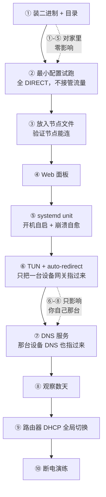

# 02 · 旁路由

← [仓库首页](../README.md)　|　上一步 ← [01 · 基础设施](../01-infrastructure/)　|　配置 → [`config/`](config/)

> **状态**：🚧 已完成安装与最小验证；TUN / DNS / 全局切换未做

家庭网络的分流网关。从模板 `9000` 克隆而来。

| 项 | 值 |
|---|---|
| 机器 | `vm-router` @ `192.168.5.2`，VMID `102` |
| 规格 | 1 核 / 1 GB / 50 GB（thin，实占约 5 GB） |
| 自启 | `onboot=1`，`startup order=1,up=30`（**第一批启动**，其他机器依赖网络） |
| 软件 | mihomo（Clash.Meta 内核）v1.19.30 |

---

## 它做两件事

| | 方向 | 内容 |
|---|---|---|
| **出站** | 家里 → 外面 | 按目标地址分流：海外走代理，国内直连 |
| **入站** | 外面 → 家里 | 在 4G / 公司 / 酒店能访问家里服务 |

**合在一台机器上**：两者都是网络层工作，都要开 IP 转发写防火墙规则；而且**从外面回家后还想用分流** —— 同一台机器上这是一条路由规则，分两台就要做策略路由。

---

## 渐进式上线



**前五步完全不影响家里任何人**，第六七步只影响自己那台。跑稳几天再切全局。

---

## 选型

### mihomo，不是 sing-box / OpenWrt

| | |
|---|---|
| **mihomo** | YAML 能写注释、可进 git；自带面板**实时看域名命中哪条规则**；单二进制无依赖；排查就是 `systemctl` + `journalctl` |
| sing-box | JSON 不能写注释 |
| OpenWrt + 插件 | 价值在拨号 / Wi-Fi / VLAN / QoS —— **这些都在光猫上，一个都用不到** |

### VM，不是 LXC

透明代理要 **TUN 设备 + 大量 nftables 规则**。非特权 LXC 会遇到一连串权限问题，特权 LXC 又失去隔离意义。

### 🔴 下载不带微架构后缀的包

```
mihomo-linux-amd64-v1.19.30.gz              ← 用这个
mihomo-linux-amd64-v3-v1.19.30.gz           ← 需要 AVX2
mihomo-linux-amd64-compatible-v1.19.30.gz   ← 给很老的 CPU
```

`v1`/`v2`/`v3` 是 **GOAMD64 微架构等级**。mihomo 瓶颈在网络 I/O 和加解密，加解密走 **AES-NI**，各等级都有，优化收益几乎为零；而 v3 二进制在不支持 AVX2 的机器上直接 **`SIGILL` 崩溃**。不值得换这个风险。

---

## 部署记录

### 前置：机器怎么来的

```bash
./tools/fleet.sh run <克隆机临时IP> -- 01-infrastructure/scripts/init-clone.sh \
    --hostname vm-router --ip 192.168.5.2 --router --apply
```

`--router` 写入的三个内核参数及其后果见 [01 · scripts](../01-infrastructure/scripts/#init-clonesh--克隆后定制)。

### 下载渠道实测

```
github.com                            直连 200
release-assets.githubusercontent.com  直连 200      ← Release 文件实际存放处
raw.githubusercontent.com             直连和走代理都被重置
```

版本不写死，从 API 查：

```bash
curl -s https://api.github.com/repos/MetaCubeX/mihomo/releases/latest | grep '"tag_name"'
```

### 安装

```bash
# Mac
scp /tmp/mihomo-linux-amd64-v1.19.30.gz vm-router:~/

# vm-router
gunzip -t ~/mihomo-linux-amd64-v1.19.30.gz && echo "压缩包完好"
sha256sum ~/mihomo-linux-amd64-v1.19.30.gz          # 和 Mac 比对
gunzip -f ~/mihomo-linux-amd64-v1.19.30.gz
sudo install -m 0755 ~/mihomo-linux-amd64-v1.19.30 /usr/local/bin/mihomo
rm -f ~/mihomo-linux-amd64-v1.19.30
mihomo -v
sudo mkdir -p /etc/mihomo/{ui,providers,ruleset}
```

```
Mihomo Meta v1.19.30 linux amd64 with go1.26.6
Use tags: with_gvisor          ← 带 gvisor 网络栈，TUN 的 stack: mixed 需要它
```

> **用 `install` 不用 `cp` + `chmod`**：一步完成复制+权限，且**先写临时文件再原子替换** —— 覆盖正在运行的二进制不会写坏。升级时这个特性是关键。

### 验证

```bash
sudo mihomo -t -d /etc/mihomo                       # 语法校验，不启动
sudo systemd-run --unit=mihomo-test --collect -p Restart=no \
     /usr/local/bin/mihomo -d /etc/mihomo           # 临时 unit 试跑
```

`systemd-run` 比 `nohup &` 好在：有正常的 `systemctl status` / `journalctl` / `stop`，`--collect` 停止后自动回收，且是通往正式 unit 的自然过渡。

| 检查 | 命令 | 实测 |
|---|---|---|
| 服务状态 | `systemctl is-active mihomo-test` | `active` |
| 监听 | `sudo ss -lntp \| grep -E ':(7890\|9090)'` | `*:7890` `*:9090` —— `*` 说明 `allow-lan` 生效 |
| API 带密码 | `curl -H "Authorization: Bearer $S" .../version` | `{"meta":true,"version":"v1.19.30"}` |
| **API 不带密码** | `curl -o /dev/null -w '%{http_code}' .../version` | **`401`** —— `secret` 生效，局域网内别人改不了 |
| 经代理口 | `curl -x http://192.168.5.2:7890 ...` | `200` |

```bash
sudo systemctl stop mihomo-test
```

> `mihomo -t -d` 这条后面会反复用到 —— **订阅更新时"校验通过才替换"就靠它**。实际运行中"订阅拉到坏配置导致起不来"比宿主机挂掉常见得多，而且**表现和断电一模一样**（全家断网），容易往硬件方向查。

---

## 待办

```
□ ③ 放入节点文件 → 验证节点能连
     先确认格式：grep -c '^proxies:' <文件>    1=Clash 可直接用，0=Surge 需转换
□ ④ Web 面板 metacubexd
□ ⑤ 正式 systemd unit（Restart=always / AmbientCapabilities）
□ ⑥ TUN + auto-redirect
□ ⑦ DNS（fake-ip + fake-ip-filter）
□ ⑧ 订阅更新脚本：校验通过才替换 + 热重载
□ ⑨ 路由器 DHCP 全局切换（网关与 DNS 都指向 .2，备用 DNS 留空）
□ ⑩ 断电演练
```

配置各段的设计见 [`config/README.md`](config/)。

---

## 坑

### 1 · macOS TCC 让 `scp` 读不了 `~/Downloads`

```
scp: open local ".../mihomo-....gz": Operation not permitted
```

**不是 Unix 权限问题。** macOS 对 `~/Downloads`、`~/Documents`、`~/Desktop` 做了内核级保护（TCC），应用要单独授权。

| 信号 | 含义 |
|---|---|
| `ls -l` 显示你是属主、权限正常 | Unix 权限够 |
| 目录权限位末尾有 `+`（`drwx------+`） | 带 ACL —— TCC 标记 |
| 🔴 报 **`Operation not permitted`(EPERM)** 而不是 `Permission denied`(EACCES) | **判断是不是 TCC 的关键信号**。看到 EPERM 往隐私权限查，别去 `chmod` |

```bash
cp ~/Downloads/xxx /tmp/          # 一次性绕开
# 永久：系统设置 → 隐私与安全性 → 文件与文件夹 → 终端 → 打开「下载文件夹」
#       🔴 改完必须 Cmd+Q 完全退出终端 —— TCC 权限在【进程启动时】确定
```

### 2 · `sudo` 只作用于它所在的那一侧

```bash
sudo scp file vm-router:~/        # 绝对不要
```

`sudo scp` 让 scp 以 **Mac 的 root** 运行，`HOME` 变成 `/var/root`：读不到 `~/.ssh/config` 里的 `Host vm-*`、读不到私钥、会尝试 `root@vm-router`。

| 问自己 | 答案 |
|---|---|
| 要读 `~/.ssh/` 吗？（`ssh`/`scp`/`rsync`/`git`） | **绝不加 sudo** |
| 要写系统目录吗？ | 加 sudo，**只在目标机器上加** |

另外 **`scp` 不能直接写需要 root 的目录** —— 远端 scp 进程以登录用户身份运行。所以必须"先传家目录，再登进去 `sudo install`"。

### 3 · `pkill -f` 会杀掉自己

```bash
sudo pkill -f 'mihomo -d'         # SSH 立刻断开，退出码 255
```

`-f` 匹配**完整命令行**，而执行这段脚本的远端 bash 进程，命令行里正好包含 `mihomo -d /etc/mihomo` —— 把自己的 shell 干掉了。

```bash
sudo pkill -x mihomo              # -x 精确匹配【进程名】
```

**通用教训**：`pkill -f` 的模式串不要包含当前脚本命令行里出现过的内容。能用 `-x` 就用 `-x`。
