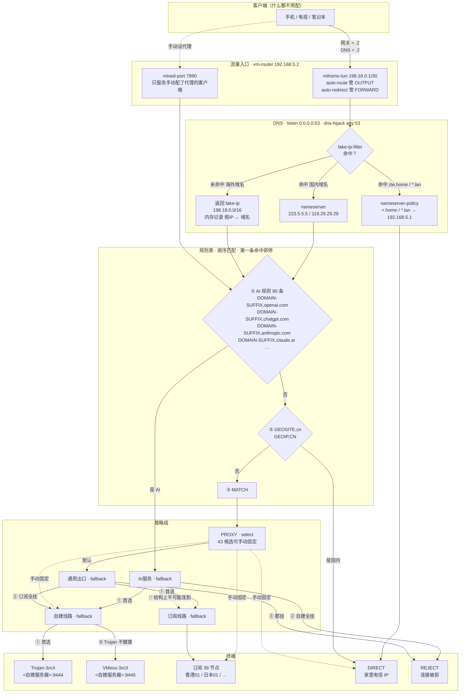
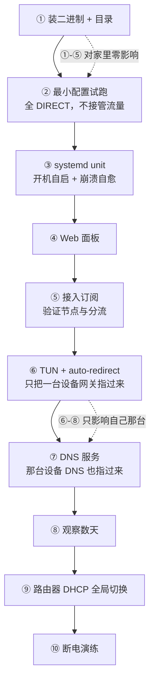

# 02 · 旁路由

← [仓库首页](../README.md)　|　上一步 ← [01 · 基础设施](../01-infrastructure/)

| 文档 | 内容 |
|---|---|
| **本文** | 部署记录 · 运维 · 踩坑 |
| [**原理**](principles.md) | 策略组 / 规则 / mode / TUN / fake-ip / Geo 数据库的机制 |
| [**配置**](config/) | 策略组结构 · AI 规则 · 各段取舍依据 · 机密管理 |

> **状态**：✅ **已全局上线** —— 路由器 DHCP 下发网关与 DNS 均指向 `.2`，全家设备生效

---

## 这台机器

| 项 | 值 |
|---|---|
| 机器 | `vm-router` @ `192.168.5.2`，VMID `102` |
| 规格 | 1 核 / 1 GB / 50 GB（thin，实占约 5 GB） |
| 自启 | `onboot=1`，`startup order=1,up=30`（第一批启动，其他机器依赖网络） |
| 软件 | mihomo（Clash.Meta 内核）v1.19.30 |
| 面板 | metacubexd v1.273.0 @ `http://vm-router:9090/ui` |

它做两件事：**出站分流**（海外走代理、国内直连）与**入站回家**（在外面访问家里服务）。合在一台机器上 —— 两者都是网络层工作，且从外面回家后还想用分流，同一台机器上是一条路由规则，分两台要做策略路由。

---

## 流量路由逻辑

### 全景图



### 三条降级链

```
AI 域名   →  AI服务   →  自建线路(Trojan-3xUI → VMess-3xUI)  →  REJECT
其余流量  →  PROXY   →  通用出口  →  订阅线路(39 节点顺序切)
                                  →  自建线路(Trojan-3xUI → VMess-3xUI)
                                  →  REJECT
国内域名  →  DIRECT（家里电信 IP）
```

### 策略组一览

| 组名 | 类型 | 候选链 | 职责 |
|---|---|---|---|
| `自建线路` | `fallback` | `Trojan-3xUI` → `VMess-3xUI` | 协议级冗余，同一台 VPS 两个端口 |
| **`AI服务`** | `fallback` | `自建线路` → **`REJECT`** | 🔴 候选里**没有订阅节点，也没有 DIRECT** |
| `订阅线路` | `fallback` | 订阅 39 节点 | 按 provider 顺序取第一个健康的 |
| `通用出口` | `fallback` | `订阅线路` → `自建线路` → **`REJECT`** | **平时就在用**，不是"只在异常时用" |
| **`PROXY`** | `select` | `通用出口` / `订阅线路` / `自建线路` / `DIRECT` / 39 节点 | 通用流量落点，43 候选可手动固定 |

### 规则表

| 优先级 | 规则 | 目标 | 条数 |
|---|---|---|---|
| ① | `DOMAIN-SUFFIX,openai.com` `chatgpt.com` `anthropic.com` `claude.ai` … | **`AI服务`** | **90** |
| ② | `GEOSITE,cn` | `DIRECT` | 111,097 域名 |
| ③ | `GEOIP,CN` | `DIRECT` | GeoIP 库 |
| ④ | `MATCH` | `PROXY` | 兜底 |

### DNS 分流实测

| 域名 | 解析结果 | 说明 |
|---|---|---|
| `zte.home` | `192.168.5.1` | `nameserver-policy` 转给光猫 |
| `<自建服务器域名>` | `<真实 IP>` | 在 `fake-ip-filter` 里，返回真实 IP |
| `connectivity-check.ubuntu.com` | `185.125.190.101` | 同上，避免误判"无网络" |
| `www.baidu.com` | `198.18.0.6` | fake-ip。反查域名后命中 `GEOSITE,cn` → `DIRECT` |
| `www.youtube.com` | `198.18.0.4` | fake-ip → `MATCH` → `PROXY` |
| `chatgpt.com` | `198.18.0.5` | fake-ip → AI 规则 → `AI服务` |

> 🔴 **国内域名也返回 fake-ip 是正常的** —— fake-ip 只是"给客户端一个占位地址"，mihomo 反查出域名后照样能命中 `GEOSITE,cn` 走 `DIRECT`，届时由它自己真解析再连。

### 链路实测

```
huggingface.co         DomainSuffix,huggingface.co   AI服务 <- 自建线路 <- Trojan-3xUI
speed.cloudflare.com   Match                         PROXY <- 通用出口 <- 订阅线路 <- 香港01
mirrors.aliyun.com                                   DIRECT
```

### 两个贯穿全局的设计决定

| 决定 | 理由 |
|---|---|
| **全部用 `fallback`，一个 `url-test` 都没有** | `url-test` 每 300 秒按延迟重选，**出口 IP 频繁变动会触发服务端风控**。`fallback` 只在当前节点不健康时才切，健康时 IP 稳定 |
| **两条链都以 `REJECT` 收尾，不退回 `DIRECT`** | `REJECT` 让连接**立刻被拒**，故障马上可见；退回 `DIRECT` 会变成"能上网但没代理"的**隐性故障**，察觉不到 |

### AI 隔离是结构性的，不是靠规则约束

`AI服务` 的候选只有 `[自建线路, REJECT]` —— **没有任何订阅节点，也没有 `DIRECT`**。即使规则写错、即使手动误操作，也不可能把 AI 流量送到订阅节点上。

原因：AI 服务对**出口 IP 纯净度**敏感。共享节点上其他用户的行为会连累你的账号，表现为验证码变多、限流、乃至封号。

---

## 渐进式上线



**①–⑤ 已完成，对家里其他人零影响** —— 没开 TUN、不占 53 端口，只有手动配了代理的客户端会走。

---

## 选型

| | |
|---|---|
| **mihomo** 而不是 sing-box | YAML 能写注释、可进 git；面板能**实时看域名命中哪条规则**；排查就是 `systemctl` + `journalctl` |
| **mihomo** 而不是 OpenWrt | OpenWrt 的价值在拨号 / Wi-Fi / VLAN / QoS —— 这些都在光猫上，一个都用不到 |
| **VM** 而不是 LXC | TUN + 大量 nftables 规则，非特权 LXC 权限问题多，特权 LXC 又失去隔离意义 |

### 🔴 下载不带微架构后缀的包

```
mihomo-linux-amd64-v1.19.30.gz              ← 用这个
mihomo-linux-amd64-v3-v1.19.30.gz           ← 需要 AVX2
mihomo-linux-amd64-compatible-v1.19.30.gz   ← 给很老的 CPU
```

`v1`/`v2`/`v3` 是 GOAMD64 微架构等级。mihomo 瓶颈在网络 I/O 和加解密，加解密走 AES-NI 各等级都有，优化收益几乎为零；而 v3 二进制在不支持 AVX2 的机器上直接 `SIGILL` 崩溃。

---

## 部署记录

### 前置：机器怎么来的

```bash
./tools/fleet.sh run <克隆机临时IP> -- 01-infrastructure/scripts/init-clone.sh \
    --hostname vm-router --ip 192.168.5.2 --router --apply
```

`--router` 写入的三个内核参数及后果见 [01 · scripts](../01-infrastructure/scripts/)。

### 下载渠道实测

```
github.com                            直连 200
release-assets.githubusercontent.com  直连 200      ← Release 文件实际存放处
raw.githubusercontent.com             直连和走代理都被重置
```

版本不写死：

```bash
curl -s https://api.github.com/repos/MetaCubeX/mihomo/releases/latest | grep '"tag_name"'
```

### 安装

```bash
# Mac → vm-router
scp /tmp/mihomo-linux-amd64-v1.19.30.gz vm-router:~/

# vm-router
gunzip -t ~/mihomo-linux-amd64-v1.19.30.gz && echo "压缩包完好"
sha256sum ~/mihomo-linux-amd64-v1.19.30.gz            # 与 Mac 比对
gunzip -f ~/mihomo-linux-amd64-v1.19.30.gz
sudo install -m 0755 ~/mihomo-linux-amd64-v1.19.30 /usr/local/bin/mihomo
rm -f ~/mihomo-linux-amd64-v1.19.30
mihomo -v
sudo mkdir -p /etc/mihomo/{ui,providers,ruleset}
```

```
Mihomo Meta v1.19.30 linux amd64 with go1.26.6
Use tags: with_gvisor          ← 带 gvisor 网络栈，TUN 的 stack: mixed 需要它
```

> **用 `install` 不用 `cp` + `chmod`**：一步完成复制+权限，且**先写临时文件再原子替换** —— 覆盖正在运行的二进制不会写坏。升级时这个特性是关键。

### systemd

```ini
[Unit]
After=network-online.target nss-lookup.target
Wants=network-online.target
# 🔴 重启风暴保护，见坑 5
StartLimitIntervalSec=300
StartLimitBurst=5

[Service]
ExecStart=/usr/local/bin/mihomo -d /etc/mihomo
Restart=always
RestartSec=3
LimitNOFILE=1048576          # 代理并发连接多，默认 1024 远不够
```

自愈已实测：`sudo pkill -x mihomo` 后 3 秒自动拉起，PID 变化确认是新进程。

### Web 面板

```bash
curl -sfL -o /tmp/ui.tgz \
  https://github.com/MetaCubeX/metacubexd/releases/download/v1.273.0/compressed-dist.tgz
sudo rm -rf /etc/mihomo/ui && sudo mkdir -p /etc/mihomo/ui
sudo tar -xzf /tmp/ui.tgz -C /etc/mihomo/ui
```

配置加 `external-ui: /etc/mihomo/ui`，**必须 `systemctl restart`** —— `external-ui` 在启动时注册静态路由，热重载不生效。

🔴 **面板显示的"IP"是浏览器自己查的，反映的是浏览器所在机器**，不是服务器。判断服务器出口必须在服务器上 `curl -x http://127.0.0.1:7890 ...`。

### 接入订阅

订阅链接写进 `config/mihomo.local.env`（gitignore，权限 600），模板里用 `${SUB_URL_A}` 占位。详见 [`config/`](config/)。

---

## 验收

### 五层体检

| 层 | 查什么 | 命令 |
|---|---|---|
| L1 | 服务在不在 | `systemctl is-active/is-enabled mihomo`、**`NRestarts`** |
| L2 | 端口在不在 | `sudo ss -lntp \| grep -E ':(7890\|9090)'` |
| L3 | 配置对不对 | `sudo mihomo -t -d /etc/mihomo` |
| L4 | API 与鉴权 | 带密码返回版本 / 不带密码 **401** / 面板 200 |
| L5 | 🔴 **代理链路** | **在服务器上** `curl -x http://127.0.0.1:7890 ...` |

**L5 是面板给不了的**，也是唯一能证明代理真的在工作的检查。

### 实测结果

```
策略组
  AI服务     fallback   自建线路 → REJECT
  自建线路   fallback   Trojan-3xUI(726ms) → VMess-3xUI(1433ms)
  订阅线路   fallback   39 节点按顺序
  订阅兜底   fallback   订阅线路 → 自建线路 → REJECT
  PROXY     select     43 候选，默认订阅兜底

连接链路实测
  huggingface.co      DomainSuffix    AI服务 <- 自建线路 <- Trojan-3xUI
  www.youtube.com     Match           PROXY <- 订阅兜底 <- 订阅线路 <- 香港01
  mirrors.aliyun.com                  DIRECT
  api.openai.com      HTTP 401        OpenAI 正常响应，请求确实到达

出口 IP
  国内域名   myip.ipip.net 经代理 → 36.106.203.193 中国天津电信   走 DIRECT
  海外域名   ipinfo.io    经代理 → 185.220.238.132 JP/Tokyo      走节点
```

> `chatgpt.com` / `claude.ai` 用 `curl` 测会返回 **403** —— 那是 Cloudflare 的机器人挑战要求浏览器指纹，不是链路问题。浏览器访问正常。

---

## 坑

### 1 · macOS TCC 让 `scp` 读不了 `~/Downloads`

```
scp: open local ".../mihomo-....gz": Operation not permitted
```

**不是 Unix 权限问题。** macOS 对 `~/Downloads`、`~/Documents`、`~/Desktop` 做了内核级保护（TCC）。

| 信号 | 含义 |
|---|---|
| `ls -l` 显示你是属主、权限正常 | Unix 权限够 |
| 目录权限位末尾有 `+`（`drwx------+`） | 带 ACL —— TCC 标记 |
| 🔴 报 **`Operation not permitted`(EPERM)** 而非 `Permission denied`(EACCES) | **判断是不是 TCC 的关键信号**。看到 EPERM 查隐私权限，别去 `chmod` |

```bash
cp ~/Downloads/xxx /tmp/          # 一次性绕开
# 永久：系统设置 → 隐私与安全性 → 文件与文件夹 → 终端 → 下载文件夹
#       🔴 改完必须 Cmd+Q 完全退出终端 —— TCC 权限在进程启动时确定
```

### 2 · `sudo` 只作用于它所在的那一侧

```bash
sudo scp file vm-router:~/        # 绝对不要
```

`sudo scp` 让 scp 以 **Mac 的 root** 运行，`HOME` 变 `/var/root`：读不到 `~/.ssh/config` 的 `Host vm-*`、读不到私钥、会尝试 `root@vm-router`。

| 问自己 | 答案 |
|---|---|
| 要读 `~/.ssh/` 吗？（`ssh`/`scp`/`rsync`/`git`） | **绝不加 sudo** |
| 要写系统目录吗？ | 加 sudo，**只在目标机器上加** |

另外 **`scp` 不能直接写需要 root 的目录** —— 远端 scp 进程以登录用户身份运行。必须"先传家目录，再 `sudo install`"。

### 3 · `pkill -f` 会杀掉自己

```bash
sudo pkill -f 'mihomo -d'         # SSH 立刻断开，退出码 255
```

`-f` 匹配**完整命令行**，而执行脚本的远端 bash 进程命令行里正好含 `mihomo -d /etc/mihomo`。

```bash
sudo pkill -x mihomo              # -x 精确匹配进程名
```

**通用教训**：`pkill -f` 的模式串不要包含当前脚本命令行里出现过的内容。

### 4 · 🔴 mihomo 默认的 Geo 数据源在国内不可达

```
GEOIP 规则需要 country.mmdb
  ↓ mihomo 默认从 raw.githubusercontent.com 下载
  ↓ 该域名直连和走代理都被重置
can't download MMDB: context deadline exceeded
  ↓ Parse config error → 进程 fatal 退出
```

必须显式配 `geox-url`。实测下载速度：

```
cdn.jsdelivr.net        1.8 MB/s   4.3s      ✅ 选它
testingcf.jsdelivr.net  572 KB/s   13.4s
GitHub Release          27 KB/s    30s 只拉到 10%
raw.githubusercontent   完全不通
```

### 5 · 🔴 `Restart=always` + 配置错误 = 无限重启，而 `is-active` 显示 `active`

```
起来 → fatal 退出 → 3 秒后重启 → 起来 → fatal ...
systemctl is-active 抓拍时经常正好是 active   ← 状态具有欺骗性
```

加重启风暴保护，**让故障暴露而不是被掩盖**：

```ini
StartLimitIntervalSec=300
StartLimitBurst=5      # 300 秒内失败 5 次就停止重试，进入 failed
```

### 6 · 管道会吞掉退出码

```bash
sudo mihomo -t -d /etc/mihomo 2>&1 | tail -1     # set -e 拿到的是 tail 的退出码，永远 0
```

结果是校验失败了脚本还继续往下 restart。**判断成败必须直接看命令本身的退出码**：

```bash
if sudo mihomo -t -d /etc/mihomo > /tmp/t.log 2>&1; then ok; else cat /tmp/t.log; exit 1; fi
```

### 7 · 🔴 IPv6 优先导致订阅被 403

机场对订阅链接做 IP 鉴权，白名单加的是 IPv4。而 Linux 按 **RFC 6724** 默认优先 IPv6：

```
默认（走 IPv6）  403 AUTH_FAIL
强制 IPv4        200 ✅          ← 白名单其实生效了
```

**Happy Eyeballs 救不了** —— 它只处理"IPv6 连不上"，而这里 TCP + TLS 都成功了，403 是应用层返回的。

**改 `/etc/gai.conf` 也没用** —— mihomo 是 Go 写的，用 Go 自己的解析器，不读 `gai.conf`。

解法是配置里一行：

```yaml
ipv6: false
```

副作用是正收益：**DNS 不返回 AAAA，客户端不会走 IPv6 直连绕过代理**，分流泄漏从源头消失。

### 8 · `GEOIP,CN,DIRECT,no-resolve` 让国内流量全走了代理

实测 `www.qq.com` 命中 `Match` 经日本节点。根因与正确写法见 [原理 · 规则](principles.md#3-规则)。

### 9 · `ipv6: false` 的真实副作用：清华镜像连不上

```
清华镜像  强制 IPv4  →  403        你家的 IPv4 被清华拒绝
          强制 IPv6  →  200
阿里云    强制 IPv4  →  200
中科大    强制 IPv4  →  200
```

之前 `provision-base.sh` 那次 403 曾被归因为"走代理出口变境外"，**实际可能一直是这个 IPv4 被拒**。

`ipv6: false` 让 `DIRECT` 只走 IPv4，所以设备走旁路由后清华镜像会连不上。

| 方案 | 取舍 |
|---|---|
| **apt 源换阿里云/中科大** | 最简单，实测都 200。**推荐** |
| 打开 `ipv6: true` | 重新引入 IPv6 分流泄漏风险 |
| 加规则让清华走代理 | 清华拒绝境外 IP，更不通 |

### 10 · 🔴 `systemd-resolved` 占着 53，与 `0.0.0.0:53` 不能共存

```
UDP 0.0.0.0:53  Errno 98 Address already in use
TCP 0.0.0.0:53  Errno 98
```

`systemd-resolved` 监听 `127.0.0.53:53`（stub）。**通配绑定 `0.0.0.0:53` 与任何 `x.x.x.x:53` 冲突**，不是"只要地址不同就能共存"。

```bash
# /etc/systemd/resolved.conf.d/20-no-stub.conf
[Resolve]
DNSStubListener=no
```

```bash
# resolv.conf 从 stub 改指向真实上游
sudo ln -sf /run/systemd/resolve/resolv.conf /etc/resolv.conf
sudo systemctl restart systemd-resolved
```

关掉后 `systemd-resolved` 仍工作，只是不再监听 53。

> ⚠️ **但 vm-router 自己的 DNS 最终还是会走 mihomo** —— `dns-hijack: any:53` + `auto-route` 会把本机发往 `223.5.5.5:53` 的查询也劫持进 TUN。实测 `getent hosts www.baidu.com` 返回 `198.18.0.x`。
>
> 这不是问题：**mihomo 正常退出时会清理 TUN 设备、nftables 规则和路由表**，DNS 自动恢复直连。只有 mihomo 卡死（进程在但不工作）才会陷入"解析不了 → 修不了"，那种情况用 Proxmox 的 noVNC 进。

### 11 · 🔴 `fake-ip-filter` 的语法限制

只支持 **`*.` 前缀**（匹配一级）和 **`+.` 后缀**（自身及所有子域）：

| 写法 | 合法 |
|---|---|
| `*.lan` `+.home` `example.com` | ✅ |
| `time.*.com`（中间通配） | 🔴 `invalid domain` |
| `vm-*` `pve*`（尾部通配） | 🔴 `invalid domain` |

报错只有一句 `level=error msg="invalid domain"`，**不指出是哪一条**，只能逐条排查。

### 12 · 🔴 `lazy` 默认 `true` 让 fallback 启动时选错候选

实测现象：重启后 `通用出口` 选中了 `自建线路`，**而 `订阅线路` 明明健康（延迟 352ms）**。

```
通用出口   延迟=未测   → 自建线路      🔴
订阅线路   延迟=352    → 香港01        健康
自建线路   延迟=790    → Trojan-3xUI   健康
```

根因：健康检查的 `lazy` 默认为 `true` —— **组未被使用时不测速**。启动瞬间没有任何健康数据，fallback 的选择就不确定了，要等 `interval` 到期（300 秒）才自愈。

**后果**：启动后最长 5 分钟内，通用流量全部走了本该只给 AI 用的自建节点。

```yaml
- name: 通用出口
  type: fallback
  interval: 300
  lazy: false        # 🔴 启动后立即并持续测速
```

手动触发健康检查可立刻验证：

```bash
curl -H "Authorization: Bearer <secret>" \
  'http://vm-router:9090/group/<组名URL编码>/delay?url=https%3A%2F%2Fwww.gstatic.com%2Fgenerate_204&timeout=5000'
# 返回 {"自建线路":890,"订阅线路":277} 后立刻切回 订阅线路
```

### 13 · 内网域名要用 `nameserver-policy` 转给光猫

`zte.home` 在 `fake-ip-filter` 里（不做假 IP，要真实解析），但**公共 DNS 不认识光猫自己注册的名字** —— 解析结果为空。

```yaml
dns:
  nameserver-policy:
    '+.home': [192.168.5.1]
    '*.lan': [192.168.5.1]
```

### 14 · 代理服务器域名必须进 `fake-ip-filter`

不加的话 `getent <自建服务器域名>` 返回 `198.18.0.x`。mihomo 内部靠 `proxy-server-nameserver` 直连解析所以能连上，但本机层面看到的是假 IP，排查时极易误判。

```yaml
fake-ip-filter:
  - '${SELF_SERVER}'          # 渲染时替换成真实域名
```

### 15 · 远程改 TUN 有失联风险，先挂自动回滚

TUN 会改内核路由表和 nftables。改坏了 SSH 会断，就没法执行 `systemctl stop` 了。

```bash
# 部署前挂 5 分钟自动回滚
sudo cp -a /etc/mihomo/config.yaml /etc/mihomo/config.yaml.before-tun
sudo systemd-run --on-active=300 --unit=mihomo-rollback --collect \
  /bin/sh -c "cp /etc/mihomo/config.yaml.before-tun /etc/mihomo/config.yaml; systemctl restart mihomo"

# 验证通过后取消
sudo systemctl stop mihomo-rollback.timer
```

> **`strict-route` 不要开** —— 它会强制一切流量进 TUN 包括 SSH，远程操作时失联风险高。`auto-redirect` 已经覆盖旁路由所需的场景。

### 16 · 🔴 全局切换后设备"只有 Telegram 能用" —— DNS 污染 + IPv6 绕过

**现象**：改完路由器，手机上 Telegram 和 Gmail 正常，YouTube、Discord 打不开。

**排查的决定性一步**：看 mihomo 连接列表里目标是**域名**还是**纯 IP**。

```
192.168.5.108  →  123.54.192.47    GeoIP  DIRECT     🔴 全是 IP，没有域名
192.168.5.108  →  185.45.5.35      Match  PROXY      ← Telegram
```

**目标全是 IP，说明 DNS 没走 mihomo** —— 设备自己解析后直连那个 IP，mihomo 只能靠 `GEOIP` 判断，`GEOSITE` 等域名规则全部失效。

#### 两个根因

**① DNS 污染 —— 拿到的是假 IP，走代理也没用**

从未被劫持的机器（Mac）查光猫的 DNS：

```
www.youtube.com   A → 185.45.5.35        🔴 这是 Telegram 的 IP 段
youtube.com       A → 31.13.92.37        🔴 这是 Facebook 的 IP 段
discord.com       A → 182.50.139.56      🔴 国内 IP → 命中 GEOIP,CN → DIRECT
                AAAA → 2001::1            🔴 典型污染标记
mail.google.com   A → 192.178.163.19     ✅ 真实 IP，没被污染
```

**「海外 IP 会走代理」这个推论不成立** —— 投毒返回的是**随机无关地址**，走代理连过去对面也不是目标站点。

这解释了全部现象：

| App | 结果 | 原因 |
|---|---|---|
| Gmail | ✅ | 域名没被污染，拿到真实 IP → `MATCH` → 走代理 |
| Telegram | ✅ | **硬编码 IP 段，根本不查 DNS** |
| YouTube | ❌ | 污染成 Telegram 的 IP，连过去不是 YouTube |
| Discord | ❌ | 污染成国内 IP → `GEOIP,CN` → `DIRECT` |

**② 🔴 IPv6 完全绕过旁路由**

```
Mac 的地址     240e:328:1d83:f10:...       公网 IPv6
IPv6 默认路由  fe80::5%en0                 🔴 指向光猫，不是 .2
nftables 的 IPv6 规则数                     0
```

DHCP 的 option 3（网关）和 option 6（DNS）**只作用于 IPv4**。IPv6 的默认路由由 **RA** 下发，仍然指向光猫 —— 设备的 IPv6 流量和 IPv6 DNS 查询全部绕过旁路由。

#### 解法：关掉光猫的 `IPv6（WAN）`

两个根因同一个解法。中兴光猫的路径：

```
局域网配置 → IPv6 配置 → IPv6（WAN） → 关闭 → 提交
```

**没有单独的"LAN 关闭"选项**，因为 LAN 侧是跟随 WAN 的：

```
没有 WAN 侧 IPv6 → 拿不到运营商前缀 → 没有前缀可委派 → LAN 设备拿不到公网 IPv6
```

底下 `IPv6 地址分配方式`、`DNS 配置` 不用动。`路由器内网 IPv6 地址 fe80::5` 是**链路本地地址，永远存在也必须存在**，它不能路由到公网，不构成绕过。

> ⚠️ 关了不会立刻生效 —— 设备上已有的 `240e:` 地址有生命周期。等 5–10 分钟，或让设备「忘记此网络」再重连。

#### 代价

| 失去 | 换来 |
|---|---|
| 公网 IPv6（只有 IPv6 的站点访问不了，极少见） | **分流确定性** —— 不会有流量从 IPv6 悄悄溜出去 |
| "用公网 IPv6 回家"这条备选路 | 入站方案本来就定的 Tailscale，不受影响 |

这与 mihomo 里的 `ipv6: false` 是同一个决定，现在贯彻到整个局域网。

#### 验收判据

**连接列表里出现域名而不是纯 IP**：

```
192.168.5.113  [域名] 45-courier2.push.apple.com   Match     PROXY <- 通用出口 <- 订阅线路
192.168.5.113  [域名] time.g.aaplimg.com           GeoSite   DIRECT
192.168.5.108  [域名] meetings.googleapis.com      Match     PROXY <- 通用出口 <- 订阅线路
```

> 切换后残留的纯 IP 连接是**修好之前建立的长连接**（推送、IM 心跳），会随连接结束消失。

### 17 · 设备本地代理（Surge / Clash 客户端）与旁路由的关系

**设备本地的代理优先级高于网关** —— 流量在**离开设备之前**就被本地代理截获了。

```
App → Surge（本地 TUN 或系统代理）
       ├─ Surge 判 DIRECT → 真实目标 IP → 出网卡 → 旁路由【再判一次】
       └─ Surge 判 PROXY  → Surge 节点 IP → 出网卡 → 旁路由看到境外 IP → 🔴 又套一层代理
```

| 问题 | 说明 |
|---|---|
| **双重代理** | `设备 → Surge 节点 → 旁路由节点 → 目标`，延迟叠加、带宽减半 |
| **两套 fake-ip 打架** | Surge 在本地做了 fake-ip，旁路由看到的是 Surge 给的地址 |
| **排障地狱** | 两套规则叠加，网站打不开时分不清是谁判错了 |

**实证**：同一时刻查 `ipinfo.io`，Mac 返回 Surge 节点的出口，vm-router 返回订阅节点 —— 两条完全不同的路。

**建议**：在家关掉设备本地代理，出门再开。Surge 支持按 SSID 自动切换配置文件。保留它的正当理由只有一个 —— 旁路由挂了时的应急通道，那时手动开即可。

---

## 待办

```
✅ ⑥ TUN + auto-redirect
✅ ⑦ DNS（fake-ip + fake-ip-filter + nameserver-policy）
✅ ⑧ 关闭光猫 IPv6（WAN），消除 IPv6 绕过
✅ ⑨ 路由器 DHCP 全局切换（网关与 DNS 都指向 .2，备用 DNS 留空，租期 7200）

□ 观察数天，关注是否有设备异常
□ 各设备关掉本地代理（Surge / Clash 客户端），避免双重代理 —— 见坑 17
□ apt 源从清华换到阿里云/中科大（ipv6:false 的副作用，见坑 9）
□ ⑩ 断电演练：BIOS「断电后恢复 = 电源开启」+ 拔插线板计时
□ healthcheck.sh：把五层体检做成退出码信号
□ 宿主机看门狗：VM 挂了自动拉起（L2 层自愈）
□ Tailscale 入站（在外面回家）
```
