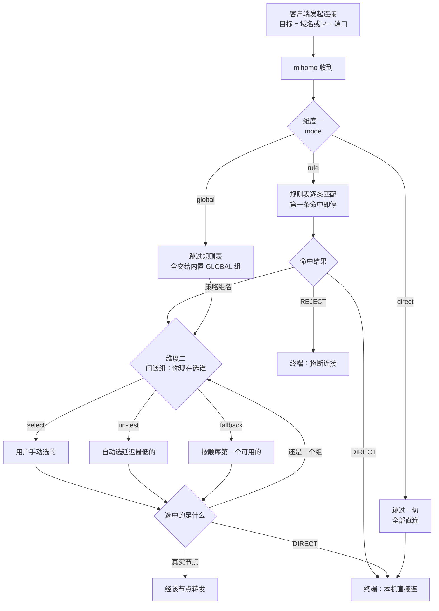
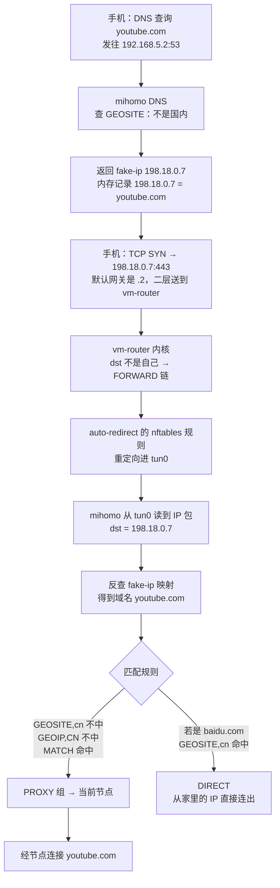

# 代理网关原理

← [02 · 旁路由](README.md)　|　配置说明 → [`config/`](config/)

本文只讲**机制**，不含具体配置。看完能自己推导出"改哪里会有什么后果"。

配置怎么写见 [`config/README.md`](config/)，部署步骤见 [README.md](README.md)。

---

## 1. 两个正交的维度

代理软件的核心模型只有两层，**互相独立**：

| 维度 | 决定 | 控制方式 |
|---|---|---|
| **模式（mode）** | **用不用规则表** | 全局开关：`rule` / `global` / `direct` |
| **策略组（proxy-groups）** | **选中的路具体走哪个节点** | 每个组自己的类型与当前选择 |

理解这两层正交，其余问题都能自行推导。



**"组里可以放组"是理解链路显示的钥匙**：

```
PROXY  <-  自动选择  <-  [Lv3·1.8x] 日本03
 组          组             真实节点
```

---

## 2. 策略组

### 三个内置终端（不可再展开）

| | 行为 | 典型用途 |
|---|---|---|
| `DIRECT` | mihomo **自己**去连目标，不经任何代理节点 | 国内流量 |
| `REJECT` | 直接掐断连接 | 广告屏蔽 |
| `PASS` | 跳过当前规则集，继续往下匹配 | 嵌套规则集 |

**`DIRECT` ≠ 不经过 mihomo**：

```
DIRECT            客户端 → mihomo → mihomo 自己连目标 → 转发字节
                            ↑ 仍在链路上，仍是中间人
完全不经过 mihomo  客户端 → 直接连目标
```

区别很实际：`DIRECT` 的连接**在连接页可见、受规则控制、计入流量统计**；完全不经过的则三者皆无。

### 组的类型

| 类型 | 行为 |
|---|---|
| `select` | 用户手动选，选了就固定 |
| `url-test` | 定期测延迟，自动选最低的。`tolerance` 控制切换阈值，避免来回抖动 |
| `fallback` | 按配置顺序，用第一个健康的 |
| `load-balance` | 按算法分摊到多个节点 |

### 为什么要分层

```
rules              MATCH,PROXY          规则只认组名
   ↓
PROXY (select)     [自动选择, DIRECT, 39个节点]
   ↓
自动选择 (url-test) 39 个节点
```

| 收益 | 说明 |
|---|---|
| **规则与节点解耦** | 规则写死指向 `PROXY`。换机场、加组、改节点，**规则一行不用改** |
| **逃生开关** | `PROXY` 里放 `DIRECT`。代理出问题时面板上一点，全家立刻直连 —— 不改配置、不重启、不用 SSH |

合成一层就失去第二条：恢复直连只能改配置文件。

### selector 的选择默认不持久化

```yaml
profile:
  store-selected: true
```

**默认 `false`** —— 手动选的节点只存在内存，重启回到第一个候选。开这项才写入 `cache.db`。

---

## 3. 规则

### 顺序匹配，第一条命中即停

`MATCH` 匹配一切，**必须是最后一条**，否则后面全是死代码。

### 常见类型

| 类型 | 判断依据 | 需要 DNS 解析 |
|---|---|---|
| `GEOSITE,cn` | **域名**是否在国内域名库里 | 否 |
| `DOMAIN-SUFFIX,cn` | 域名后缀 | 否 |
| `DOMAIN-KEYWORD,google` | 域名含关键词 | 否 |
| `GEOIP,CN` | **IP** 是否属于中国 | 是 |
| `IP-CIDR,192.168.0.0/16` | IP 网段 | 是 |
| `RULE-SET,youtube` | 引用外部规则集文件 | 看规则集类型 |
| `MATCH` | 兜底 | 否 |

### `no-resolve` 的语义与陷阱

`no-resolve` = **不要为了评估这条规则而触发 DNS 解析**。

```yaml
- GEOIP,CN,DIRECT,no-resolve      # 陷阱
```

HTTP 代理请求携带的是**域名**，此时没有 IP 可判断 → 这条规则**被整条跳过** → 落到 `MATCH` 走代理。

**实测后果**：`www.qq.com` 命中 `Match`，经日本节点访问。国内流量全部走代理，浪费带宽且部分国内服务会因境外 IP 拒绝服务。

正确写法：

```yaml
- GEOSITE,cn,DIRECT     # 域名维度先判，不需解析，快且准
- GEOIP,CN,DIRECT       # IP 维度兜底，允许解析
- MATCH,PROXY
```

`no-resolve` 只该用在**明确只匹配已经是 IP 的连接**的场景，例如内网网段直连。

---

## 4. 三种模式

| mode | 行为 | 用途 |
|---|---|---|
| `rule` | 走规则表 | 日常 |
| `global` | 跳过规则表，全部交给内置 `GLOBAL` 组 | **排障**：怀疑规则写错时全走代理试，好了说明问题在规则 |
| `direct` | 跳过规则表和策略组，全部直连 | 快速验证"是不是代理导致的"；全家临时断代理但不断网 |

`GLOBAL` 是 mihomo **内置**的 select 组，候选为所有节点 + DIRECT + REJECT。`mode: rule` 下它不起作用，但仍会出现在 API 和面板里。

---

## 5. 流量进入代理的两条路

这是最容易混淆的部分。**两条路并存，机制完全不同。**

| | **代理端口（7890）** | **TUN** |
|---|---|---|
| 工作层次 | 应用层（HTTP CONNECT / SOCKS5） | **网络层（原始 IP 包）** |
| 应用视角 | "我连 `192.168.5.2:7890`，告诉它我想访问 google" | "我在直连 `142.250.x.x:443`" |
| 应用要配置吗 | 🔴 **必须配**（浏览器代理设置 / `HTTP_PROXY`） | **完全不用** |
| mihomo 怎么知道目标 | 客户端**明说**：`CONNECT google.com:443` | 从 **IP 包头**读 dst IP + port |
| UDP | HTTP 代理不支持，SOCKS5 支持 | 支持 |
| 需要权限 | 无 | **CAP_NET_ADMIN**（建虚拟网卡 + 改路由表） |

### 旁路由场景下客户端不走 7890

```
7890 端口   只服务于「手动配置了代理」的客户端
TUN         服务于「什么都没配」的所有设备      ← 旁路由靠这个
```

### 为什么必须 TUN：mihomo 不在内核转发路径上

mihomo 是**用户态程序**。内核转发一个包时不会经过任何用户态进程。要让它参与，必须把包从内核"捞"上来。

| 捞包机制 | 说明 |
|---|---|
| **TUN** | 虚拟网卡，读写原始 IP 包。**支持 TCP + UDP + ICMP** |
| TPROXY | 内核透明代理，需 mangle 表 + 策略路由。配置复杂 |
| REDIRECT | NAT 重定向到本地端口，**只支持 TCP** |

`stack` 选项决定谁来实现 TCP/IP 协议栈：

| stack | 实现 | 特点 |
|---|---|---|
| `system` | 内核协议栈 | 最快，对环境挑剔 |
| `gvisor` | 用户态栈（gVisor） | 兼容性最好，稍慢 |
| `mixed` | TCP 走 system，UDP 走 gvisor | 折中，推荐起步 |

> 二进制启动时打印的 `Use tags: with_gvisor` 表示编译进了 gvisor 栈，`mixed` 才可用。

---

## 6. 旁路由的完整包路径

### 两个开关的分工

| 开关 | 接管什么 | 内核路径 |
|---|---|---|
| `auto-route` | **本机自己发出的**流量 | 改路由表，作用于 `OUTPUT` |
| **`auto-redirect`** | **转发流量**（目标不是本机） | 写 nftables，作用于 `FORWARD` |

作为旁路由，其他机器把网关指过来的包**目标不是本机**，走 `FORWARD` 链 —— `auto-route` 改的路由表管不到。**必须靠 `auto-redirect`。**

### 两个条件缺一不可

```
条件① 设备把网关指向 192.168.5.2
      否则包根本不会发到 vm-router
条件② vm-router 开了 TUN + auto-redirect
      否则包到了但走 FORWARD 被原样转发出去（普通路由器行为）
```

| 组合 | 结果 |
|---|---|
| 网关不指过来 | 完全无关 |
| 网关指过来 + 无 TUN | **能上网但没代理** —— 就是一台普通 NAT 路由器 |
| 网关指过来 + TUN + `auto-redirect` | 走代理分流 |

条件①是"包怎么来"，条件②是"包来了怎么处理"。这也是"路由器全局切换"和"开 TUN"必须是两个独立步骤的原因。

### 完整路径



---

## 7. fake-ip：TUN 模式下如何拿到域名

**问题**：IP 包里只有 IP，没有域名。而 `GEOSITE` / `DOMAIN-*` 规则需要域名。

**解法**：

```
① 客户端问 DNS：youtube.com 是多少
   （DNS 也被劫持到 mihomo）
② mihomo 不做真实解析，返回假 IP 198.18.0.7
   同时记录 198.18.0.7 ←→ youtube.com
③ 客户端往 198.18.0.7 发包 → 进 TUN
④ mihomo 收到，用假 IP 反查出域名
⑤ 现在域名规则可用了
```

### 三个推论

| # | |
|---|---|
| 1 | **TUN 和 DNS 劫持必须成对出现**。只开 TUN 不接管 DNS，`GEOSITE` 全部失效，只剩 `GEOIP` 可用 |
| 2 | **海外域名全程不在国内解析**，从根本上绕开 DNS 污染 |
| 3 | `fake-ip-filter` 必须排除内网域名，否则内网设备名会被解析成 `198.18.x.x`。实测未过滤时 `ping zte.home` 返回 `198.18.4.51` |

`198.18.0.0/15` 是 RFC 2544 的基准测试保留段，不会与真实地址冲突 —— 这就是各家代理软件都用它做 fake-ip 池的原因。

---

## 8. Geo 数据库

| 文件 | 内容 | 服务于 |
|---|---|---|
| `geoip.metadb` | IP 段 → 国家 | `GEOIP` 规则 |
| `GeoSite.dat` | 域名分类（cn / youtube / netflix …） | `GEOSITE` 规则 |
| `GeoLite2-ASN.mmdb` | IP → 自治域号 | `IP-ASN` 规则 |

### 按需下载

只有规则实际用到的库才会下载。加了 `IP-ASN` 规则才会去拉 ASN 库。

### 更新失败的两种后果，差别很大

| 场景 | 后果 |
|---|---|
| **首次下载失败**（本地无文件） | 🔴 **致命** —— 规则初始化失败，mihomo `fatal` 退出 |
| 后续更新失败（本地已有可用文件） | ✅ 安全 —— 记 warning，继续用旧文件 |

风险点只在第一次，或文件被删/损坏之后。**所以下载源必须稳定可达。**

### 🔴 默认源在国内不可达

mihomo 默认从 `raw.githubusercontent.com` 拉。实测下载速度：

```
cdn.jsdelivr.net        1.8 MB/s   4.3s      ✅
testingcf.jsdelivr.net  572 KB/s   13.4s
GitHub Release          27 KB/s    30s 只拉到 10%
raw.githubusercontent   完全不通              ← 默认源
```

不显式配 `geox-url` 的后果：`can't download MMDB: context deadline exceeded` → `Parse config error` → 进程退出 → 配合 `Restart=always` 变成无限重启循环。

### 域名库比 IP 库更需要勤更新

| | 变化速度 | 过期后果 |
|---|---|---|
| GeoIP | 慢（IP 段转让，月级） | 少数 IP 判断错 |
| **GeoSite** | **快**（新站点、CDN 迁移，天级） | 新的国内站点被判成境外走代理 |

特征是"**以前好好的，某天某个网站突然不对劲**"，只影响特定站点，很难联想到数据库过期。

---

## 9. 这套概念在其他工具中的对应

核心模型通用，命名与抽象层次有差异。

| 概念 | Clash / mihomo | Surge | sing-box | V2Ray / Xray |
|---|---|---|---|---|
| 节点 | `proxies` | `[Proxy]` | `outbounds` | `outbounds` |
| **策略组** | `proxy-groups` | `[Proxy Group]` | `outbounds`(selector/urltest) | 无，用 `balancers` |
| 规则 | `rules` | `[Rule]` | `route.rules` | `routing.rules` |
| 直连 | `DIRECT` | `DIRECT` | `direct` outbound | `freedom` |
| 拒绝 | `REJECT` | `REJECT` | `block` outbound | `blackhole` |
| 全局模式开关 | `mode` | 界面模式 | 无（靠规则表达） | 无 |

### 迁移成本

| 目标 | 成本 |
|---|---|
| **Surge** | **几乎为零** —— 概念一一对应，都有策略组，只是语法从 YAML 变 ini 风格 |
| **sing-box** | 中等 —— 把"节点"和"组"统一成 `outbound`，无独立策略组概念，需重新映射 |
| V2Ray / Xray | 较大 —— 无策略组，负载均衡靠 `balancers`，配置更底层 |

底层模型是一致的：**三层（节点 → 组 → 规则）× 两个维度（mode × 组类型）**。看别的工具主要是在做术语翻译。
