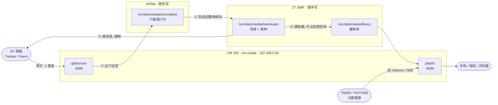

# 03 · 媒体库：下载 + 播放

← [仓库首页](../README.md)　|　依赖 → [01 · 基础设施](../01-infrastructure/)、[05 · 数据盘](../01-infrastructure/05-storage.md)

一台虚拟机上跑两个服务：**qBittorrent 负责下载和做种，Jellyfin 负责刮削和播放**。

本文的重点不是"怎么装"，而是**三个不装就会踩坑的设计**：存储怎么分层、文件怎么共享、流量怎么分流。

---

## 0. 全景



| 服务 | 角色 | 地址 |
|---|---|---|
| **qBittorrent** | 下载端 —— BT 客户端，下载并做种（把文件分享回给别人） | `http://192.168.5.60:8080` |
| **Jellyfin** | 播放端 —— 扫描视频、刮削海报剧情、给各种设备串流 | `http://192.168.5.60:8096` |

---

## 1. 🔴 设计一：存储分层 —— 为什么下载中和下载完要分开放

数据盘是一块 **SMR（叠瓦式）机械盘**，最怕**持续随机写**（详见 [05 · 数据盘 §1.2](../01-infrastructure/05-storage.md#12--判断是不是-smr叠瓦盘)）。

而 **BT 下载恰恰是最典型的随机写**：一个种子被切成几千个块，从几十个 peer 那里**乱序**收到，收到哪块就往文件的哪个偏移量写。直接下到 SMR 盘上，缓存区一满速度就会从 100+ MB/s 掉到 10–20 MB/s，还会拖累同时进行的播放。

**解法是把下载的两个阶段拆到不同介质：**

```
① 下载进行中   →  /srv/downloads/incomplete   NVMe    随机写全部吃在 SSD 上
② 下载完成后   →  /srv/data/media/downloads   2T SMR  一次顺序大写，SMR 扛得住
③ 做种         →  从 2T 盘顺序读                       SMR 读性能不受影响
```

qBittorrent 原生支持这个模式，对应两个配置项：

```ini
[BitTorrent]
# 完成后的落地目录
Session\DefaultSavePath=/srv/data/media/downloads
# 进行中的临时目录
Session\TempPathEnabled=true
Session\TempPath=/srv/downloads/incomplete
```

> 界面上对应 **设置 → 下载 → 「保存到」** 和 **「下载中的种子保存到」**。

**代价**：下载完成时要把整个文件从 SSD 搬到机械盘，一个 20 GB 的文件大约要 3 分钟。这是**顺序大写**，正是 SMR 舒适区，值得。

**临时盘要多大**：取决于你同时在下多少东西。这里给了 200 GB（LVM-thin 精简置备，实际只占用真正写入的量）。

---

## 2. 🔴 设计二：硬链接 —— 做种和媒体库共用一份文件

**问题**：下载完的文件要做种（不能删、不能改名），但 Jellyfin 需要按它的规范命名和归类（`电影名 (年份).mkv`）。

**错误做法**：复制一份到媒体库 → **占双倍空间**。一个 4K 电影 60 GB，复制一份就是 120 GB。

**正确做法：硬链接（hard link）。**

**硬链接是什么**：文件系统里，"文件名"和"文件内容"是分开的两样东西。文件名只是指向内容的一个指针。硬链接就是**给同一份内容再建一个名字** —— 两个路径指向磁盘上完全相同的数据块，**只占一份空间**。删掉其中一个名字，内容还在（因为还有另一个名字指着它）。

```
/srv/data/media/downloads/xxx.2024.2160p.BluRay.x265.mkv     ← 做种用，名字不能动
/srv/data/media/library/movies/某电影 (2024).mkv              ← Jellyfin 用，规范命名
        ↓ 两个名字
   磁盘上同一份 60 GB 数据，只占 60 GB
```

**🔴 硬链接的硬性前提：两个路径必须在同一个文件系统内。**

这就是为什么 `downloads/` 和 `library/` 都放在 `/srv/data` 下面 —— 它们在同一块盘的同一个 ext4 上。如果一个在机械盘、一个在 SSD，硬链接**建不起来**（报 `Invalid cross-device link`），只能退化成复制。

验证方法（链接数为 `2` 即成立）：

```bash
ln /srv/data/media/downloads/.t /srv/data/media/library/movies/.t2
ls -l /srv/data/media/downloads/.t     # 第二列的链接数应为 2
```

> **virtio-fs 支持硬链接** —— 这一点经实测确认，不是想当然。

---

## 3. 🔴 设计三：流量分流 —— BT 直连，刮削走代理

这台机器上有两种**性质完全相反**的出站流量：

| 流量 | 需求 |
|---|---|
| Jellyfin 刮削元数据（TMDB / TheTVDB） | 🔴 **必须走代理** —— 国内直连基本拉不动 |
| BT 下载与做种 | 🔴 **绝不能走代理** —— 慢，且多数机场明确禁止 BT |

所以**整机网关设成 `.1` 或 `.2` 都会顾此失彼**：

- 网关设 `.2`（旁路由）→ BT 的 peer 连接是发往世界各地的随机 IP，会落到 mihomo 的 `MATCH,PROXY` 兜底规则上，**整个 BT 都走了代理** ❌
- 网关设 `.1`（直连）→ BT 正常，但 Jellyfin 刮不到元数据 ❌

**解法：整机走直连，只给 Jellyfin 单独指定 HTTP 代理。**

```
整机网关            192.168.5.1        直连光猫，BT 不受任何影响
Jellyfin 环境变量    HTTP(S)_PROXY=http://192.168.5.2:7890
```

.NET 的 HttpClient 会读 `HTTP_PROXY` / `HTTPS_PROXY` 环境变量，所以给 systemd 单元加个 drop-in 就够了：

```ini
# /etc/systemd/system/jellyfin.service.d/proxy.conf
[Service]
Environment=HTTP_PROXY=http://192.168.5.2:7890
Environment=HTTPS_PROXY=http://192.168.5.2:7890
Environment=NO_PROXY=localhost,127.0.0.1,192.168.5.0/24
```

> `NO_PROXY` 不能漏 —— 否则 Jellyfin 访问局域网内的地址也会绕去旁路由。

**验证（这是可机器判定的信号）：**

```bash
curl -s -o /dev/null -w '%{http_code}\n' --max-time 8 https://api.themoviedb.org/3/
#   期望 000  ← 直连确实连不上，说明没有意外走代理

curl -s -o /dev/null -w '%{http_code}\n' --max-time 15 \
     -x http://192.168.5.2:7890 https://api.themoviedb.org/3/
#   期望 401  ← 服务器【答复了】，只是没带 API key。连通性 OK
```

**关键在于看懂 `401`**：它不是失败，是**成功的证据** —— 只有真正连上 TMDB 服务器才可能收到它的鉴权拒绝。`000` 才是连不上。

---

## 4. 🔴 设计四：权限模型 —— 两个服务共享同一批文件

qBittorrent 和 Jellyfin 是**两个不同的系统用户**。qBittorrent 下载的文件，Jellyfin 必须读得到。

而文件实际躺在**宿主机**的盘上，通过 virtio-fs 映射进来，`virtiofsd` **不做 UID 转换** —— 客体内的 UID/GID 数字直接当成宿主机的用。

**三件事必须同时做到，缺一个就会出现"下载好了但 Jellyfin 看不到"：**

```
① 两边约定同一个 GID       宿主机和客体都建 GID=3000 的 media 组
② 目录带 setgid            chmod 2775 —— 新文件自动继承目录的组，而非创建者的私有组
③ 服务带 UMask=0002        新文件默认带【组写】权限
```

```bash
# 宿主机
groupadd -g 3000 media
chown -R 3000:3000 /srv/data
find /srv/data -type d ! -name 'lost+found' -exec chmod 2775 {} +

# 客体
groupadd -g 3000 media
usermod -aG media jellyfin
usermod -aG media qbittorrent
```

```ini
# 两个服务的 systemd 单元都要加
[Service]
UMask=0002
```

**为什么三件缺一不可：**

| 缺了哪个 | 后果 |
|---|---|
| ① GID 不一致 | 宿主机上文件属主是个不存在的号，客体内谁都没权限 |
| ② 没有 setgid | qBittorrent 建的文件属组是 `qbittorrent`，Jellyfin 不在这个组里，读不到 |
| ③ 没有 UMask | 文件权限是 `644`，组内成员只能读不能写 —— 移动、重命名、删除全部失败 |

验证：

```bash
sudo -u qbittorrent touch /srv/data/media/downloads/.t   # 应成功
sudo -u jellyfin   ls   /srv/data/media/library/         # 应成功
```

---

## 5. 部署

### 5.1 虚拟机规格

从模板 `9000` 完整克隆，规格与挂载见 [05 · 数据盘](../01-infrastructure/05-storage.md)。

```
VM 160  vm-media  192.168.5.60   6 核 / 8 GB
├─ scsi0      50 G   系统盘              local-lvm（NVMe）
├─ scsi1     200 G   /srv/downloads      local-lvm（NVMe）← 下载临时区
├─ virtiofs0         /srv/data           2T SMR 盘
└─ onboot=1, startup order=2             排在 vm-router 之后启动
```

```bash
qm clone 9000 160 --name vm-media --full 1
qm set 160 --cores 6 --memory 8192 --onboot 1 --startup order=2,up=30
qm set 160 --scsi1 local-lvm:200,discard=on,iothread=1,ssd=1
qm set 160 --virtiofs0 dirid=data
```

### 5.2 装服务

```bash
# qBittorrent —— Ubuntu 源里就有
sudo apt-get install -y qbittorrent-nox

# Jellyfin —— 需要官方源
sudo mkdir -p /etc/apt/keyrings
curl -fsSL https://repo.jellyfin.org/jellyfin_team.gpg.key \
  | sudo gpg --dearmor -o /etc/apt/keyrings/jellyfin.gpg
echo "deb [signed-by=/etc/apt/keyrings/jellyfin.gpg arch=amd64] https://repo.jellyfin.org/ubuntu noble main" \
  | sudo tee /etc/apt/sources.list.d/jellyfin.list
sudo apt-get update && sudo apt-get install -y jellyfin
```

> 🔴 **`qbittorrent-nox` 这个包不创建系统用户，也不带 systemd 服务** —— Ubuntu 把它设计成跑用户级服务。得自己建：

```bash
sudo useradd -r -m -d /var/lib/qbittorrent -s /usr/sbin/nologin qbittorrent
sudo usermod -aG media qbittorrent
```

```ini
# /etc/systemd/system/qbittorrent-nox.service
[Unit]
Description=qBittorrent-nox
After=network-online.target srv-data.mount srv-downloads.mount
Wants=network-online.target

[Service]
Type=simple
User=qbittorrent
Group=media
UMask=0002
ExecStart=/usr/bin/qbittorrent-nox --webui-port=8080
Restart=on-failure
RestartSec=5

[Install]
WantedBy=multi-user.target
```

### 5.3 目录

```
/srv/data/media/                  2T SMR 盘（virtio-fs 映射进来）
├── downloads/                    下载完成区，做种从这里读
└── library/
    ├── movies/                   电影：  电影名 (年份).mkv
    ├── tv/                       剧集：  剧名/Season 01/剧名 S01E01.mkv
    └── music/

/srv/downloads/incomplete/        NVMe，下载进行中
```

Jellyfin 的媒体库路径填 **`/srv/data/media/library`** 下面对应的子目录，**不要**直接指向 `downloads/`。

---

## 6. 首次配置

### qBittorrent

**🔴 密码机制要先搞明白**：没设过密码时，qBittorrent 每次启动都会在日志里生成一个**只对本次会话有效的临时密码** —— 服务一重启就失效。

```bash
sudo journalctl -u qbittorrent-nox --since '2 min ago' | grep -i 'temporary password'
```

登录（用户名 `admin`）后**第一件事**：`设置 → Web UI → 认证` 设一个固定密码。

忘了密码怎么重置：

```bash
sudo systemctl stop qbittorrent-nox
sudo sed -i '/^WebUI\\Password_PBKDF2/d' \
  /var/lib/qbittorrent/.config/qBittorrent/qBittorrent.conf
sudo systemctl start qbittorrent-nox
# 再去日志里读新的临时密码
```

其余要点：
- **BT 监听端口**固定为 `16887`，想提高连接质量就在光猫上把这个端口映射进来
- **不要开「预分配磁盘空间」** —— 临时区在 SSD 上，预分配只是白写一遍

### Jellyfin

浏览器打开 `http://192.168.5.60:8096` 走向导：

1. 建管理员账号
2. 添加媒体库 → 类型选「电影」→ 路径 `/srv/data/media/library/movies`；剧集同理
3. 元数据语言选中文，**国家/地区选中国**
4. 🔴 **关掉硬件转码**（`控制台 → 播放`）—— 当前没有给虚拟机直通 GPU，走 CPU 软件转码

**关于转码**：宿主机是 i7-12700F，20 线程软转 1080p 足够。而且大多数播放**根本不需要转码** —— 客户端支持原始编码时就是 **Direct Play（直接播放）**，服务器只负责把文件原样发出去，几乎不耗 CPU。

---

## 7. 关于硬件转码（当前未启用）

宿主机上插着一块 **GTX 1050 Ti（Pascal / GP107）**，带第 6 代 NVENC，支持 H.264 和 HEVC 编解码。但**现在没有给这台虚拟机用**，原因是：

> B660 主板配的是 **i7-12700F，F 后缀没有核显** —— 这块 1050 Ti 是宿主机**唯一的显示输出**。一旦用 VFIO 直通给虚拟机，显卡就被虚拟机独占，**宿主机彻底失去画面**，本地救援都做不了。

**两条路的取舍：**

| 方案 | 硬件转码 | 宿主机显示输出 |
|---|---|---|
| **VM + GPU 直通** | ✅ | ❌ **彻底失去** |
| **LXC 容器共享 GPU** | ✅ | ✅ 保留 |
| **VM + CPU 软转**（当前） | ❌（软转代替） | ✅ 保留 |

LXC 之所以能两全，是因为**容器和宿主机共享同一个内核**，GPU 设备节点可以被双方同时打开，不存在独占。代价是**隔离性弱于 VM** —— qBittorrent 是要暴露给外网做种的服务，跑在容器里安全边界更薄。

本方案选了 VM，所以硬件转码暂时放弃。**这个决定可逆**：以后要启用，关机加一行直通配置即可。

---

## 8. 排错

| 症状 | 原因 | 处理 |
|---|---|---|
| 下载好了但 Jellyfin 看不到文件 | 权限模型三件套缺了一个 | 见 [§4](#4--设计四权限模型--两个服务共享同一批文件) |
| 硬链接失败 `Invalid cross-device link` | 两个目录不在同一个文件系统 | `downloads/` 和 `library/` 必须都在 `/srv/data` 下 |
| Jellyfin 刮不到海报和简介 | 代理没生效 | `systemctl show jellyfin -p Environment` 确认；用 §3 的 curl 对照测试 |
| BT 速度很慢、连接数很少 | 流量走了代理，或端口没映射 | 确认网关是 `.1`；在光猫映射 `16887` |
| qBittorrent 密码登录不上 | 临时密码在服务重启后失效 | 见 [§6](#qbittorrent) 的重置步骤 |
| 下载时整机卡顿、写入掉到十几 MB/s | 下载临时区配错了，直接写在 SMR 盘上 | 确认 `Session\TempPathEnabled=true` 且 `TempPath` 在 NVMe 上 |
| 重启后 `/srv/data` 没挂上 | virtio-fs 的 fstab 项缺失 | `data /srv/data virtiofs defaults,nofail 0 0` |

---

## 9. 速查

```bash
# ── 地址 ──
# qBittorrent  http://192.168.5.60:8080   （admin / 见日志里的临时密码）
# Jellyfin     http://192.168.5.60:8096

# ── 服务 ──
systemctl status jellyfin qbittorrent-nox
sudo journalctl -u qbittorrent-nox --since '5 min ago' | grep -i password

# ── 存储 ──
df -h /srv/data /srv/downloads
ls -ln /srv/data/media/downloads          # 属主应为 3000:3000

# ── 权限自检 ──
sudo -u qbittorrent touch /srv/data/media/downloads/.t && echo OK
sudo -u jellyfin   ls   /srv/data/media/library/       && echo OK

# ── 分流自检 ──
curl -s -o /dev/null -w '直连 %{http_code}\n' --max-time 8 https://api.themoviedb.org/3/
curl -s -o /dev/null -w '代理 %{http_code}\n' --max-time 15 -x http://192.168.5.2:7890 https://api.themoviedb.org/3/
# 期望：直连 000（连不上）  代理 401（服务器答复了）
```

---

← 返回 [仓库首页](../README.md)　|　相关 → [05 · 数据盘](../01-infrastructure/05-storage.md)、[02 · 旁路由](../02-gateway/)
