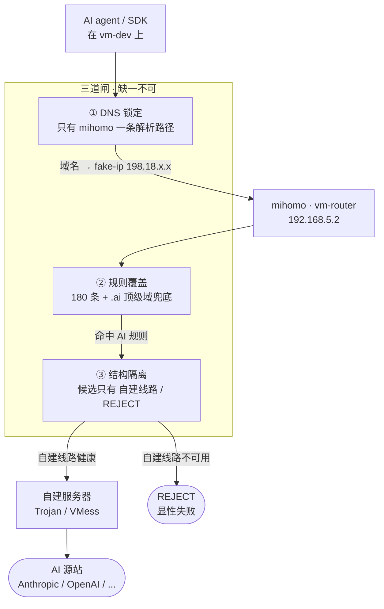

# 04 · 开发机：AI 流量保障

← [仓库首页](../README.md)　|　依赖 → [02 · 旁路由](../02-gateway/)

`vm-dev`（`192.168.5.21`，VMID `121`）是日常开发机，上面跑 AI agent。

**本文的核心命题不是"配了代理"，而是「任何一条 AI 流量都不可能绕过自建线路」。**

这两件事差别很大：前者只要网关指对就算完成；后者要求**穷尽所有可能的绕过路径并逐一封死**，而且每一条都能被实测验证。

---

## 0. 全景



**三道闸的分工**：② 决定「这条流量算不算 AI」，③ 决定「算 AI 的能去哪」，而 ① 决定「② 有没有机会做判断」——**没有 ①，②③ 都会被静默跳过**。

---

## 1. 机器规格

```
VM 121  vm-dev  192.168.5.21/24
├─ CPU 8 核 / 内存 8 GB / 系统盘 100 GB（local-lvm，NVMe）
├─ 🔴 网关 192.168.5.2   —— 全部流量进 mihomo
├─ 🔴 DNS  192.168.5.2   —— 且【只有】这一条，见第 3 节
├─ onboot=1，startup order=3（排在 vm-router 与 vm-media 之后）
└─ 每天 04:00 自动纳入 PVE 备份
```

> **和 `vm-media` 的取舍正好相反**：媒体机网关走 `.1` 直连（BT 不能走代理），只给 Jellyfin 单独配 `HTTP_PROXY` 刮元数据。开发机反过来 —— 整机走 `.2`，因为这里的每一条出站都可能是 AI 请求。

---

## 2. 🔴 三道闸

### ① DNS 锁定

**目的**：保证 mihomo 是唯一的解析来源，域名规则才有机会生效。

这是最容易被忽略、也是本文的重点，详见[第 3 节](#3-dns-锁定的完整实现)。

### ② 规则覆盖

180 条规则把 AI 域名判进 `AI服务` 策略组。除了逐条列出的具体域名，还有一条 `.ai` 顶级域兜底，接住将来新出现的服务。

规则本体与设计依据在 [02 · 旁路由](../02-gateway/)，此处不重复。

**关键认知**：结构隔离只保证「`AI服务` 组不可能连到订阅」，**不保证「所有 AI 域名都命中了 `AI服务`」**。没命中的域名会落到最后的 `MATCH,PROXY` → 走订阅节点 —— 这才是真正的泄漏形式，**光看策略组配置永远看不出来**。

### ③ 结构隔离

`AI服务` 策略组的候选**只有** `[自建线路, REJECT]`，结构上不可能连到订阅节点。自建线路不可用时是 `REJECT`（显性失败），而不是退回 `DIRECT`。

---

## 3. DNS 锁定的完整实现

### 3.1 为什么网关指向 `.2` 还不够

mihomo 用 **fake-ip** 模式：海外域名不做真实解析，直接返回 `198.18.0.0/16` 段的假 IP；客户端往假 IP 发包进 TUN，mihomo 再反查还原出域名，**域名规则这才有得判**。

```
✅ DNS = 192.168.5.2
   api.anthropic.com → 198.18.0.5（fake-ip）
   → 进 TUN → mihomo 反查还原域名 → 命中 DomainSuffix(anthropic.com) → AI服务

❌ DNS = 任何其他解析源
   api.anthropic.com → 160.79.104.10（真实 IP）
   → mihomo 只看到「连某个 IP」，GEOSITE / DOMAIN 规则【全部匹配不上】
   → 一路穿到兜底的 MATCH,PROXY → 🔴 走订阅节点
```

**所以 DNS 走哪里，决定了域名规则有没有机会生效。** 网关对了但 DNS 错了，等于三道闸只剩一道。

### 3.2 三条泄漏路径

Ubuntu 用 `systemd-resolved`，它的 DNS 来源不止一处。装完 `provision-base.sh` 的默认状态：

```
Global
  DNS Servers:          223.5.5.5  119.29.29.29        ← ① 全局
  Fallback DNS Servers: 180.76.76.76  114.114.114.114  ← ② 兜底
Link 2 (enp6s18)
  DNS Servers: 192.168.5.2  fe80::5                    ← ③ 光猫的 IPv6 链路本地
```

正常情况下链路级优先，走 `192.168.5.2` ✅。但**每一条备用路径都是一个静默劣化的入口**：

```
mihomo 进程挂了，而 vm-router 这台虚拟机还活着
  → mihomo 的 :53 不再响应
  → resolved 转向 ①/②/③ 任意一条 → 拿到【真实 IP】
  → 而 vm-router 的 ip_forward + NAT 仍在，网络照样通
  → AI 流量以真实 IP 直连出去，域名规则全部失效
  → 🔴 你不会收到任何提示，一切「看起来正常」
```

> ⚠️ 要区分：**vm-router 整台虚拟机挂了**的话，vm-dev 连网关都没了，全网不通，那时兜底 DNS 也没用。**风险只存在于「mihomo 死了但虚拟机还活着」这个窗口。**

这与旁路由「两条链都以 `REJECT` 收尾、不退回 `DIRECT`」是同一条原则：**宁可显性失败，不要「能上网但没代理」的隐性劣化。**

### 3.3 🔴 IPv6：WAN 关闭 ≠ 链路本地关闭

第 ③ 条最容易被误判成"已经不存在了"，因为光猫的 **IPv6 WAN 早就关了**。但这是两个不同层面：

| | 状态 | 说明 |
|---|---|---|
| **全局 IPv6**（公网） | ✅ 已关 | 本机无全局 IPv6 地址、无 IPv6 默认路由，上不了 IPv6 网站 |
| **链路本地 IPv6**（`fe80::/10`） | ❌ **关不掉** | 只要网卡启用 IPv6 就一定有，**是链路层固有的，不依赖运营商** |

```
vm-dev 的网卡：fe80::be24:11ff:fefb:38af/64  scope link
光猫：        fe80::5
```

光猫即使 WAN 侧没有 IPv6，**在局域网内仍会发路由器通告（RA）**，把自己的 `fe80::5` 通告成 DNS。而 DNS 查询恰恰是发给**同一个二层网段**的光猫 —— 全程不需要任何公网 IPv6。

**实测证据（这条风险是真的，不是理论）：**

```bash
dig +short @fe80::5%enp6s18 api.anthropic.com     # 直接问光猫
→ 160.79.104.10        🔴 真实 IP

dig +short @192.168.5.2 api.anthropic.com          # 问 mihomo
→ 198.18.0.5           ✅ fake-ip

dig +short @fe80::5%enp6s18 www.baidu.com          # 确认光猫确实在提供 DNS 服务
→ 220.181.111.232      ✅ 正常应答
```

> **一条纵深防御刚好救了 Anthropic**：规则里有 `IP-CIDR,160.79.104.0/21,AI服务,no-resolve`，光猫返回的 `160.79.104.10` 正落在这个段里，即使拿到真实 IP 也仍会被判进 `AI服务`。
>
> 但它**只覆盖 Anthropic 的已知网段**。OpenAI、Groq、Tavily 等没有对应 IP-CIDR 规则，拿到真实 IP 就会一路穿到 `MATCH,PROXY`。**不能靠这个兜底。**

### 3.4 实施

**文件一：清空全局与兜底 DNS**

```ini
# /etc/systemd/resolved.conf.d/20-no-dns-fallback.conf
[Resolve]
DNS=
FallbackDNS=
```

🔴 **文件名序号必须大于 `10-cn-dns.conf`** —— systemd 按字典序加载 drop-in，后者覆盖前者。`10-cn-dns.conf` 是 `provision-base.sh` 写的全局兜底，对其他机器是好默认值，**不要去改它**，用一个更高序号的文件在本机覆盖即可。

**文件二：关掉路由器通告**

```yaml
# /etc/netplan/50-cloud-init.yaml
network:
  version: 2
  ethernets:
    enp6s18:
      dhcp4: false
      addresses: [192.168.5.21/24]
      routes:
        - to: default
          via: 192.168.5.2
      nameservers:
        addresses:
          - 192.168.5.2
      accept-ra: false      # 🔴 不接受 RA，光猫的 fe80::5 就进不来
      dhcp6: false
```

```bash
sudo netplan generate     # 先校验语法
sudo netplan apply        # IP 不变，SSH 不中断
```

> **`resolvectl revert <link>` 清不掉 `fe80::5`** —— 它只重置「运行时覆盖」，而 RA 学来的 DNS 记在 networkd 的链路状态里。必须从 netplan 关掉 RA。

### 3.5 生效后的状态

```
Global
  （无 DNS Servers，无 Fallback DNS Servers）
Link 2 (enp6s18)
  DNS Servers: 192.168.5.2
accept_ra: 0
```

**mihomo 的 DNS 一挂就直接解析失败 —— 显性暴露，不会静默裸奔。**

### 3.6 🔴 遗留：`init-clone.sh` 会覆盖 netplan

第二个文件是 `init-clone.sh` 生成的。**下次对这台机器跑 `init-clone.sh`，`accept-ra: false` 会被覆盖掉。**

重跑之后必须手工补回，或者给该脚本加一个角色选项（类似现有的 `--router`）把这条固化进去。

---

## 4. 验证 —— 四层，缺一层就不算数

**每一层都要有机器可判定的信号，不能靠"配置看起来对"。**

### ① DNS 层：所有 AI 域名都是 fake-ip

```bash
for d in api.anthropic.com api.openai.com claude.ai chatgpt.com \
         generativelanguage.googleapis.com tavily.com api.groq.com openrouter.ai; do
  ip=$(getent hosts $d | head -1 | awk '{print $1}')
  case "$ip" in 198.18.*) echo "  ✅ $d $ip";; *) echo "  🔴 $d $ip 非 fake-ip";; esac
done
```

**判据**：非 `198.18.x.x` 的数量必须为 **0**。

### ② 解析源层：确认没有第二条解析路径

```bash
resolvectl status | sed -n '/^Global/,/^Link/p'   # 应无 DNS Servers / Fallback
resolvectl dns                                     # Link 应只有 192.168.5.2
cat /proc/sys/net/ipv6/conf/enp6s18/accept_ra      # 应为 0
```

### ③ 规则层：实际命中了哪条规则

从 vm-dev 发起真实连接，再读 mihomo 的日志：

```bash
# vm-dev 上
date '+%H:%M:%S'
for d in api.anthropic.com api.openai.com tavily.com; do
  curl -s -o /dev/null --connect-timeout 6 "https://$d/" &
done; wait

# vm-router 上（时间填上面那个）
sudo journalctl -u mihomo --since '<HH:MM:SS>' --no-pager \
  | grep '192\.168\.5\.21:' \
  | sed -E 's/.*--> ([^ ]+):[0-9]+ match (.*) using (.*)"$/\1 → \2 → \3/'
```

**期望输出**：

```
api.anthropic.com → DomainSuffix(anthropic.com) → AI服务[Trojan-3xUI]
api.openai.com    → DomainSuffix(openai.com)    → AI服务[Trojan-3xUI]
tavily.com        → DomainSuffix(tavily.com)    → AI服务[Trojan-3xUI]
```

🔴 **只要出现 `using PROXY`，就是泄漏** —— 那条流量走了订阅节点。

### ④ 出口层：确认终点是自建服务器

```bash
# vm-router 上，SECRET / PORT 从 /etc/mihomo/config.yaml 读
curl -s -H "Authorization: Bearer $SECRET" \
  "http://127.0.0.1:$PORT/proxies/AI%E6%9C%8D%E5%8A%A1" | python3 -c 'import sys,json;print(json.load(sys.stdin)["now"])'
# → 自建线路

curl -s -H "Authorization: Bearer $SECRET" \
  "http://127.0.0.1:$PORT/proxies/%E8%87%AA%E5%BB%BA%E7%BA%BF%E8%B7%AF" | python3 -c 'import sys,json;print(json.load(sys.stdin)["now"])'
# → Trojan-3xUI

# 此刻是否真有到自建服务器的连接（端口见 mihomo.local.env）
sudo ss -tnp | grep -c ':<自建端口>'
```

**完整链路**：`vm-dev → AI服务 → 自建线路 → Trojan-3xUI → <自建服务器> → AI 源站`

> 🔴 自建服务器的域名、IP、端口一律**不写进文档**，只存在 `02-gateway/config/mihomo.local.env`（600，gitignored）。

### ⑤ 定期复跑：新增 AI 服务的泄漏审计

规则是静态列表，**新用一个 AI 服务就可能多一个漏网域名**。方法见 [02 · 旁路由 → AI 流量泄漏审计](../02-gateway/)。

**开始用任何新的 AI 服务时，跑一次第 ③ 层验证。** 看到 `using PROXY` 就补规则。

---

## 5. 会话保持：tmux

SSH 断线会给前台进程组发 `SIGHUP`，长任务直接终止 —— **跑 AI agent 时尤其致命**，任务跑到一半断线，上下文全丢。

`provision-base.sh` 已经装好 tmux 并写了配置（`~/.tmux.conf`），两项关键设置：

| 设置 | 为什么 |
|---|---|
| `escape-time 0` | 默认 500ms 是为了区分 ESC 键与终端转义序列，但全屏 TUI 应用按 ESC 会明显卡顿 |
| `history-limit 50000` | 默认 2000 行，AI agent 的输出量轻易冲掉；断线重连后想翻之前的输出会发现已经没了 |

```bash
tmux new-session -d -s agent 'claude'    # 后台起一个会话跑 agent
tmux attach -t agent                      # 断线后接回去
tmux send-keys -t agent '继续' Enter       # 从外部发指令
tmux capture-pane -t agent -p             # 把输出抓出来
# 主动脱离（进程继续跑）：Ctrl+b 然后 d
```

---

## 6. 坑

| 症状 | 根因 | 处理 |
|---|---|---|
| 网关指对了，AI 仍走订阅 | DNS 没指向 mihomo，拿到真实 IP，域名规则匹配不上 | 见 [§3](#3-dns-锁定的完整实现) |
| 以为关了 IPv6 就没有 IPv6 DNS | 关的是 WAN，**链路本地 `fe80::` 关不掉** | `accept-ra: false` |
| `resolvectl revert` 清不掉 `fe80::5` | 它只重置运行时覆盖，RA 学来的记在 networkd 链路状态里 | 从 netplan 关 RA |
| 新用的 AI 服务悄悄走了订阅 | 规则是静态列表，必然有漏网 | 定期跑第 ③ 层验证 |
| `init-clone.sh` 跑完 `accept-ra` 没了 | 该脚本会重写整个 netplan | 见 [§3.6](#36--遗留init-clonesh-会覆盖-netplan) |
| 长任务随 SSH 断线终止 | 前台进程收到 SIGHUP | 在 tmux 里跑 |

---

## 7. 速查

```bash
# ── 一键自检：四层里最关键的两层 ──
# ① DNS 全是 fake-ip？
for d in api.anthropic.com api.openai.com tavily.com api.groq.com openrouter.ai; do
  printf '  %-34s %s\n' "$d" "$(getent hosts $d | head -1 | awk '{print $1}')"
done
# ② 解析源只有 mihomo？
resolvectl dns; cat /proc/sys/net/ipv6/conf/enp6s18/accept_ra

# ── 出问题时的排查顺序 ──
# 1. DNS 拿到的是不是 fake-ip     → 不是就查 §3
# 2. mihomo 日志命中了哪条规则     → using PROXY 就是泄漏，补规则
# 3. AI服务 组当前选中哪个候选     → 应为 自建线路，REJECT 说明自建线路不健康
```

---

← 返回 [仓库首页](../README.md)　|　相关 → [02 · 旁路由](../02-gateway/)、[01 · 网络规划](../01-infrastructure/02-network.md)
