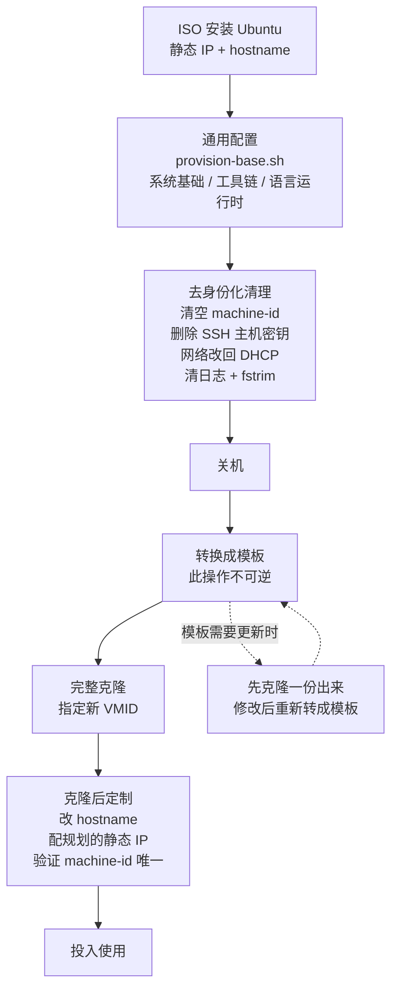

# 04 · 虚拟机创建与模板化

> **承接**：[03 · Proxmox VE 核心概念](03-proxmox-concepts.md)
> **本文的两个目标**：① 用 ISO 装出第一台可用的 Ubuntu 虚拟机；② 把它清理成一个可以反复克隆的模板
> **各项配置的"为什么"**已在 [03](03-proxmox-concepts.md) 详述，本文只给结论和操作

---

## 0. 模板生命周期



---

## 1. 准备 ISO

### 1.1 版本选择

| 版本 | 评价 |
|---|---|
| **Ubuntu 24.04 LTS (Noble Numbat)** | **推荐**。NVIDIA 驱动、CUDA、vLLM、k8s 的官方文档和社区经验绝大多数基于它 |
| 最新的 LTS（如 26.04） | 支持周期更长，但刚发布几个月 —— **遇到问题搜不到答案**，第三方软件适配还不全 |

用太新的系统会让时间花在"为什么教程里的命令在我这不работ"上，而不是花在真正想学的东西上。

**下 Server 版，不要 Desktop 版**。文件名形如 `ubuntu-24.04.x-live-server-amd64.iso`。Desktop 版带图形界面，对服务器纯属浪费（多占 4GB 磁盘 + 几百 MB 内存）。

### 1.2 让 Proxmox 自己下载（推荐）

不经过浏览器，服务器直连下载。

```
左侧展开节点 → local → ISO 映像 → 【从 URL 下载 / Download from URL】
  ① 粘贴 URL → 点【查询 URL】（会自动填好文件名和大小）
  ② 确认文件名含 live-server
  ③ 点【下载】
```

国内镜像（快得多）：

```
https://mirrors.tuna.tsinghua.edu.cn/ubuntu-releases/24.04/
https://mirrors.ustc.edu.cn/ubuntu-releases/24.04/
```

等价的 Shell 操作：

```bash
cd /var/lib/vz/template/iso/
wget https://mirrors.tuna.tsinghua.edu.cn/ubuntu-releases/24.04/ubuntu-24.04.x-live-server-amd64.iso
```

校验：

```bash
sha256sum ubuntu-24.04.x-live-server-amd64.iso
curl -s https://mirrors.tuna.tsinghua.edu.cn/ubuntu-releases/24.04/SHA256SUMS | grep live-server
```

---

## 2. 创建虚拟机

### 2.1 建议先建一台练手机

```
名称:   vm-test
VMID:   190
IP:     192.168.5.90    ← 预留段，跑通流程后删掉或转成模板
```

第一台难免要重来几次，用预留地址练手，正式的实例等熟了再按规划表建。

### 2.2 逐页配置

#### 常规 (General)

| 字段 | 填 | 说明 |
|---|---|---|
| 节点 | `pve-old` | — |
| **VM ID** | `190` | 建议 **100 + IP 尾数**。看到 `qm stop 190` 就知道动的是 `.90` 那台。**创建后不能改** |
| 名称 | `vm-test` | 纯显示标签，随时可改 |

配置文件路径：`/etc/pve/qemu-server/190.conf`

#### 操作系统 (OS)

| 字段 | 选 |
|---|---|
| 存储 | `local` |
| ISO 映像 | 刚下的 Ubuntu Server |
| 类别 | `Linux` |
| 版本 | `6.x - 2.6 Kernel` |

> 这不是"检测系统"，而是告诉 QEMU 采用哪一套默认硬件参数。选 Linux 会启用 `kvm-clock` 时钟源、假定支持 VirtIO、硬件时钟按 UTC 处理。**选成 Windows 会导致 Linux 客户机时间差 8 小时**。

#### 系统 (System) —— 三个必改

| 字段 | 默认 | **改成** | 事后能改吗 |
|---|---|---|---|
| **机型** | `i440fx` | **`q35`** | **不能**（系统会起不来） |
| **BIOS** | `SeaBIOS` | **`OVMF (UEFI)`** | **不能**（必须重装） |
| EFI 存储 | — | `local-lvm` | — |
| 预注册密钥 | 勾着 | **取消勾选**（Linux 客户机） | 能 |
| SCSI 控制器 | `VirtIO SCSI single` | 保持默认 | — |
| **QEMU 代理** | 不勾 | **勾上** | 能 |

#### 磁盘 (Disks)

| 字段 | 设成 |
|---|---|
| 总线/设备 | **SCSI** |
| 存储 | **`local-lvm`** |
| 磁盘大小 | 练手 `32` GB；k8s 节点建议 `60–100` GB |
| **丢弃 (Discard)** | **勾上** |
| **SSD 仿真** | **勾上** |
| **IO thread** | 勾上 |
| 缓存 | 保持 `默认(无缓存)` |

#### CPU

| 字段 | 设成 |
|---|---|
| 插槽 | `1` |
| 核心 | `2`（练手） |
| **类别** | 默认 `x86-64-v2-AES` → **改成 `host`** |

#### 内存 (Memory)

| 字段 | 设成 |
|---|---|
| 内存 | `4096` MB |
| 气球设备 | 保持勾选（**GPU 直通的虚拟机必须取消**） |

#### 网络 (Network)

| 字段 | 设成 |
|---|---|
| 桥接 | `vmbr0` |
| 模型 | **VirtIO (半虚拟化)** |
| VLAN 标签 | 留空 |
| 防火墙 | **取消勾选**（起步阶段少一层排查点，随时能开） |

> Proxmox 这一侧只负责"把网线插到 `vmbr0` 上"，**不管 IP**。IP 是在客户机系统内部配的。

---

## 3. Ubuntu 安装向导

### 3.1 网络配置

```
Network connections
   ens18   eth   -              ← 选中它，回车
       → Edit IPv4
           IPv4 Method:    Manual         （不要用 Automatic/DHCP）
           Subnet:         192.168.5.0/24 ← 【网段】
           Address:        192.168.5.90   ← 【本机地址】
           Gateway:        192.168.5.1
           Name servers:   223.5.5.5,119.29.29.29
           Search domains: (留空)
       → Save
```

| 常见错误 | 后果 |
|---|---|
| **`Subnet` 和 `Address` 填反** | 系统认为自己的地址是 `192.168.5.0`（网络地址，非法）→ 完全不通 |
| 用 DHCP | 服务器地址会被写死在别的地方（k8s 证书、监控目标、其他服务的配置），租约到期换地址就全废 |

> 网卡名是 `ens18`（VirtIO 网卡的标准命名），不是 `eth0`。

### 3.2 引导式存储配置 —— 三个决定

```
Guided storage configuration

  (X) Use an entire disk
      [ /dev/sda   local disk   32.000G  ▼ ]
      [X] Set up this disk as an LVM group
          [ ] Encrypt the LVM group with LUKS

  ( ) Custom storage layout
```

#### 决定一：整盘 vs 自定义

| | **Use an entire disk** | Custom storage layout |
|---|---|---|
| 做什么 | 自动划分好所有分区 | 手动一个个建 |
| 适合 | **虚拟机、绝大多数场景** | 有特殊分区需求时 |

**什么时候才需要 Custom**：给某个容易膨胀的目录单独一个分区，防止它撑爆根分区。

| 目录 | 谁会撑爆它 |
|---|---|
| `/var/log` | 日志失控（某个服务疯狂报错） |
| **`/var/lib/containerd`** | **容器镜像**，k8s 节点上很容易几十 GB（CUDA 基础镜像动辄 5–10GB） |

根分区被撑满的后果很严重：系统日志写不进去、SSH 登不上（需要写临时文件）、服务批量异常。独立分区能把损害限制在那一个目录里。

> 练手 VM 不需要。**以后建 k8s 节点时可以考虑**，或者更简单：把根盘直接给大一点（60–100GB）。

#### 决定二：LVM 勾不勾 —— 建议保持勾选

| | **勾 LVM** | 不勾 |
|---|---|---|
| 分区结构 | 多一层抽象 | 简单直接 |
| **加第二块虚拟磁盘扩容** | **直接吸收进 VG，不碰分区表** | 只能挂在别的目录，不能扩根分区 |
| 扩大原有磁盘 | `pvresize` + `lvextend` + `resize2fs` | `growpart` + `resize2fs` |
| 客户机内快照 | 支持 | 不支持 |

**一个合理的疑问**：Proxmox 那层已经有 LVM 了，客户机里再套一层不重复吗？

确实有点重复，但仍建议勾上：

| 理由 | 说明 |
|---|---|
| **加盘扩容更灵活** | 磁盘不够时在 Proxmox 里加一块新虚拟磁盘 → 客户机里 `vgextend` 吸收 → 根分区在线变大，**全程不重启、不碰分区表** |
| 这是 Ubuntu 的默认路径 | 出问题时网上搜到的答案都基于这个结构 |

**不勾也完全能用**，这是"两个都对"的选择。

#### 决定三：LUKS 加密 —— 不要勾

```
勾了之后：每次开机 → 停在密码提示符 → 必须有人手动输密码 → 才继续启动
```

| 场景 | 后果 |
|---|---|
| 宿主机断电重启 | 虚拟机停在密码提示符，服务全挂，直到你去控制台手动输 |
| 你人在外地 | 只能远程连 Proxmox 开控制台输密码 —— 前提是网络还通 |
| 自动化重启（升级内核） | 完全没法无人值守 |

它防的是**物理威胁**（有人偷走硬盘直接读数据）。家用虚拟机的威胁模型不成立 —— 而且 **Proxmox 宿主机那一层本来就没加密**，虚拟磁盘躺在宿主机上，能拿到宿主机就什么都能拿到。

### 3.3 生成的分区结构

```
/boot/efi   1.0 G   fat32   ESP（EFI 系统分区）
/boot       2.0 G   ext4    内核 + initrd + GRUB
/           剩余     ext4    LVM 逻辑卷 ubuntu-lv
```

| 分区 | 为什么存在 |
|---|---|
| **`/boot/efi`** | **必须是 FAT32** —— UEFI 规范只要求固件实现 FAT 驱动，加载操作系统之前它不认识 ext4。因为在 Proxmox 里选了 OVMF 才有这个分区；选 SeaBIOS 会换成一个 1MB 的 BIOS boot 分区 |
| **`/boot`** | 根分区在 LVM 里面。GRUB 虽然能读 LVM，但**读一个普通 ext4 分区更简单可靠**。2GB 不大 —— 每个内核版本约 150–200MB，Ubuntu 默认保留 2–3 个旧内核以便回滚 |
| `/` | LVM 逻辑卷，主体 |

### 3.4 关键的坑：`ubuntu-lv` 没有占满卷组

```
USED DEVICES
  ubuntu-vg (new)   LVM volume group   28.996G
    ubuntu-lv (new)                    16.996G   ← 只拿了一半多
    free space                         12.000G   ← 白白空着
```

**Ubuntu 的引导式 LVM 默认只分配一部分空间给根分区**，留出空闲给以后做快照或划分独立分区。在物理服务器上这个保留有价值，**但对虚拟机没必要** —— 虚拟机的磁盘本身就能在 Proxmox 里随时扩大。

不改的话，你以为给了 32GB，实际能用的只有 17GB —— 装几个容器镜像就满了。

#### 修复方法一：装的时候就改（推荐）

```
① 用方向键移到 USED DEVICES 里的 ubuntu-lv 那一行
② 回车 → 选【Edit】
③ Size 那一栏：直接清空（留空 = 用满所有可用空间），或填一个具体值
④ 选【Save】
⑤ 回到摘要，确认 / 的大小接近磁盘总容量
⑥ 【Done】→【Continue】（会警告要格式化磁盘）
```

#### 修复方法二：装完之后扩

```bash
sudo vgs                                          # 看 VFree 有多少空闲
sudo lvextend -l +100%FREE /dev/ubuntu-vg/ubuntu-lv
sudo resize2fs /dev/ubuntu-vg/ubuntu-lv           # 这一步不能省
df -h /
```

**全程在线，不用重启、不会丢数据。**

> `lvextend` 只是把"容器"变大了，文件系统还不知道自己可以用更多空间。**两步都做才生效。**

### 3.5 用户设置

Ubuntu 安装器**强制要求建一个普通用户**，并**默认锁定 root 账号**（root 密码字段是 `!`，任何输入都无法匹配）。这是 Ubuntu 的设计，没有跳过选项。

```
Your name:            Jing              ← 只是显示名
Your server's name:   vm-test           ← 【这就是 hostname】，别填成人名
Pick a username:      jing              ← 登录用的用户名
Choose a password:    ********
```

**日常不需要解锁 root**：

```bash
sudo -i          # 直接得到完整的 root shell，提示符变成 root@vm-test:~#
```

**真要启用 root，三个层次：**

| 层次 | 做法 | 评价 |
|---|---|---|
| ① 仅本地控制台 | `sudo passwd root` | 设完密码自动解锁，**不影响 SSH** |
| ② **root 密钥 SSH** | 把公钥放到 `/root/.ssh/authorized_keys` | **推荐的折中**。Ubuntu 的 sshd 默认就是 `prohibit-password`，不用改配置。这也是 Proxmox/Debian 的默认模式 |
| ③ root 密码 SSH | `PermitRootLogin yes` | **不建议**。root 是全世界都知道的用户名，开放密码登录等于把攻击面减半 |

**建议按 Ubuntu 默认来**，理由不是安全教条：

```
① k8s、Ansible、绝大多数工具的文档都假设「普通用户 + sudo」
② sudo 有审计日志（/var/log/auth.log），能查"这个配置什么时候被改的"
③ 沉淀的技术文档用行业标准做法才有参考价值
```

代价是多打四个字母，可以配成免密：

```bash
echo "$USER ALL=(ALL) NOPASSWD:ALL" | sudo tee /etc/sudoers.d/$USER
sudo chmod 440 /etc/sudoers.d/$USER
```

> **为什么 Proxmox 是 root 直登、Ubuntu 不是**：Debian 保留传统 Unix 的 root 模型，Ubuntu 从一开始就推 sudo 模型。都能用，跟着各自的默认走最省事。

### 3.6 Ubuntu Pro —— Skip for now

Canonical 的订阅服务，**个人用户最多 5 台机器免费**。

| 功能 | 说明 |
|---|---|
| **ESM（扩展安全维护）** | 安全更新从 5 年延长到 10 年 |
| **扩大覆盖范围** | 免费版只对 `main` 仓库（约 2300 个包）提供安全更新；Pro 覆盖 `universe` 的 23000+ 个包 |
| Livepatch | 内核热补丁，打安全补丁不用重启 |

**现在选 `Skip for now`**：启用要登录账号拿 token，安装流程多一步；随时能后补（`sudo pro attach <token>`）；24.04 标准支持到 2029 年，ESM 现在用不上；实验虚拟机随时可能重建，绑 5 台的免费额度不划算。

跳过后每次登录会看到一行 ESM 广告，纯属美观问题，嫌烦可以关：

```bash
sudo pro config set apt_news=false
sudo chmod -x /etc/update-motd.d/88-esm-announce 2>/dev/null
sudo chmod -x /etc/update-motd.d/91-contract-ua-esm-status 2>/dev/null
```

### 3.7 SSH 与 Snap

```
SSH Setup
  [X] Install OpenSSH server           勾上
  Import SSH identity: from GitHub     ← 公钥在 GitHub 上的话可以直接导入
```

不装 OpenSSH 的话只能用 Proxmox 的控制台 —— 那是 **VNC**，输入有延迟、不能复制粘贴、终端尺寸受限。装几十台 VM 会崩溃。

**Featured server snaps 一个都别选。** Snap 自带运行时、包体积大、启动慢、还会跑后台更新守护进程。服务器上用 `apt` 就够了。

### 3.8 安装完成时的一个坑

**不要在点 "Reboot Now" 之前卸载 ISO。**

```
点 Reboot Now 时，系统仍运行在【从 ISO 启动的临时环境】里
  → 卸载 ISO → 临时环境的根文件系统凭空消失
  → shutdown 可执行文件读不到 → 报 "Failed to execute shutdown binary"
```

**这不是故障，安装已经完成了**，硬盘上的系统是好的。处理：

```
Proxmox 网页 → 虚拟机 →【停止 / Stop】（强制断电，不是「关机」）→ 再【启动】
```

用「停止」而不是「关机」：客户机的 shutdown 已经坏了不会响应 ACPI 信号，「关机」会一直等到超时。这次强制断电是安全的 —— 安装早就写完盘了。

**更干净的做法：不卸载 ISO，改引导顺序**

```
虚拟机 → 选项 (Options) → 引导顺序 (Boot Order) → 编辑
  → 把 scsi0（硬盘）拖到第一位
  → 把 ide2（CD/DVD）取消勾选或排到最后
```

这样 ISO 可以一直挂着不用管，需要重装或救援时随时能用回它。

---

## 4. 装完必做

```bash
# ① QEMU 代理（Proxmox 侧勾选只是打开通道，客户机里必须装上软件才能应答）
sudo apt update
sudo apt install -y qemu-guest-agent
sudo systemctl enable --now qemu-guest-agent

# ② 系统更新
sudo apt full-upgrade -y

# ③ 检查根分区是否被 LVM 只分了一半
df -h /
sudo vgs        # VFree 应该接近 0
```

**验证：**

```bash
# 确认是 UEFI 引导（对应选的 OVMF）
[ -d /sys/firmware/efi ] && echo "UEFI ✓" || echo "Legacy ✗"

# 从另一台机器
ping -c 3 192.168.5.90
ssh jing@192.168.5.90
```

装完 guest-agent 后回 Proxmox 网页看虚拟机的「摘要」页，**IP 地址那一栏显示出来**就是生效了。

---

## 5. 模板通用配置脚本

系统装完之后、去身份化之前，跑一遍 [`scripts/provision-base.sh`](../scripts/provision-base.sh)，把**所有克隆机都需要**的东西一次配齐。

### 5.1 边界：什么进模板，什么不进

模板的价值在于**省掉重复劳动**，而不是"功能齐全"。判断标准只有一条：**是不是每台克隆机都要**。

| ✅ 进模板 | 理由 |
|---|---|
| `qemu-guest-agent` | 不装的话 Proxmox 看不到 VM 的 IP、「关机」按钮无响应 |
| SSH 公钥、sudo 免密 | 否则每台克隆都要重配一遍 |
| 时区、NTP、DNS、journald 限制 | 系统级基础，每台都要 |
| 运维/研发工具、语言运行时 | 开局第一件事都是装这些 |

| ❌ 不进模板 | 理由 |
|---|---|
| **桌面环境（XFCE / xrdp）** | 7 台克隆里只有 2 台需要。让 5 台白背 500 MB 磁盘和一堆用不上的包 |
| **业务软件**（Jellyfin、qBittorrent、数据库…） | 各机器角色不同 |
| **Docker** | 见 5.4 |
| `/etc/fstab` 的外接盘挂载 | 每台机器接的盘不一样 |

> **一个反模式**：先装满所有软件，做模板时再卸载掉不需要的。
> `apt remove` 会残留配置文件、数据目录、用户、systemd unit、apt 源和 GPG key；`apt purge` 也不删 `/var/lib/xxx`。
> **最大的问题是你无法验证干净到什么程度** —— 半年后模板出问题，你会怀疑"是不是当初卸载没干净"，而这几乎没法排查。
> **模板应该是「从来没装过」的状态，不是「装了又卸掉」的状态。**

### 5.2 用法

```bash
# 在目标机器上，用【普通用户】执行，不要用 root
cd homelab/scripts
./provision-base.sh
```

或者直接从仓库拉：

```bash
curl -fsSLO https://raw.githubusercontent.com/Jingk97/homelab/main/scripts/provision-base.sh
chmod +x provision-base.sh
./provision-base.sh
```

**可选开关：**

| 环境变量 | 作用 |
|---|---|
| `SKIP_MIRROR=1` | 跳过国内镜像源配置（apt / pip / npm / GOPROXY），全部用官方源 |
| `SKIP_LANG=1` | 跳过语言运行时（Python 工具链 / Go / Node.js），只做系统配置和工具 |

> **为什么不能用 root 跑**：`nvm` 和 `uv` 安装在**用户目录**（`~/.nvm`、`~/.local/bin`）。用 root 执行会装到 `/root` 下，普通用户完全用不了。脚本会检测并警告。

### 5.3 脚本做了什么

| 模块 | 内容 | 关键说明 |
|---|---|---|
| **M0** 前置检查 | 拒绝 root 直跑、确认系统版本、确认 sudo 可用 | 见上方 |
| **M1** apt 源 + 更新 | 切清华镜像（**deb822 格式**）+ `full-upgrade` | Ubuntu 24.04 用 `.sources` 而非 `.list`，格式不同 |
| **M2** 系统基础 | 时区 / NTP / DNS / journald / locale / sudo 免密 | 详见下表 |
| **M3** 运维工具 | `htop btop ncdu mtr tcpdump nmap rsync sysstat smartmontools tmux vim …` | |
| **M4** 研发工具 | `git build-essential jq ripgrep fd bat yq` | Ubuntu 把 `bat`/`fd` 打包成 `batcat`/`fdfind`，脚本建了软链恢复常用名 |
| **M5** Python | 系统 `python3` + `venv` + `pipx` + **`uv`** | 见下方说明 |
| **M6** Go | **动态拉官方最新稳定版**到 `/usr/local/go` | 不写死版本号 |
| **M7** Node.js | **nvm** + 最新 LTS | 用户级安装，以后能随时切版本 |
| **M8** 收尾 | 清 apt 缓存 + 打印版本汇总 | |

**M2 的六项分别解决什么：**

| 项 | 配置 | 不做的后果 |
|---|---|---|
| 时区 | `Asia/Shanghai` | 日志时间全是 UTC，排查时要心算 +8 |
| **NTP** | 阿里云 + `cn.pool.ntp.org` | 🔴 **时钟漂移会导致 k8s 证书验证失败、TLS 握手失败** |
| **DNS** | `223.5.5.5` / `119.29.29.29` 兜底 | 这是**全局兜底**，DHCP 下发的 DNS 优先级更高，不会覆盖 netplan 的设置 |
| **journald** | `SystemMaxUse=500M` | 🔴 默认无上限，跑久了能吃掉几个 GB，32 G 磁盘上很要命 |
| locale | 系统 `en_US.UTF-8` + 生成 `zh_CN.UTF-8` | 系统保持英文让**报错能搜到答案**；同时保证中文文件名/网页正常显示 |
| sudo 免密 | `NOPASSWD:ALL` | 脚本会用 `visudo -c` 校验语法 —— 写坏 sudoers 会导致完全无法提权 |

**M5 为什么不直接 `pip install`：**

Ubuntu 24.04 起启用了 **PEP 668** 保护，`pip install` 到系统 Python 会被直接拒绝。所以脚本装的是：

- `pipx` —— 隔离安装命令行工具（每个工具一个独立虚拟环境）
- `uv` —— Astral 的现代 Python 工具链，比 pip 快一到两个数量级，能自己下载和管理多个 Python 版本，不污染系统 Python

**M6 为什么动态取版本号：**

```bash
curl -fsSL 'https://golang.google.cn/VERSION?m=text'
```

写死版本号的脚本半年后就过期了。用官方接口取最新稳定版，脚本永远不用改。`golang.google.cn` 是 Go 官方的中国站点，国内可直连；失败时自动回退到 `go.dev`。

> **解压前必须先 `rm -rf /usr/local/go`** —— Go 官方明确要求。不删直接覆盖会让新旧版本文件混在一起，出现极难排查的编译错误。脚本里这个顺序不能调换。

### 5.4 🔴 脚本刻意不做的三件事

| 不做 | 原因 | 谁需要 |
|---|---|---|
| **不装 Docker** | 🔴 Docker 和 k8s 用的 containerd 存在 **cgroup driver 冲突**，是经典排查陷阱。而且 7 台克隆里只有开发机需要 | 需要的机器克隆后单独装 |
| **不关 swap** | k8s 节点**必须关**（kubelet 默认拒绝在开启 swap 的节点启动），但媒体机 / 开发机保留 swap 更好 | 见 [8.1](#81-必须关闭-swap) |
| **不改 SSH 密码登录** | 🔴 模板里禁用密码登录，万一克隆后公钥没生效，就把自己**锁在门外**了 | 克隆后确认密钥可用再关 |

> 这三项的共同点：**它们的正确取值取决于机器角色**。放进模板等于替所有克隆做了决定，而其中大部分决定是错的。

### 5.5 幂等性与网络降级

**反复执行是安全的：**

| 项 | 幂等方式 |
|---|---|
| apt 源 | 已是镜像源则跳过；首次替换会备份为 `ubuntu.sources.bak-<时间戳>` |
| Go | 比对已安装版本与官方最新版，相同则跳过 |
| nvm / uv | 检测已安装则跳过 |
| 系统配置 | 全部写成独立的 drop-in 文件（`*.conf.d/`），**不修改主配置文件** |
| `~/.bashrc` | 检测到已有 `NVM_DIR` 则不重复追加 |

**网络失败不会中断整个脚本：**

`yq`、`uv`、`nvm`、`Go` 这四项依赖外网下载。任何一项失败**只跳过该项并告警**，其余配置照常完成，失败项可事后手动补装。

### 5.6 验证

脚本结尾会自动打印版本汇总。也可以手动确认：

```bash
# 重新加载环境变量
source ~/.bashrc && source /etc/profile.d/golang.sh

# 系统基础
timedatectl                          # 时区 Asia/Shanghai，NTP synchronized: yes
resolvectl status | grep -A2 'DNS Servers'
journalctl --disk-usage              # 应该在 500M 以内
sudo -n true && echo "sudo 免密 OK"

# 语言运行时
python3 --version && uv --version && pipx --version
go version && go env GOPROXY
node --version && npm --version && npm config get registry
```

---

## 6. 模板化

### 6.1 核心概念：必须先"去身份化"

克隆出来的虚拟机会**原样继承模板里的一切**，包括那些本该每台唯一的东西。不清理的话，你会得到一堆"长得一模一样"的机器，然后遇到极其难查的问题。

| # | 内容 | 不清理的后果 |
|---|---|---|
| 1 | **`/etc/machine-id`** | 见 6.2，**最坑的一个** |
| 2 | **SSH 主机密钥** | 所有克隆机指纹相同 → SSH 警告 + 中间人攻击风险 |
| 3 | hostname | 全都同名，日志和监控里分不清谁是谁 |
| 4 | **静态 IP** | 全都是同一个地址 → 一开机就 IP 冲突 |
| 5 | 日志 / apt 缓存 / bash 历史 | 模板体积膨胀，每台克隆机都带一份垃圾 |
| 6 | cloud-init 状态 | 首次启动逻辑不会重新执行 |

### 6.2 为什么 machine-id 是重点

这是一个 32 位十六进制字符串，systemd 在首次启动时生成，**本该全世界唯一**。

| 用途 | 重复了会怎样 |
|---|---|
| systemd journal 的机器标识 | 集中收集日志时分不清来源 |
| **DHCP 客户端标识符** | 现代 dhclient 用 machine-id 而不是 MAC 生成 client-id → **两台机器 MAC 不同，却拿到同一个 IP** |
| **kubelet 的 `machineID` 字段** | **k8s 节点注册混乱**，调度器可能认为两个节点是同一台 |

**第三条对建 k8s 集群特别重要**：machine-id 重复会导致节点状态互相覆盖、Pod 调度异常、`kubectl get nodes` 显示的信息对不上。而且这类问题的报错**完全不会提到 machine-id**。

**为什么不能直接删掉文件：**

```bash
sudo rm /etc/machine-id              # 错误做法
sudo truncate -s 0 /etc/machine-id   # 正确：清空但保留文件
```

systemd 在启动早期就要读它，文件不存在会导致部分服务启动异常。**文件存在但内容为空** → systemd 首次启动时检测到这个状态，自动生成一个新的。

### 6.3 模板里应该装什么

| 应该装 | 理由 |
|---|---|
| `qemu-guest-agent` | 每台都要，装一次省事 |
| `cloud-init` | 以后想用自动化配置 |
| 常用工具（vim / curl / htop / net-tools） | 省得每台重装 |
| 你的 SSH 公钥 | 克隆出来直接能连 |
| 时区、软件源、sudo 免密 | 通用配置 |

| **不该装** | 理由 |
|---|---|
| **静态 IP** | 克隆后会冲突。**改回 DHCP**，或留给 cloud-init |
| 绑定主机名的服务 | k8s、数据库等要在克隆后单独初始化 |
| 任何已生成唯一标识的软件 | 比如已经 join 过集群的 kubelet |

### 6.4 去身份化清理脚本

在**要转成模板的那台虚拟机里**执行：

```bash
#!/bin/bash
set -e

# ① 更新到最新，装好所有克隆机都要用的通用软件
sudo apt update && sudo apt full-upgrade -y
sudo apt install -y qemu-guest-agent cloud-init vim curl wget htop
sudo systemctl enable qemu-guest-agent

# ② 清理 apt 缓存和无用包（顺序不能换：先卸载再清缓存）
sudo apt autoremove --purge -y
sudo apt clean

# ③ 清空 machine-id（最关键的一步）
sudo truncate -s 0 /etc/machine-id
sudo rm -f /var/lib/dbus/machine-id
sudo ln -s /etc/machine-id /var/lib/dbus/machine-id

# ④ 删除 SSH 主机密钥（首次启动会自动重新生成）
sudo rm -f /etc/ssh/ssh_host_*

# ⑤ 清空日志
sudo journalctl --rotate
sudo journalctl --vacuum-time=1s
sudo find /var/log -type f -exec truncate -s 0 {} \;

# ⑥ 清 shell 历史
cat /dev/null > ~/.bash_history
sudo sh -c 'cat /dev/null > /root/.bash_history' 2>/dev/null || true
history -c

# ⑦ 清 cloud-init 状态
sudo cloud-init clean --logs --seed 2>/dev/null || true

# ⑧ 释放未使用的块，让 thin 池回收空间
sudo fstrim -av

# ⑨ 关机
sudo shutdown -h now
```

> **第 ⑧ 步 `fstrim` 的价值**：模板会被克隆很多次。做模板前跑一次，把"已删除但底层还占着"的块还给 LVM-Thin 池 —— **模板本身变小，之后每一份完整克隆也跟着变小**。

**网络一定要改回 DHCP**（在关机之前）：

```yaml
# /etc/netplan/50-cloud-init.yaml
network:
  version: 2
  ethernets:
    ens18:
      dhcp4: true
```

```bash
sudo netplan apply
```

克隆出来的机器先用 DHCP 拿个临时地址进得去，再手动改成规划的静态 IP。这比"克隆出来就冲突、进都进不去"好得多。

### 6.5 转换成模板

```
关机后 → 右键虚拟机 → 转换成模板 (Convert to template)
```

| 特性 | 说明 |
|---|---|
| **转换不可逆** | 模板变不回普通虚拟机 |
| **模板不能启动** | 想改内容只能克隆一份出来改，再重新做模板 |
| 图标会变成一张"纸" | 和普通虚拟机区分开 |

**建议给模板规范的命名：**

```
名称:  tmpl-ubuntu-2404
VMID:  9000              ← 模板用 9000+ 编号，和实际虚拟机分开
```

### 6.6 克隆

```
右键模板 → 克隆 (Clone)
```

| 字段 | 选 |
|---|---|
| VM ID | 按规划表（如 `125` 对应 `192.168.5.25`） |
| 名称 | `vm-k8s-cp` |
| 模式 | 见下 |

| | **完整克隆 (Full)** | 链接克隆 (Linked) |
|---|---|---|
| 原理 | 完整复制一份磁盘 | 只存和模板的**差异** |
| 速度 | 几十秒 | **秒级** |
| 占空间 | 每份都占（thin 池下差别不大） | 极省 |
| **依赖** | **完全独立** | **模板不能删、不能改**，删了所有克隆机全废 |

**建议用完整克隆。** thin provisioning 本身已经很省空间了，不值得为省一点空间换来"模板成了单点依赖"。

### 6.7 克隆之后的三步

```bash
# ① 改主机名
sudo hostnamectl set-hostname vm-k8s-cp
sudo sed -i 's/vm-test/vm-k8s-cp/g' /etc/hosts

# ② 改成规划的静态 IP
sudo nano /etc/netplan/50-cloud-init.yaml
sudo netplan apply

# ③ 验证 machine-id 是新的（和模板、和其他克隆机都不一样）
cat /etc/machine-id
```

```yaml
network:
  version: 2
  ethernets:
    ens18:
      dhcp4: false
      addresses: [192.168.5.25/24]
      routes:
        - to: default
          via: 192.168.5.1
      nameservers:
        addresses: [223.5.5.5, 119.29.29.29]
```

**第 ③ 步一定要验。** 如果输出是空的或者和别的克隆机一样，说明清理那步没生效：

```bash
sudo systemd-machine-id-setup      # 手动重新生成
sudo reboot
```

---

## 7. 进阶：Cloud-Init 模板

上面这套"克隆后手动改 hostname 和 IP"，建三五台还行，建十几台会烦。

**cloud-init 的做法**：克隆之后在 Proxmox 网页的 **Cloud-Init** 标签页里直接填用户名 / SSH 公钥 / IP / 网关 / DNS，开机后自动完成配置 —— **30 秒就能 SSH 进去**，不用进控制台、不用改任何文件。

| | ISO 安装 → 模板 | cloud image + cloud-init |
|---|---|---|
| 制作成本 | 已经做完了 | 要花一小时搭一次 |
| **每台克隆的成本** | 手动改 hostname + IP，约 5 分钟 | **界面填两栏，30 秒** |
| 磁盘大小 | 32GB（含完整安装） | 3.5GB（云镜像很精简） |
| 灵活性 | 改模板要克隆出来改再转回去 | 配置全在克隆时注入 |

**建议**：先用 ISO 装的这台做成模板，够用了。**等真的要批量建 k8s 节点（4 台以上）时，再花一小时做 cloud-init 模板** —— 那时候投入产出比才划算，而且现在积累的分流规则、网络配置经验都能复用。

---

## 8. k8s 节点的额外准备

以后用这个模板建 k8s 节点时，克隆后还要多做两步。

### 8.1 必须关闭 swap

Ubuntu 现在默认用 **swapfile**（`/swap.img`）而不是 swap 分区。

**kubelet 默认拒绝在开启 swap 的节点上启动** —— swap 会让 cgroup 的内存限制语义失效，Pod 可能被静默地换出到磁盘，性能塌陷而没有任何告警。

```bash
sudo swapoff -a
sudo sed -i '/swap/s/^/#/' /etc/fstab     # 永久关闭
sudo rm -f /swap.img                       # 释放空间
free -h                                    # Swap 那一行应该全是 0
```

### 8.2 容器镜像的空间

`/var/lib/containerd` 会存所有拉取的容器镜像，跑 AI 相关镜像时膨胀很快（CUDA 基础镜像动辄 5–10GB）。

| 做法 | 说明 |
|---|---|
| **简单** | 不单独分区，但**根盘直接给大一点**（60–100GB） |
| 讲究 | 加一块独立虚拟磁盘挂到 `/var/lib/containerd`，撑爆了也不影响系统 |

---

## 9. 操作清单

### 建第一台虚拟机

```
□ local → ISO 映像 → 从 URL 下载 Ubuntu Server 24.04
□ 创建虚拟机，六个必改项：
     机型 = q35
     BIOS = OVMF (UEFI)，EFI 存储 = local-lvm
     取消勾选「预注册密钥」
     勾选「QEMU 代理」
     磁盘：SCSI + local-lvm + Discard + SSD 仿真 + IO thread
     CPU 类别 = host
□ 启动 → 控制台 → Ubuntu 安装向导
     网络 Manual：Subnet 是网段，Address 是本机
     磁盘：把 ubuntu-lv 撑满
     Ubuntu Pro：Skip for now
     勾选 Install OpenSSH server，snaps 一个不选
□ 点 Reboot Now（此时不要卸载 ISO）
□ 从另一台机器 SSH 验证
```

### 跑通用配置脚本

```
□ Web 界面：引导顺序只留 scsi0，卸掉 CD/DVD 的 ISO，重启使其生效
□ 打快照 01-clean（不勾「包含内存」）
□ Mac 上 ssh-copy-id，把公钥推进去
□ cd homelab/scripts && ./provision-base.sh      🔴 用普通用户，不要 root
□ 按 5.6 逐条验证（时区 / NTP / DNS / 日志上限 / 各语言版本）
□ 打快照 02-base
```

### 转成模板

```
□ 跑去身份化清理脚本（6.4 节，重点：machine-id、SSH 主机密钥、fstrim）
□ 网络改回 DHCP
□ 关机
□ 🔴 删掉所有快照（带快照转模板会让后续克隆行为受限）
□ 改名 tmpl-ubuntu-2404
□ 右键 → 转换成模板
□ 开启「保护」防误删
□ 克隆一台出来验证：machine-id 是新的、能改 IP、能 SSH
```

> **最后的验证别跳过** —— 模板做坏了要等你克隆了五台之后才发现，那时候返工成本高得多。

---

## 10. 排障速查

| 现象 | 根因 | 解决 |
|---|---|---|
| 点 Reboot Now 前卸载 ISO，报 `Failed to execute shutdown binary` | 系统仍运行在安装介质的临时环境里 | **安装已完成**。用「停止」强制断电再「启动」 |
| 重启后又进了安装程序 | 引导顺序里 CD 排在硬盘前面 | `选项 → 引导顺序`，把 scsi0 拖到第一位 |
| 磁盘明明给了 32G，`df` 只显示 17G | Ubuntu 引导式 LVM 只分配了一半 | `lvextend -l +100%FREE` + `resize2fs` |
| Proxmox 摘要页看不到虚拟机 IP | 客户机里没装 `qemu-guest-agent` | `apt install qemu-guest-agent` 并 enable |
| 点「关机」没反应，一直转圈 | 同上（只能靠 ACPI 超时） | 同上；紧急情况用「停止」 |
| 克隆的机器 MAC 不同却拿到同一个 IP | **machine-id 重复**（DHCP client-id 由它生成） | `truncate -s 0 /etc/machine-id` 后重启 |
| SSH 到克隆机报主机密钥冲突 | 模板里的 SSH 主机密钥没删 | 模板里 `rm -f /etc/ssh/ssh_host_*`，重做模板 |
| 网络完全不通 | Ubuntu 安装器里 `Subnet` 和 `Address` 填反了 | Subnet 填网段 `x.x.x.0/24`，Address 填本机 |

---

**回到** → [README](../README.md)
